# Nestify — Implementation Plan

**A multi-module web platform for bachelor students and job holders in Bangladesh.**

| | |
|---|---|
| **Document status** | Developer-ready implementation plan. Supersedes the tech-stack section of `README.md`. |
| **Stack (locked)** | Blazor · ASP.NET Core Web API · PostgreSQL · Entity Framework Core |
| **Detected framework** | **.NET 10** (`net10.0`) — read from all three `.csproj` files |
| **Detected hosting model** | **Standalone Blazor WebAssembly** — retained (§1.3) |
| **Solution file** | `Nestify.slnx` (new XML solution format) |
| **Currency** | Bangladeshi Taka (৳ / BDT) |

> **Note on document shape.** The original brief asked for fourteen separate files under `docs/plan/`. At the user's explicit direction this is delivered instead as a single consolidated document; the fourteen sections below map one-to-one onto those fourteen files. `docs/plan/` is not created.

---

## Table of contents

| § | Section |
|---|---|
| [0](#0--overview) | Overview — scope, assumptions, glossary, non-goals |
| [1](#1--architecture) | Architecture — layout, layering, hosting model, notifications |
| [2](#2--data-model) | Data model — full PostgreSQL schema and ER diagram |
| [3](#3--api-contract) | API contract — every endpoint, policy, DTOs, IDOR risk |
| [4](#4--authorization-model) | Authorization model — roles, policies, permission matrix |
| [5](#5--m1--housing--seat-listings) | M1 — Housing & seat listings |
| [6](#6--m2--domestic-help-directory) | M2 — Domestic help (Khala/Bua) directory |
| [7](#7--m3--shared-expense--meal-cost-settlement) | M3 — Shared expense & meal cost settlement |
| [8](#8--m4--second-hand-marketplace) | M4 — Second-hand marketplace |
| [9](#9--m5m6--verification--admin) | M5/M6 — Verification & admin |
| [10](#10--ml-component--owner-ishmam) | ML component — owner: Ishmam |
| [11](#11--security) | Security |
| [12](#12--build-order) | Build order, Git workflow, migration policy |
| [13](#13--open-decisions) | Open decisions |

---

# 0 — Overview

## 0.1 What Nestify is

Nestify unifies four things a bachelor student or young job holder in Bangladesh currently does across four disconnected channels — finding a seat in a mess or shared house, hiring domestic help, splitting the month's meal and utility costs with housemates, and buying or selling second-hand goods — behind one verified account.

## 0.2 Detected repository state

This plan was written against the repository as it actually exists, not against the `README.md`.

| Fact | Value | Consequence for this plan |
|---|---|---|
| Target framework | `net10.0` in all three projects | Plan targets .NET 10 APIs throughout |
| `Nestify.Api` | `Microsoft.NET.Sdk.Web`; only `Microsoft.AspNetCore.OpenApi` referenced | **No EF Core, Npgsql, Identity or JWT packages exist.** The entire backend is greenfield |
| `Nestify.Api/Program.cs` | Calls `UseAuthentication()`/`UseAuthorization()` with **no scheme registered** | Would throw on the first authenticated request. Fixed in Milestone 2 |
| `Nestify.Web` | `Microsoft.NET.Sdk.BlazorWebAssembly`, classic `Router` + `index.html`, no `@rendermode` | Standalone WASM confirmed — see §1.3 |
| `Nestify.Shared` | Plain class library, 3 auth DTOs, **zero validation attributes** | The `DataAnnotationsValidator` in `Login.razor` is currently inert |
| Existing pages | Only `Login.razor` is real; `NavMenu` links to `counter`/`weather`/`/` which do not exist | No landing page — login redirects to a 404 |
| `AuthorizationMessageHandler.cs` | **0 bytes**, and no `DelegatingHandler` is registered | Bearer token is lost on browser refresh |
| Client API calls | `AuthService` POSTs to `api/v1/auth/login` and `api/v1/auth/register` | **Neither endpoint exists.** This plan adopts the `/api/v1/` prefix so those calls become valid |
| `.gitignore` | **Does not exist**; ~1,223 `bin/`+`obj/` files are tracked in git | Milestone 0 — see §12.2 |
| Port configuration | API CORS allows `7100`; client `ApiBaseUrl` points elsewhere; API listens on `7284`/`5293`; client on `7205`/`5290` | Three-way mismatch, fixed in Milestone 0 |

**`README.md` is stale** — it claims React, Clean Architecture, and Docker, none of which exist. This plan does not modify it; correcting it is listed in §13.

## 0.3 Assumptions

1. **PostgreSQL 14+** is available locally for each developer and for the demo. Everything specified here (`numeric`, `xmin`, `percentile_cont`, partial indexes, `jsonb`, `inet`) is core PostgreSQL, not an extension.
2. The demo runs over HTTPS on `localhost`; HSTS and production cookie flags are configured but only enforced outside Development.
3. One deployed environment plus local development. No staging tier.
4. Email delivery may not be wired for the demo; where a flow needs email (password reset, verification decision) the plan specifies the behaviour and §13 records the fallback.
5. All timestamps are stored as `timestamptz` in UTC. Display converts to Asia/Dhaka (UTC+6) in the client. **Why:** a settlement month boundary computed in the wrong zone silently moves expenses between months.

## 0.4 Scope

**In scope:** the six modules (M1–M6) and one ML component, with authentication, authorization, notifications, and the Bangladesh area hierarchy that M1 and M2 both depend on.

## 0.5 Non-goals

Explicitly **not** built, so nobody plans around them:

- **No in-app messaging.** Parties exchange social handles and move to their own channel. This is a deliberate scope decision, and it is why §11.4 (contact disclosure) matters so much — the handles *are* the product's contact mechanism.
- **No payment processing.** M3 computes who owes whom; money moves outside the system.
- **No mobile app.** Responsive web only.
- **No real-time push.** Notifications are polled (§1.5).
- **No multi-language UI.** Bangla names from the area dataset are stored and may be displayed, but the interface is English.
- **No geocoding service.** Helper coordinates are captured by map pin or manual entry (§13).
- **No background job framework.** The two recurring jobs (document purge, model retrain) are triggered by an authenticated admin endpoint or a hosted `PeriodicTimer` service. **Why:** Hangfire/Quartz is a dependency and a dashboard to secure, for two jobs.

## 0.6 Glossary

| Term | Meaning |
|---|---|
| **House** | A physical shared residence. The unit of scope for M3 expenses and for M1 house roles. |
| **House-scoped role** | `Manager`, `CoManager`, or `Member`, held **per house** on `house_memberships`. Not an Identity role. |
| **Sub-Manager** | The brief's M1 name for what M3 calls **Co-Manager**. Unified into one role, `CoManager` (§13, D-02). |
| **Seeker** | A user browsing housing posts. Not a stored role — anyone authenticated is a seeker. |
| **Eligibility requirement** | A constraint the poster attaches to a housing post. A server-side visibility boundary, **not** a UI filter (§5.3). |
| **Engagement** | A `service_engagements` row: the verifiable record that a client actually received service from a specific helper. Gates reviews (§6.4). |
| **Contribution** | Money a member paid out of pocket on the house's behalf during a settlement period. |
| **Equal-split cost** | An expense divided evenly across house members (cylinder, bulbs, internet). |
| **Meal-based cost** | Grocery spending settled by meals consumed, not by headcount. |
| **Per-meal rate** | `total_meal_spending ÷ total_meals_consumed` for a period. |
| **Net** | `contributions − meal_cost − equal_share`. Positive = the house owes the member. |
| **Settlement run** | An immutable snapshot of one house-month's computed settlement. |
| **Disclosure transition** | The specific state change that unlocks contact details between two parties (§11.4). |
| **Upazila** | Sub-district. The finest area granularity used. Metropolitan Thanas are the urban equivalent. |

---

# 1 — Architecture

## 1.1 Solution layout

Three projects, all already present. **No new projects are added.** **Why:** the existing `.slnx` and teammates' branches already reference this layout; adding projects for architectural purity costs merge pain and buys nothing a folder cannot.

```
Nestify.slnx
└── src/
    ├── Nestify.Api/            ASP.NET Core Web API (net10.0)
    │   ├── Controllers/        Thin — bind, authorize, delegate, return
    │   ├── Services/           Business logic, one service per module
    │   ├── Data/
    │   │   ├── NestifyDbContext.cs
    │   │   ├── Configurations/ IEntityTypeConfiguration<T>, one per entity
    │   │   ├── Entities/       EF entities — never leave this assembly
    │   │   ├── Seed/           Area seeder + embedded JSON
    │   │   └── Migrations/     THE ONLY migrations folder (§12.3)
    │   ├── Authorization/      Policies, requirements, resource handlers
    │   ├── Security/           File validation, signed URLs, token service
    │   └── Ml/                 Training pipeline + prediction service
    ├── Nestify.Shared/         DTOs + enums ONLY. Referenced by BOTH ends
    └── Nestify.Web/            Blazor WebAssembly client
        ├── Pages/  Layout/  Auth/  Services/  wwwroot/
```

**Layering inside `Nestify.Api` is folder-based, not a Clean Architecture project graph.** **Why:** a four-project onion forces every feature to touch four `.csproj` files, which for four undergraduates on parallel branches multiplies merge conflicts without improving anything a viva examiner will ask about.

**`Nestify.Shared` holds DTOs and enums only — no EF entities, no EF packages.** **Why:** it ships into the browser; putting entities there would leak the schema to the client and make it trivially easy to bind an entity to an endpoint (§11.3.5).

**EF entities never leave `Nestify.Api`.** **Why:** this is the structural guarantee behind mass-assignment prevention — a controller *cannot* accept an entity, because the type is not visible to the client contract.

## 1.2 Component diagram

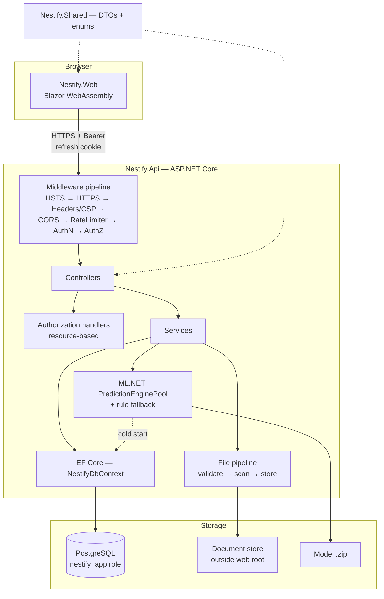

## 1.3 Blazor hosting model — decision

**Decision: keep the existing standalone Blazor WebAssembly client, served separately from the API.**

**Why:** the project is already a standalone WASM app with a finished login page and custom CSS; migrating to a Blazor Web App would discard `index.html`, `App.razor`, `CustomAuthStateProvider`, and the login wiring, and invalidate teammates' open branches — for a security benefit this plan obtains by other means (§11.2).

| Consequence | How it is handled |
|---|---|
| No server-side rendering — the token must live in the browser | Access token in **memory only**, never `localStorage`; refresh token in an `HttpOnly` cookie (§11.2.3) |
| Client and API are different origins | Strict CORS allowlist with `AllowCredentials`; `SameSite=None` on the refresh cookie, compensated by a required custom header forcing preflight (§11.7.3) |
| All client code is downloadable and readable | Every authorization check is duplicated server-side; UI gating is UX only (§11.3.6) |
| `wasm-unsafe-eval` needed in CSP | Explicitly allowed and justified in §11.9.3 |

Rejected alternatives, recorded so the viva answer exists: **Blazor Server** (simplest auth — cookie only, no browser token — but discards the WASM project and makes the separate Web API redundant); **Blazor Web App / InteractiveAuto** (best token story via co-hosted cookie auth, but a full restructure mid-project).

## 1.4 Request pipeline order

Order is load-bearing, so it is specified rather than left to habit.

| # | Middleware | Why it sits here |
|---|---|---|
| 1 | `UseHsts()` *(non-Development)* | Must precede anything that could emit a redirect |
| 2 | `UseHttpsRedirection()` | Upgrade before any credential is read |
| 3 | Security headers + CSP | Applies to every response including errors |
| 4 | `UseRouting()` | Endpoint metadata needed by CORS and rate limiting |
| 5 | `UseCors("NestifyClient")` | **Before** auth — a rejected preflight must not consume a rate-limit permit or hit the DB |
| 6 | `UseRateLimiter()` | **Before** authentication — brute-force must be throttled before password verification runs |
| 7 | `UseAuthentication()` | Establishes identity |
| 8 | `UseAuthorization()` | Consumes identity |
| 9 | `MapControllers()` | |

**Why 6 before 7:** if the limiter ran after authentication, every throttled login attempt would still cost a PBKDF2 hash verification — the exact CPU cost an attacker wants to inflict.

## 1.5 Notification mechanism — decision

**Decision: a `notifications` table polled by the client, not SignalR.**

**Why:** a standalone WASM client on a different origin makes SignalR hub authentication a real piece of work (access-token-in-query-string negotiation, CORS on the hub, reconnect handling) for a feature whose entire requirement is "the Manager finds out somebody booked."

| Aspect | Design |
|---|---|
| Write path | Services insert a `notifications` row **inside the same transaction** as the triggering action. **Why:** a notification written after commit can be lost, and a notification written before can describe an action that rolled back. |
| Read path | `GET /api/v1/notifications?unreadOnly=true` |
| Polling | A client `NotificationService` polls every 30 s while a tab is focused, and once on navigation. Paused when hidden via `visibilitychange`. |
| Flood control | Unique index on `(RecipientUserId, SourceType, SourceId, Type)` — a duplicate trigger updates nothing (§11.6.4) |
| Retention | Read notifications older than 60 days are deleted by the maintenance job (§13, D-15) |

Upgrade path if time allows: keep the table, add a SignalR hub that pushes the same rows. The polling client keeps working unchanged.

## 1.6 Configuration and ports

Milestone 0 collapses the three-way port mismatch to one source of truth.

| Setting | Location | Value shape |
|---|---|---|
| API listen URLs | `Nestify.Api/Properties/launchSettings.json` | `https://localhost:7284` |
| Client listen URLs | `Nestify.Web/Properties/launchSettings.json` | `https://localhost:7205` |
| `ApiBaseUrl` | `Nestify.Web/wwwroot/appsettings.json` | must equal the API https URL |
| `Cors:AllowedOrigins` | API config | must contain exactly the client https URL |

**Why one table:** the current failure is invisible at compile time and presents as a generic CORS error at runtime, which is a bad thing to be debugging the night before a viva.

## 1.7 Security considerations

Architectural choices that are security decisions: EF entities are confined to `Nestify.Api` (mass assignment, §11.3.5); the middleware order above (§1.4); notification writes are transactional (no information leak about rolled-back actions); and `Nestify.Shared` carries no persistence types, so the browser bundle discloses no schema.

---

# 2 — Data model

## 2.1 Conventions

| Convention | Value | Why |
|---|---|---|
| Primary keys | `uuid` (v7-style sequential where available) for domain entities; `int` for seeded reference data; `bigint` identity for append-only logs | Guessable sequential ids on user-facing resources make IDOR probing trivial; reference data ids come from the dataset; logs need cheap ordering |
| Money | `decimal` → `numeric(18,2)` | Binary floating point cannot represent 0.10; a meal split in `double` silently drifts (§11.6.1) |
| Per-meal rate | `numeric(18,6)` | Six places absorb the repeating decimal before a single rounding step (§7.4) |
| Timestamps | `timestamptz`, UTC, suffixed `...AtUtc` | Month boundaries must not move with the server's locale |
| Coordinates | `numeric(9,6)` | ~11 cm precision, exact, no float drift |
| Enums | `smallint` with a C# enum + a `CHECK` constraint | Readable in code, compact and indexable in PostgreSQL |
| Soft delete | **Not used** except where stated | A global query filter that someone forgets to apply is an authorization bug; hard delete plus append-only logs is easier to reason about |
| Naming | `snake_case` via `UseSnakeCaseNamingConvention()` (`EFCore.NamingConventions`) | Unquoted identifiers in `psql` during a live demo. Falls back to EF's default PascalCase if the team declines the package (§13, D-16) |
| Concurrency | Npgsql `UseXminAsConcurrencyToken()` on mutable financial rows | Native system column, no extra column, no manual version bumping (§11.6.3) |

## 2.2 ER diagram

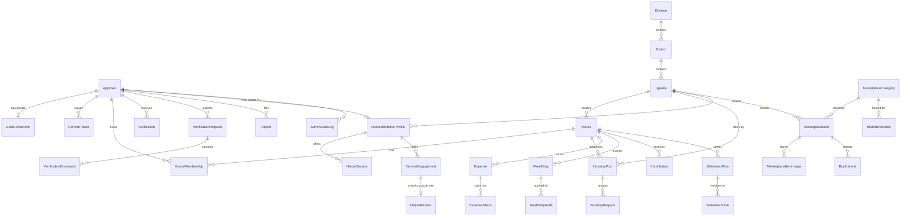

## 2.3 Identity and profile

### `asp_net_users` — `AppUser : IdentityUser<Guid>`

Standard Identity columns (`Id`, `UserName`, `NormalizedUserName`, `Email`, `NormalizedEmail`, `EmailConfirmed`, `PasswordHash`, `SecurityStamp`, `ConcurrencyStamp`, `PhoneNumber`, `PhoneNumberConfirmed`, `TwoFactorEnabled`, `LockoutEnd`, `LockoutEnabled`, `AccessFailedCount`) plus:

| Column | Type | Null | Notes |
|---|---|---|---|
| `FullName` | `varchar(120)` | no | |
| `DateOfBirth` | `date` | yes | Source of `Age` for eligibility matching (§5.3) |
| `Gender` | `smallint` | yes | `1 Male, 2 Female, 3 Other` |
| `Occupation` | `smallint` | yes | `1 Student, 2 JobHolder, 3 Both, 4 Other` |
| `IsVerified` | `boolean` | no | Default `false`. Denormalized from the latest approved `verification_requests` |
| `ProfileUpazilaId` | `int` | yes | FK → `upazilas` |
| `IsBanned` | `boolean` | no | Default `false` |
| `CreatedAtUtc` | `timestamptz` | no | |

Indexes: Identity's `NormalizedEmail`/`NormalizedUserName` uniques, plus `ix_users_is_verified` on `(IsVerified)` (filtered predicate in §5.3).

Also present, unmodified: `asp_net_roles`, `asp_net_user_roles`, `asp_net_user_claims`, `asp_net_user_logins`, `asp_net_user_tokens`, `asp_net_role_claims`.

### `user_contact_info` — the PII table

| Column | Type | Null |
|---|---|---|
| `UserId` | `uuid` PK, FK → `asp_net_users` | no |
| `PhoneNumber` | `varchar(20)` | yes |
| `WhatsAppNumber` | `varchar(20)` | yes |
| `FacebookHandle` | `varchar(100)` | yes |
| `MessengerHandle` | `varchar(100)` | yes |
| `UpdatedAtUtc` | `timestamptz` | no |

**Why a separate table rather than columns on `AppUser`:** contact details are the one thing in this system that must never be emitted before a disclosure transition. As a separate entity, reaching them requires a deliberate join or `Include` — of which there are exactly three call sites in the whole codebase (§11.4). Columns on `AppUser` would ride along in every accidental `SELECT *` projection.

### `refresh_tokens`

| Column | Type | Null | Notes |
|---|---|---|---|
| `Id` | `uuid` PK | no | |
| `UserId` | `uuid` FK → `asp_net_users` | no | `ON DELETE CASCADE` |
| `TokenHash` | `bytea(32)` | no | SHA-256 of the opaque token. **The raw token is never stored** |
| `FamilyId` | `uuid` | no | Rotation chain identity — reuse detection revokes the whole family (§11.2.4) |
| `ExpiresAtUtc` | `timestamptz` | no | |
| `CreatedAtUtc` | `timestamptz` | no | |
| `RevokedAtUtc` | `timestamptz` | yes | |
| `ReplacedByTokenId` | `uuid` | yes | FK → self |
| `CreatedByIp` | `inet` | yes | |

Indexes: `ux_refresh_token_hash` UNIQUE on `(TokenHash)`; `ix_refresh_user_active` on `(UserId)` `WHERE RevokedAtUtc IS NULL`; `ix_refresh_family` on `(FamilyId)`.

## 2.4 Area reference tables

Seeded once from the dataset in §5.5. Ids come from the dataset so they are stable across reseeds.

### `divisions`

| Column | Type | Null | Notes |
|---|---|---|---|
| `Id` | `int` PK | no | Dataset id (1–8), **not** generated |
| `Name` | `varchar(60)` | no | |
| `BnName` | `varchar(60)` | no | |

### `districts`

| Column | Type | Null | Notes |
|---|---|---|---|
| `Id` | `int` PK | no | Dataset id (1–64) |
| `DivisionId` | `int` FK → `divisions` | no | `ON DELETE RESTRICT` |
| `Name` | `varchar(60)` | no | |
| `BnName` | `varchar(60)` | no | |
| `Latitude` | `numeric(9,6)` | yes | District HQ, from the dataset |
| `Longitude` | `numeric(9,6)` | yes | |

Indexes: `ix_districts_division` on `(DivisionId)`; `ux_districts_division_name` UNIQUE on `(DivisionId, Name)`.

### `upazilas`

| Column | Type | Null | Notes |
|---|---|---|---|
| `Id` | `int` PK | no | Dataset id (1–494) for dataset rows; ≥ 10000 for locally-added metropolitan thanas (§13, D-03) |
| `DistrictId` | `int` FK → `districts` | no | `ON DELETE RESTRICT` |
| `Name` | `varchar(80)` | no | |
| `BnName` | `varchar(80)` | no | |
| `IsMetropolitanThana` | `boolean` | no | Default `false`. The dataset has none; see §13, D-03 |

Indexes: `ix_upazilas_district` on `(DistrictId)`; `ux_upazilas_district_name` UNIQUE on `(DistrictId, Name)`.

## 2.5 M1 — Housing

### `houses`

| Column | Type | Null | Notes |
|---|---|---|---|
| `Id` | `uuid` PK | no | |
| `Name` | `varchar(120)` | no | |
| `AddressLine` | `varchar(300)` | no | |
| `UpazilaId` | `int` FK → `upazilas` | no | `ON DELETE RESTRICT` |
| `Latitude` / `Longitude` | `numeric(9,6)` | yes | |
| `CreatedByUserId` | `uuid` FK → `asp_net_users` | no | `ON DELETE RESTRICT` |
| `CreatedAtUtc` | `timestamptz` | no | |

Index: `ix_houses_upazila` on `(UpazilaId)`.

### `house_memberships` — the house-scoped role table

| Column | Type | Null | Notes |
|---|---|---|---|
| `Id` | `uuid` PK | no | |
| `HouseId` | `uuid` FK → `houses` | no | `ON DELETE CASCADE` |
| `UserId` | `uuid` FK → `asp_net_users` | no | `ON DELETE RESTRICT` |
| `Role` | `smallint` | no | `1 Manager, 2 CoManager, 3 Member`. `CHECK (Role BETWEEN 1 AND 3)` |
| `JoinedAtUtc` | `timestamptz` | no | |
| `LeftAtUtc` | `timestamptz` | yes | `NULL` = active member |

Indexes: `ux_membership_active` UNIQUE on `(HouseId, UserId)` `WHERE LeftAtUtc IS NULL`; `ix_membership_user` on `(UserId)` `WHERE LeftAtUtc IS NULL`; `ux_house_single_manager` UNIQUE on `(HouseId)` `WHERE Role = 1 AND LeftAtUtc IS NULL`.

**Why the last index:** exactly one Manager per house is a rule the database can enforce for free, and a house with two Managers makes the M3 audit trail ambiguous.

**This table — not Identity roles — is the entire basis of house-scoped authorization.** **Why:** Identity roles are global, so a `Manager` Identity role would grant Manager powers in *every* house (§4.2).

### `housing_posts`

| Column | Type | Null | Notes |
|---|---|---|---|
| `Id` | `uuid` PK | no | |
| `HouseId` | `uuid` FK → `houses` | no | `ON DELETE CASCADE` |
| `CreatedByUserId` | `uuid` FK → `asp_net_users` | no | |
| `Title` | `varchar(150)` | no | |
| `Description` | `text` | no | Max 4000 enforced by DTO validation |
| `ListingType` | `smallint` | no | `1 SingleSeat, 2 MultipleSeats, 3 EntireHouse` |
| `SeatsAvailable` | `int` | no | `CHECK (SeatsAvailable >= 1)` |
| `MonthlyRent` | `numeric(18,2)` | no | `CHECK (MonthlyRent >= 0)` |
| `UpazilaId` | `int` FK → `upazilas` | no | Denormalized from the house for area filtering |
| `Status` | `smallint` | no | `1 Active, 2 Closed`. `CHECK` |
| `CreatedAtUtc` / `UpdatedAtUtc` | `timestamptz` | no / yes | |
| `xmin` | system | — | Concurrency token |

**Eligibility requirement columns — all nullable, `NULL` meaning "no constraint":**

| Column | Type | Matches against |
|---|---|---|
| `ReqGender` | `smallint` | `AppUser.Gender` |
| `ReqOccupation` | `smallint` | `AppUser.Occupation` |
| `ReqMinAge` | `int` | Age derived from `DateOfBirth` |
| `ReqMaxAge` | `int` | Age derived from `DateOfBirth` |
| `ReqVerifiedOnly` | `boolean` (not null, default `false`) | `AppUser.IsVerified` |
| `ReqStudentOnly` | `boolean` (not null, default `false`) | `AppUser.Occupation IN (Student, Both)` |
| `ReqMaritalStatus` | `smallint` | `AppUser.MaritalStatus` |

`CHECK (ReqMinAge IS NULL OR ReqMaxAge IS NULL OR ReqMinAge <= ReqMaxAge)`.

**Why typed nullable columns and not an EAV `post_requirements(key, value)` table:** the eligibility match is an authorization boundary that must compile into the SQL `WHERE` clause of every read (§5.3). Typed columns produce a composable `IQueryable` predicate the database can index; EAV forces either a post-fetch filter in C# — which is precisely the vulnerability the brief forbids — or a correlated-subquery-per-key construction no undergraduate should be asked to get right on a deadline.

Indexes: `ix_posts_area_active` on `(UpazilaId, Status)` `WHERE Status = 1`; `ix_posts_owner` on `(CreatedByUserId)`; `ix_posts_house` on `(HouseId)`.

### `booking_requests`

| Column | Type | Null | Notes |
|---|---|---|---|
| `Id` | `uuid` PK | no | |
| `HousingPostId` | `uuid` FK → `housing_posts` | no | `ON DELETE CASCADE` |
| `RequesterUserId` | `uuid` FK → `asp_net_users` | no | |
| `Message` | `varchar(500)` | yes | |
| `Status` | `smallint` | no | `1 Pending, 2 Accepted, 3 Rejected, 4 Withdrawn` |
| `CreatedAtUtc` | `timestamptz` | no | |
| `DecidedAtUtc` | `timestamptz` | yes | |
| `DecidedByUserId` | `uuid` FK → `asp_net_users` | yes | |

Indexes: `ux_booking_open` UNIQUE on `(HousingPostId, RequesterUserId)` `WHERE Status IN (1,2)`; `ix_booking_post_status` on `(HousingPostId, Status)`; `ix_booking_requester` on `(RequesterUserId)`.

**Why the partial unique index:** it makes booking spam a database-level impossibility rather than a service-level check somebody forgets, while still allowing a re-request after a rejection or withdrawal.

## 2.6 M2 — Domestic help

### `domestic_helper_profiles`

| Column | Type | Null | Notes |
|---|---|---|---|
| `Id` | `uuid` PK | no | |
| `UserId` | `uuid` FK → `asp_net_users` | no | **UNIQUE** — one profile per account |
| `DisplayName` | `varchar(120)` | no | |
| `UpazilaId` | `int` FK → `upazilas` | no | |
| `Latitude` / `Longitude` | `numeric(9,6)` | no | Required — the brief specifies coordinates in addition to area |
| `ServiceRadiusKm` | `numeric(5,2)` | no | Default `3.00` |
| `MonthlyRate` | `numeric(18,2)` | no | `CHECK (MonthlyRate >= 0)` |
| `AvailableFrom` / `AvailableTo` | `time` | no | Daily availability window |
| `YearsExperience` | `int` | no | `CHECK (YearsExperience >= 0)` |
| `Bio` | `varchar(1000)` | yes | |
| `IsVerified` | `boolean` | no | Default `false` |
| `IsActive` | `boolean` | no | Default `true` |
| `AverageRating` | `numeric(3,2)` | yes | Denormalized from `helper_reviews` |
| `ReviewCount` | `int` | no | Default `0` |
| `CreatedAtUtc` | `timestamptz` | no | |

Indexes: `ux_helper_user` UNIQUE on `(UserId)`; `ix_helper_area_active` on `(UpazilaId, IsActive)` `WHERE IsActive`; `ix_helper_rating` on `(AverageRating DESC)`.

**Why `AverageRating` is denormalized:** the helper list is the module's main screen and sorting by rating on every request would aggregate the review table each time. It is recomputed inside the same transaction that inserts a review, so it cannot drift.

### `helper_services`

| Column | Type | Null | Notes |
|---|---|---|---|
| `Id` | `uuid` PK | no | |
| `HelperProfileId` | `uuid` FK → `domestic_helper_profiles` | no | `ON DELETE CASCADE` |
| `ServiceType` | `smallint` | no | `1 Cooking, 2 Cleaning, 3 Laundry, 4 Dishwashing, 5 Childcare` |
| `RatePerMonth` | `numeric(18,2)` | no | |

Index: `ux_helper_service` UNIQUE on `(HelperProfileId, ServiceType)`.

### `service_engagements` — the review gate

| Column | Type | Null | Notes |
|---|---|---|---|
| `Id` | `uuid` PK | no | |
| `HelperProfileId` | `uuid` FK → `domestic_helper_profiles` | no | |
| `ClientUserId` | `uuid` FK → `asp_net_users` | no | |
| `HouseId` | `uuid` FK → `houses` | yes | Optional context |
| `Status` | `smallint` | no | `1 Requested, 2 HelperConfirmed, 3 Active, 4 Completed, 5 Cancelled` |
| `StartDate` | `date` | no | |
| `EndDate` | `date` | yes | |
| `RequestedAtUtc` | `timestamptz` | no | |
| `HelperConfirmedAtUtc` | `timestamptz` | yes | **The disclosure transition** (§11.4) |
| `ClientCompletedAtUtc` | `timestamptz` | yes | |
| `HelperCompletedAtUtc` | `timestamptz` | yes | |
| `CompletedAtUtc` | `timestamptz` | yes | Set when **both** parties have marked complete |
| `CancelledAtUtc` | `timestamptz` | yes | |

`CHECK (ClientUserId <> (SELECT UserId FROM domestic_helper_profiles WHERE Id = HelperProfileId))` is not expressible directly; enforced in the service layer and covered by the no-self-review rule (§6.4).

Indexes: `ix_engagement_helper` on `(HelperProfileId, Status)`; `ix_engagement_client` on `(ClientUserId, Status)`; `ux_engagement_open` UNIQUE on `(HelperProfileId, ClientUserId)` `WHERE Status IN (1,2,3)`.

### `helper_reviews`

| Column | Type | Null | Notes |
|---|---|---|---|
| `Id` | `uuid` PK | no | |
| `ServiceEngagementId` | `uuid` FK → `service_engagements` | no | **UNIQUE — this is what enforces one review per engagement** |
| `HelperProfileId` | `uuid` FK → `domestic_helper_profiles` | no | Denormalized for the helper's review list |
| `ReviewerUserId` | `uuid` FK → `asp_net_users` | no | |
| `Rating` | `smallint` | no | `CHECK (Rating BETWEEN 1 AND 5)` |
| `Comment` | `varchar(1000)` | yes | Rendered as plain text, never `MarkupString` (§11.5.2) |
| `CreatedAtUtc` | `timestamptz` | no | |
| `IsHidden` | `boolean` | no | Default `false`. Set by admin on an upheld report |

Indexes: `ux_review_engagement` UNIQUE on `(ServiceEngagementId)`; `ix_review_helper` on `(HelperProfileId)` `WHERE NOT IsHidden`.

**Why the uniqueness lives on the engagement and not on `(helper, reviewer)`:** a client who genuinely hires the same helper twice should be able to review twice — once per engagement. Uniqueness on the pair would wrongly forbid that, and uniqueness on nothing would allow review-bombing from one engagement.

## 2.7 M3 — Expenses and settlement

### `expenses` — append-only

| Column | Type | Null | Notes |
|---|---|---|---|
| `Id` | `uuid` PK | no | |
| `HouseId` | `uuid` FK → `houses` | no | `ON DELETE CASCADE` |
| `Category` | `smallint` | no | `1 EqualSplit, 2 MealPurchase` |
| `Description` | `varchar(200)` | no | |
| `Amount` | `numeric(18,2)` | no | May be **negative** on a correcting entry |
| `SpentByUserId` | `uuid` FK → `asp_net_users` | no | Who paid — feeds `contributions` |
| `SpentOn` | `date` | no | |
| `PeriodYear` | `int` | no | `CHECK (PeriodYear BETWEEN 2020 AND 2100)` |
| `PeriodMonth` | `int` | no | `CHECK (PeriodMonth BETWEEN 1 AND 12)` |
| `CorrectsExpenseId` | `uuid` FK → self | yes | Set on a correcting entry |
| `CreatedByUserId` | `uuid` FK → `asp_net_users` | no | |
| `CreatedAtUtc` | `timestamptz` | no | |

Indexes: `ix_expense_house_period` on `(HouseId, PeriodYear, PeriodMonth, Category)`; `ix_expense_corrects` on `(CorrectsExpenseId)` `WHERE CorrectsExpenseId IS NOT NULL`.

**Rows are never updated or deleted.** A mistake is fixed by inserting a correcting row with the negated `Amount` and `CorrectsExpenseId` pointing at the original. **Why:** the settlement is a financial record; `SUM(Amount)` over an append-only table is reproducible from history, whereas an in-place edit destroys the evidence of what the house agreed to at the time.

### `expense_shares`

| Column | Type | Null | Notes |
|---|---|---|---|
| `Id` | `uuid` PK | no | |
| `ExpenseId` | `uuid` FK → `expenses` | no | `ON DELETE CASCADE` |
| `UserId` | `uuid` FK → `asp_net_users` | no | |
| `ShareAmount` | `numeric(18,2)` | no | |

Index: `ux_expense_share` UNIQUE on `(ExpenseId, UserId)`.

**Why materialize shares instead of dividing at settlement time:** membership changes mid-month. If a member joins on the 20th, dividing the whole month's cylinder bill by the *current* headcount charges someone for gas burned before they arrived. Writing shares at expense-creation time freezes the split against the membership that existed then.

### `meal_entries` — strictly append-only

| Column | Type | Null | Notes |
|---|---|---|---|
| `Id` | `uuid` PK | no | |
| `HouseId` | `uuid` FK → `houses` | no | |
| `UserId` | `uuid` FK → `asp_net_users` | no | Whose meal count this is |
| `MealDate` | `date` | no | |
| `MealCount` | `numeric(4,1)` | no | `CHECK (MealCount >= 0 AND MealCount <= 10)`. One decimal allows half meals |
| `PeriodYear` / `PeriodMonth` | `int` | no | Derived from `MealDate`, stored for index efficiency |
| `SupersedesMealEntryId` | `uuid` FK → self | yes | Set when this row corrects an earlier one |
| `RecordedByUserId` | `uuid` FK → `asp_net_users` | no | The actor, who may differ from `UserId` |
| `RecordedAtUtc` | `timestamptz` | no | |
| `xmin` | system | — | Concurrency token |

Indexes: `ix_meal_current` on `(HouseId, UserId, MealDate, RecordedAtUtc DESC)`; `ix_meal_house_period` on `(HouseId, PeriodYear, PeriodMonth)`.

**The current value of a cell is the row with the greatest `RecordedAtUtc` for `(HouseId, UserId, MealDate)`.** No row is ever updated or deleted. **Why this rather than an `IsCurrent` flag:** flipping a flag is still a mutation of a historical record, and a crash between "insert new" and "clear old flag" leaves two current rows. Greatest-timestamp-wins has no intermediate state to corrupt, and the covering index above makes the lookup a single index scan.

### `meal_entry_audits`

| Column | Type | Null | Notes |
|---|---|---|---|
| `Id` | `bigint` identity PK | no | |
| `MealEntryId` | `uuid` FK → `meal_entries` | no | |
| `HouseId` | `uuid` | no | |
| `TargetUserId` | `uuid` | no | Whose count changed |
| `ActorUserId` | `uuid` | no | Who changed it |
| `OldMealCount` | `numeric(4,1)` | yes | `NULL` on first entry |
| `NewMealCount` | `numeric(4,1)` | no | |
| `Reason` | `varchar(200)` | yes | |
| `OccurredAtUtc` | `timestamptz` | no | |

Index: `ix_meal_audit_house` on `(HouseId, OccurredAtUtc DESC)`.

### `contributions`

| Column | Type | Null | Notes |
|---|---|---|---|
| `Id` | `uuid` PK | no | |
| `HouseId` | `uuid` FK → `houses` | no | |
| `UserId` | `uuid` FK → `asp_net_users` | no | |
| `Amount` | `numeric(18,2)` | no | May be negative on a correcting entry |
| `PaidOn` | `date` | no | |
| `PeriodYear` / `PeriodMonth` | `int` | no | |
| `Source` | `smallint` | no | `1 DerivedFromExpense, 2 DirectCashIn` |
| `SourceExpenseId` | `uuid` FK → `expenses` | yes | Set when `Source = 1` |
| `CorrectsContributionId` | `uuid` FK → self | yes | |
| `RecordedByUserId` | `uuid` FK → `asp_net_users` | no | |
| `CreatedAtUtc` | `timestamptz` | no | |

Index: `ix_contribution_house_period` on `(HouseId, PeriodYear, PeriodMonth)`; `ux_contribution_expense` UNIQUE on `(SourceExpenseId)` `WHERE SourceExpenseId IS NOT NULL`.

**Why contributions are derived from expenses automatically:** when Rafi pays ৳1,400 for the cylinder, that is simultaneously a house cost and Rafi's contribution. Creating both rows in one transaction — with the unique index preventing a double-count — removes the most likely data-entry error in the whole module.

### `settlement_runs`

| Column | Type | Null | Notes |
|---|---|---|---|
| `Id` | `uuid` PK | no | |
| `HouseId` | `uuid` FK → `houses` | no | |
| `PeriodYear` / `PeriodMonth` | `int` | no | |
| `TotalMealSpending` | `numeric(18,2)` | no | |
| `TotalMeals` | `numeric(10,1)` | no | |
| `PerMealRate` | `numeric(18,6)` | no | |
| `TotalEqualCosts` | `numeric(18,2)` | no | |
| `MemberCountAtSettlement` | `int` | no | |
| `Status` | `smallint` | no | `1 Draft, 2 Finalized` |
| `ComputedByUserId` | `uuid` FK → `asp_net_users` | no | |
| `ComputedAtUtc` | `timestamptz` | no | |
| `xmin` | system | — | Concurrency token |

Index: `ux_settlement_finalized` UNIQUE on `(HouseId, PeriodYear, PeriodMonth)` `WHERE Status = 2`.

**Why the partial unique index:** a house-month can be previewed any number of times but finalized exactly once. This is the lock that makes a settled month immutable.

### `settlement_lines`

| Column | Type | Null | Notes |
|---|---|---|---|
| `Id` | `uuid` PK | no | |
| `SettlementRunId` | `uuid` FK → `settlement_runs` | no | `ON DELETE CASCADE` |
| `UserId` | `uuid` FK → `asp_net_users` | no | |
| `MealCount` | `numeric(10,1)` | no | |
| `MealCost` | `numeric(18,2)` | no | |
| `EqualShare` | `numeric(18,2)` | no | |
| `Contributions` | `numeric(18,2)` | no | |
| `RoundingAdjustment` | `numeric(18,2)` | no | Default `0.00` (§7.4) |
| `NetAmount` | `numeric(18,2)` | no | Positive = house owes the member |

Index: `ux_settlement_line` UNIQUE on `(SettlementRunId, UserId)`.

Invariant, asserted before commit: `SUM(NetAmount) = 0` for a run.

### `settlement_transfers`

| Column | Type | Null | Notes |
|---|---|---|---|
| `Id` | `uuid` PK | no | |
| `SettlementRunId` | `uuid` FK → `settlement_runs` | no | `ON DELETE CASCADE` |
| `FromUserId` | `uuid` FK → `asp_net_users` | no | The debtor |
| `ToUserId` | `uuid` FK → `asp_net_users` | no | The creditor |
| `Amount` | `numeric(18,2)` | no | `CHECK (Amount > 0)` |

`CHECK (FromUserId <> ToUserId)`.

## 2.8 M4 — Marketplace

### `marketplace_categories`

| Column | Type | Null | Notes |
|---|---|---|---|
| `Id` | `int` PK | no | Seeded |
| `Name` | `varchar(60)` | no | |
| `Slug` | `varchar(60)` | no | UNIQUE |
| `DefaultPriceLow` / `DefaultPriceHigh` | `numeric(18,2)` | no | Last-resort band for the ML rule fallback (§10.7) |

### `marketplace_items`

| Column | Type | Null | Notes |
|---|---|---|---|
| `Id` | `uuid` PK | no | |
| `SellerUserId` | `uuid` FK → `asp_net_users` | no | |
| `CategoryId` | `int` FK → `marketplace_categories` | no | |
| `Title` | `varchar(150)` | no | |
| `Description` | `text` | no | |
| `Condition` | `smallint` | no | `1 New, 2 LikeNew, 3 Good, 4 Fair, 5 Poor` |
| `AskingPrice` | `numeric(18,2)` | no | `CHECK (AskingPrice >= 0)`. **The ML label** (§10.5) |
| `AgeMonths` | `int` | yes | `CHECK (AgeMonths >= 0)` |
| `UpazilaId` | `int` FK → `upazilas` | no | |
| `Status` | `smallint` | no | `1 Active, 2 Sold, 3 Removed` |
| `CreatedAtUtc` / `UpdatedAtUtc` | `timestamptz` | no / yes | |
| `xmin` | system | — | Concurrency token |

Indexes: `ix_items_area_active` on `(UpazilaId, Status)` `WHERE Status = 1`; `ix_items_seller` on `(SellerUserId)`; `ix_items_training` on `(CategoryId, Condition, CreatedAtUtc DESC)` — serves both the browse screen and the ML rule fallback's median query.

### `marketplace_item_images`

| Column | Type | Null | Notes |
|---|---|---|---|
| `Id` | `uuid` PK | no | |
| `ItemId` | `uuid` FK → `marketplace_items` | no | `ON DELETE CASCADE` |
| `StoredFileName` | `varchar(64)` | no | Generated GUID name, never the user's |
| `ContentType` | `varchar(60)` | no | |
| `SizeBytes` | `int` | no | |
| `SortOrder` | `int` | no | |

### `buy_interests`

| Column | Type | Null | Notes |
|---|---|---|---|
| `Id` | `uuid` PK | no | |
| `ItemId` | `uuid` FK → `marketplace_items` | no | `ON DELETE CASCADE` |
| `BuyerUserId` | `uuid` FK → `asp_net_users` | no | |
| `Message` | `varchar(500)` | yes | |
| `Status` | `smallint` | no | `1 Pending, 2 Accepted, 3 Declined, 4 Withdrawn` |
| `CreatedAtUtc` | `timestamptz` | no | |
| `DecidedAtUtc` | `timestamptz` | yes | |

Indexes: `ux_buy_open` UNIQUE on `(ItemId, BuyerUserId)` `WHERE Status IN (1,2)`; `ix_buy_item_status` on `(ItemId, Status)`; `ix_buy_buyer` on `(BuyerUserId)`.

## 2.9 M5/M6 — Verification, reports, audit, notifications

### `verification_requests`

| Column | Type | Null | Notes |
|---|---|---|---|
| `Id` | `uuid` PK | no | |
| `UserId` | `uuid` FK → `asp_net_users` | no | |
| `SubjectType` | `smallint` | no | `1 User, 2 DomesticHelper` |
| `Status` | `smallint` | no | `1 Pending, 2 Approved, 3 Rejected` |
| `SubmittedAtUtc` | `timestamptz` | no | |
| `DecidedAtUtc` | `timestamptz` | yes | |
| `DecidedByAdminId` | `uuid` FK → `asp_net_users` | yes | |
| `RejectionReason` | `varchar(500)` | yes | |
| `DocumentsPurgedAtUtc` | `timestamptz` | yes | Set by the retention job (§11.5.5) |

Indexes: `ux_verification_one_open` UNIQUE on `(UserId)` `WHERE Status = 1`; `ix_verification_queue` on `(Status, SubmittedAtUtc)`.

### `verification_documents`

| Column | Type | Null | Notes |
|---|---|---|---|
| `Id` | `uuid` PK | no | |
| `VerificationRequestId` | `uuid` FK → `verification_requests` | no | `ON DELETE CASCADE` |
| `DocumentType` | `smallint` | no | `1 NationalId, 2 StudentId, 3 Passport, 4 BirthCertificate` |
| `StoredFileName` | `varchar(64)` | no | A GUID. **No directory component, no user-supplied extension** |
| `OriginalFileNameSanitized` | `varchar(120)` | no | Display only. Never used to build a path |
| `ContentType` | `varchar(60)` | no | The **sniffed** type, not the declared one |
| `SizeBytes` | `int` | no | |
| `Sha256Hash` | `bytea(32)` | no | Survives purge, so a decision stays provable |
| `ScanStatus` | `smallint` | no | `1 Pending, 2 Clean, 3 Infected, 4 ScanFailed` |
| `ScannedAtUtc` | `timestamptz` | yes | |
| `UploadedAtUtc` | `timestamptz` | no | |
| `DeletedAtUtc` | `timestamptz` | yes | Bytes unlinked; row retained |

**There is deliberately no `PublicUrl` or `Path` column.** **Why:** if no column can hold a URL, no projection can accidentally emit one (§11.5.4).

### `reports`

| Column | Type | Null | Notes |
|---|---|---|---|
| `Id` | `uuid` PK | no | |
| `ReporterUserId` | `uuid` FK → `asp_net_users` | no | |
| `TargetType` | `smallint` | no | `1 HousingPost, 2 MarketplaceItem, 3 HelperProfile, 4 HelperReview, 5 User` |
| `TargetId` | `uuid` | no | Polymorphic — no FK, validated in the service |
| `Reason` | `smallint` | no | `1 Spam, 2 Fraud, 3 Offensive, 4 Misleading, 5 Other` |
| `Details` | `varchar(1000)` | yes | |
| `Status` | `smallint` | no | `1 Open, 2 UnderReview, 3 ActionTaken, 4 Dismissed` |
| `CreatedAtUtc` | `timestamptz` | no | |
| `ResolvedAtUtc` | `timestamptz` | yes | |
| `ResolvedByAdminId` | `uuid` FK → `asp_net_users` | yes | |
| `ResolutionNote` | `varchar(1000)` | yes | |

Indexes: `ux_report_once` UNIQUE on `(ReporterUserId, TargetType, TargetId)`; `ix_report_queue` on `(Status, CreatedAtUtc)`; `ix_report_target` on `(TargetType, TargetId)`.

**Why the unique index:** report-spam prevention becomes a `409 Conflict` from the database rather than a check in a service somebody forgets to write (§11.6.2). It also gives the admin queue an honest "distinct reporters" count.

**Why `TargetId` has no foreign key:** it points at five different tables. The service validates existence against the table selected by `TargetType` before insert. The trade-off (no referential integrity) is accepted because the alternative — five nullable FK columns — makes every query on the queue awkward.

### `admin_audit_logs` — append-only

| Column | Type | Null | Notes |
|---|---|---|---|
| `Id` | `bigint` identity PK | no | |
| `AdminUserId` | `uuid` FK → `asp_net_users` | no | |
| `Action` | `varchar(60)` | no | `VerificationApproved`, `ReportResolved`, `UserBanned`, … |
| `TargetType` | `varchar(40)` | no | |
| `TargetId` | `uuid` | yes | |
| `BeforeJson` | `jsonb` | yes | Never contains document bytes or contact details |
| `AfterJson` | `jsonb` | yes | |
| `IpAddress` | `inet` | yes | |
| `OccurredAtUtc` | `timestamptz` | no | |

Index: `ix_audit_admin_time` on `(AdminUserId, OccurredAtUtc DESC)`; `ix_audit_target` on `(TargetType, TargetId)`.

`UPDATE` and `DELETE` on this table are **revoked from the `nestify_app` database role** (§11.9.5). **Why:** an audit log the application can rewrite is not an audit log.

### `notifications`

| Column | Type | Null | Notes |
|---|---|---|---|
| `Id` | `uuid` PK | no | |
| `RecipientUserId` | `uuid` FK → `asp_net_users` | no | `ON DELETE CASCADE` |
| `Type` | `smallint` | no | `1 BookingRequested, 2 BookingAccepted, 3 BookingRejected, 4 BuyInterest, 5 BuyInterestAccepted, 6 EngagementRequested, 7 EngagementConfirmed, 8 VerificationDecided, 9 ReportResolved` |
| `Title` | `varchar(150)` | no | |
| `Body` | `varchar(500)` | no | **Never contains contact details** |
| `LinkPath` | `varchar(200)` | yes | Client-relative route |
| `SourceType` | `smallint` | no | |
| `SourceId` | `uuid` | no | |
| `IsRead` | `boolean` | no | Default `false` |
| `CreatedAtUtc` | `timestamptz` | no | |

Indexes: `ix_notif_inbox` on `(RecipientUserId, IsRead, CreatedAtUtc DESC)`; `ux_notif_dedupe` UNIQUE on `(RecipientUserId, SourceType, SourceId, Type)`.

### `ml_model_versions`

| Column | Type | Null | Notes |
|---|---|---|---|
| `Id` | `uuid` PK | no | |
| `ModelName` | `varchar(60)` | no | `price-suggestion` |
| `Version` | `int` | no | |
| `TrainedAtUtc` | `timestamptz` | no | |
| `TrainingRowCount` | `int` | no | |
| `MeanAbsoluteError` | `numeric(18,4)` | no | |
| `RSquared` | `numeric(6,4)` | no | |
| `StoredFileName` | `varchar(64)` | no | GUID name of the `.zip` |
| `IsActive` | `boolean` | no | |

Index: `ux_model_active` UNIQUE on `(ModelName)` `WHERE IsActive`.

## 2.10 Security considerations

- Every user-facing primary key is a `uuid`, so an attacker cannot walk the id space (§11.3.2). Reference tables use `int` because their contents are public.
- Contact PII is isolated in `user_contact_info` and reachable only by deliberate join (§11.4).
- Refresh tokens are stored as SHA-256 hashes; a database dump does not yield usable sessions.
- Money is `numeric` everywhere; `float`/`double`/`real` appear nowhere in the schema (§11.6.1).
- `expenses`, `contributions`, `meal_entries`, and `admin_audit_logs` are append-only, so historical financial and administrative records cannot be silently rewritten.
- Business rules that the database can enforce are enforced there — single Manager per house, one open booking per user per post, one review per engagement, one report per user per target, one finalized settlement per house-month. **Why:** a constraint in the schema holds even when a service method is called from a code path its author did not anticipate.
- `verification_documents` has no column capable of holding a public path.

---

# 3 — API contract

## 3.1 Conventions

| Aspect | Rule |
|---|---|
| Base path | `/api/v1/...` — **chosen to match the paths `AuthService.cs` already calls**, so the existing client code becomes valid rather than needing rewriting |
| Content type | `application/json`, except document/image upload (`multipart/form-data`) |
| Errors | RFC 7807 `ProblemDetails`; validation failures return `ValidationProblemDetails` automatically via `[ApiController]` |
| Auth | `Authorization: Bearer <access token>`; the refresh cookie is sent only to `/api/v1/auth/refresh` and `/logout` |
| Paging | `?page=1&pageSize=20`, `pageSize` capped at 50 server-side. **Why the cap:** an uncapped `pageSize` is a denial-of-service parameter |
| Sorting | `?sort=<allowlisted enum>` only — never a raw column name (§11.5.1) |
| **Not-found vs forbidden** | When the caller has no relationship to a resource, the API returns **`404 Not Found`, not `403 Forbidden`** |

**Why 404 instead of 403:** `403` confirms the resource exists. On an eligibility-filtered housing post that confirmation is itself the leak the brief forbids — an ineligible user must not learn that a post they cannot see exists. `403` is reserved for cases where the caller demonstrably knows about the resource already (e.g. editing a post they can see but do not own).

**The universal IDOR rule.** No endpoint ever loads a resource by id alone. Every query is shaped `WHERE Id = @id AND <relationship predicate>` in a **single round trip**. A two-step "load, then check" is banned. **Why:** the check-after-load pattern is one forgotten `if` away from a disclosure, and it has already read the row into memory where a logging statement or an exception message can leak it.

## 3.2 Authentication

| Method | Route | Policy | Request DTO | Response DTO | Codes | IDOR risk & control |
|---|---|---|---|---|---|---|
| POST | `/api/v1/auth/register` | Anonymous, `auth-register` limiter | `RegisterRequestDto` | `202 Accepted`, empty | 202, 400, 429 | **Account enumeration.** Identical 202 whether or not the email exists (§11.1.3) |
| POST | `/api/v1/auth/login` | Anonymous, `auth-login` limiter | `LoginRequestDto` | `AuthResponseDto` + `Set-Cookie` refresh | 200, 400, 401, 429 | **Enumeration + brute force.** Uniform `401`, dummy hash on unknown user, lockout after 5 failures |
| POST | `/api/v1/auth/refresh` | Anonymous (cookie-bearing) | — (cookie) | `AuthResponseDto` + rotated cookie | 200, 401, 429 | **Token replay.** Reuse of a rotated token revokes the whole family (§11.2.4) |
| POST | `/api/v1/auth/logout` | Authenticated | — | `204` | 204, 401 | **Cross-user revocation.** The token family is resolved from the cookie and the caller's own `sub`; a body-supplied user id is never accepted |
| POST | `/api/v1/auth/forgot-password` | Anonymous, `auth-forgot` limiter | `ForgotPasswordRequestDto` | `202` | 202, 400, 429 | **Enumeration.** Always 202, always the same latency |
| POST | `/api/v1/auth/reset-password` | Anonymous, `auth-forgot` limiter | `ResetPasswordRequestDto` | `204` | 204, 400, 429 | **Token guessing.** Single-use Identity token, 1-hour expiry, invalidates the security stamp |
| GET | `/api/v1/auth/me` | Authenticated | — | `CurrentUserDto` | 200, 401 | **None** — reads only `User.FindFirst(sub)`. Never accepts a user id parameter |

## 3.3 Profile

| Method | Route | Policy | Request DTO | Response DTO | Codes | IDOR risk & control |
|---|---|---|---|---|---|---|
| GET | `/api/v1/profile/me` | Authenticated | — | `MyProfileDto` | 200, 401 | None — self only |
| PUT | `/api/v1/profile/me` | Authenticated | `UpdateProfileRequestDto` | `MyProfileDto` | 200, 400, 401 | **Mass assignment.** DTO omits `IsVerified`, `IsBanned`, `Id` — a user cannot self-verify |
| PUT | `/api/v1/profile/me/contact` | Authenticated | `UpdateContactRequestDto` | `204` | 204, 400, 401 | Self only; `UserId` comes from the token, never the body |
| GET | `/api/v1/profile/{userId}` | Authenticated | — | `PublicProfileDto` | 200, 401, 404 | **PII disclosure.** `PublicProfileDto` has no contact property at all (§11.4.3) |

## 3.4 Areas

All three are cacheable public reference data.

| Method | Route | Policy | Response DTO | Codes | IDOR risk & control |
|---|---|---|---|---|---|
| GET | `/api/v1/areas/divisions` | Authenticated | `DivisionDto[]` | 200, 401 | None — public reference data. `Cache-Control: public, max-age=86400` |
| GET | `/api/v1/areas/divisions/{divisionId}/districts` | Authenticated | `DistrictDto[]` | 200, 401, 404 | None — enumerating divisions reveals nothing private |
| GET | `/api/v1/areas/districts/{districtId}/upazilas` | Authenticated | `UpazilaDto[]` | 200, 401, 404 | None |

## 3.5 Houses

| Method | Route | Policy | Request DTO | Response DTO | Codes | IDOR risk & control |
|---|---|---|---|---|---|---|
| POST | `/api/v1/houses` | `VerifiedUser` | `CreateHouseRequestDto` | `HouseDto` | 201, 400, 401, 403 | Creator is made `Manager` from the token; a body-supplied manager id is not accepted |
| GET | `/api/v1/houses/mine` | Authenticated | — | `HouseSummaryDto[]` | 200, 401 | Query filtered by the caller's active memberships. **No house id parameter exists** |
| GET | `/api/v1/houses/{houseId}` | `HouseMember` (resource) | — | `HouseDetailDto` | 200, 401, 404 | **Cross-house read.** Single query joins `house_memberships` on `(HouseId = @id AND UserId = @me AND LeftAtUtc IS NULL)`; a non-member gets 404 |
| GET | `/api/v1/houses/{houseId}/members` | `HouseMember` | — | `HouseMemberDto[]` | 200, 401, 404 | Same membership join. `HouseMemberDto` carries **no contact details** |
| POST | `/api/v1/houses/{houseId}/members` | `HouseManagerOrCoManager` | `AddHouseMemberRequestDto` | `201` | 201, 400, 401, 404, 409 | **Privilege escalation across houses.** The manager check is scoped to `@houseId`; a Manager of House A gets 404 on House B |
| PUT | `/api/v1/houses/{houseId}/members/{userId}/role` | `HouseManager` only | `ChangeMemberRoleRequestDto` | `204` | 204, 400, 401, 404, 409 | **Self-promotion.** Only the Manager may change roles, and the DB's single-Manager index blocks creating a second |
| DELETE | `/api/v1/houses/{houseId}/members/{userId}` | `HouseManagerOrCoManager` | — | `204` | 204, 401, 404, 409 | Sets `LeftAtUtc`; blocked with 409 if the target is the sole Manager or the month is unsettled |

## 3.6 M1 — Housing posts

| Method | Route | Policy | Request DTO | Response DTO | Codes | IDOR risk & control |
|---|---|---|---|---|---|---|
| GET | `/api/v1/housing-posts` | Authenticated | query: `divisionId`, `districtId`, `upazilaId`, `listingType`, `maxRent`, paging | `PagedResult<HousingPostListDto>` | 200, 401 | **Eligibility bypass.** The `VisibleTo(viewer)` predicate is applied inside the query before paging (§5.3). No parameter can disable it |
| GET | `/api/v1/housing-posts/{postId}` | Authenticated | — | `HousingPostDetailDto` | 200, 401, 404 | **The critical IDOR.** Get-by-id applies the *same* `VisibleTo` predicate. An ineligible caller gets **404**, so a post's existence is never confirmed |
| GET | `/api/v1/housing-posts/mine` | Authenticated | — | `HousingPostListDto[]` | 200, 401 | Filtered by `CreatedByUserId = @me`. **Deliberately bypasses `VisibleTo`** so an owner can see their own post even if they would not match its requirements |
| POST | `/api/v1/housing-posts` | `HouseManagerOrCoManager` (on body's `houseId`) | `CreateHousingPostRequestDto` | `HousingPostDetailDto` | 201, 400, 401, 404 | **Posting into someone else's house.** The manager check is on the *body's* `houseId`, resolved before insert |
| PUT | `/api/v1/housing-posts/{postId}` | `HousingPostOwner` (resource) | `UpdateHousingPostRequestDto` | `HousingPostDetailDto` | 200, 400, 401, 403, 404 | **Editing another's post.** `WHERE Id = @id AND CreatedByUserId = @me`. DTO omits `HouseId` and `CreatedByUserId`, so a post cannot be moved to another house |
| DELETE | `/api/v1/housing-posts/{postId}` | `HousingPostOwner` | — | `204` | 204, 401, 403, 404 | Same owner predicate. Cascades to `booking_requests` |

## 3.7 M1 — Bookings

| Method | Route | Policy | Request DTO | Response DTO | Codes | IDOR risk & control |
|---|---|---|---|---|---|---|
| POST | `/api/v1/housing-posts/{postId}/bookings` | `VerifiedUser`, `booking-create` limiter | `CreateBookingRequestDto` | `BookingRequestDto` | 201, 400, 401, 404, 409 | **Booking an invisible post.** The post is resolved through `VisibleTo` — booking an ineligible post returns 404. 409 on the partial unique index prevents spam |
| GET | `/api/v1/housing-posts/{postId}/bookings` | `PostManagerView` (resource) | — | `BookingRequesterDto[]` | 200, 401, 404 | **The requester-details leak.** Caller must be Manager/CoManager **of the house owning that post** — verified by joining `housing_posts → houses → house_memberships` in one query. Contact fields appear only on rows with `Status = Accepted` |
| GET | `/api/v1/bookings/mine` | Authenticated | — | `MyBookingDto[]` | 200, 401 | Filtered by `RequesterUserId = @me`. No id parameter |
| POST | `/api/v1/bookings/{bookingId}/accept` | `PostManagerView` | — | `204` | 204, 401, 404, 409 | **Accepting another house's booking.** Single query joins booking → post → house → membership. Triggers the disclosure transition and a notification |
| POST | `/api/v1/bookings/{bookingId}/reject` | `PostManagerView` | `RejectBookingRequestDto` | `204` | 204, 401, 404, 409 | Same join |
| DELETE | `/api/v1/bookings/{bookingId}` | `BookingRequester` (resource) | — | `204` | 204, 401, 404 | Withdraw. `WHERE Id = @id AND RequesterUserId = @me` |
| GET | `/api/v1/bookings/{bookingId}/contact` | `BookingParticipant` (resource) | — | `ContactDisclosureDto` | 200, 401, 403, 404 | **The whole PII gate.** Requires `Status = Accepted` **and** caller is the requester or a manager of the owning house. Otherwise 403 (§11.4.2) |

## 3.8 M2 — Domestic help

| Method | Route | Policy | Request DTO | Response DTO | Codes | IDOR risk & control |
|---|---|---|---|---|---|---|
| POST | `/api/v1/helpers` | Authenticated | `CreateHelperProfileRequestDto` | `HelperDetailDto` | 201, 400, 401, 409 | Self-registration only — `UserId` from the token. 409 on the unique index if a profile exists |
| GET | `/api/v1/helpers` | Authenticated | query: area, `serviceType`, `maxRate`, `minRating`, paging | `PagedResult<HelperListDto>` | 200, 401 | **Coordinate harvesting.** `HelperListDto` returns the upazila name and an approximate distance band, **not** raw lat/long (§6.6) |
| GET | `/api/v1/helpers/{helperId}` | Authenticated | — | `HelperDetailDto` | 200, 401, 404 | Same — no coordinates, no contact, until an engagement is confirmed |
| PUT | `/api/v1/helpers/me` | `HelperProfileOwner` | `UpdateHelperProfileRequestDto` | `HelperDetailDto` | 200, 400, 401, 404 | Resolved by `UserId = @me`; **the route carries no helper id at all**, which removes the IDOR by construction |
| GET | `/api/v1/helpers/{helperId}/reviews` | Authenticated | paging | `PagedResult<HelperReviewDto>` | 200, 401, 404 | Public. `IsHidden` rows excluded; reviewer shown as display name only |

## 3.9 M2 — Engagements and reviews

| Method | Route | Policy | Request DTO | Response DTO | Codes | IDOR risk & control |
|---|---|---|---|---|---|---|
| POST | `/api/v1/helpers/{helperId}/engagements` | `VerifiedUser`, `engagement-create` limiter | `CreateEngagementRequestDto` | `EngagementDto` | 201, 400, 401, 404, 409 | **Self-engagement.** Rejected if the helper's `UserId` equals the caller. 409 on the open-engagement unique index |
| POST | `/api/v1/engagements/{engagementId}/confirm` | `EngagementHelper` (resource) | — | `204` | 204, 401, 404, 409 | **Confirming someone else's engagement.** One query: engagement → helper profile → `UserId = @me`. **This is the disclosure transition** |
| POST | `/api/v1/engagements/{engagementId}/complete` | `EngagementParticipant` | — | `204` | 204, 401, 404, 409 | Sets the caller's side only. `CompletedAtUtc` is set by the server **only when both sides are set** — neither party can unilaterally manufacture review eligibility |
| POST | `/api/v1/engagements/{engagementId}/cancel` | `EngagementParticipant` | `CancelEngagementRequestDto` | `204` | 204, 401, 404, 409 | Either party, only before `Completed` |
| GET | `/api/v1/engagements/mine` | Authenticated | — | `EngagementDto[]` | 200, 401 | Returns engagements where the caller is client **or** the helper. No id parameter |
| GET | `/api/v1/engagements/{engagementId}/contact` | `EngagementParticipant` | — | `ContactDisclosureDto` | 200, 401, 403, 404 | Requires `Status >= HelperConfirmed` and caller participation |
| POST | `/api/v1/engagements/{engagementId}/review` | `ReviewEligible` (resource), `review-create` limiter | `CreateReviewRequestDto` | `HelperReviewDto` | 201, 400, 401, 403, 404, 409 | **Fake reviews — the module's core risk.** Five server-side checks in §6.4; 409 from the unique index on `ServiceEngagementId` |

## 3.10 M3 — Expenses, meals, settlement

Every route in this group is house-scoped. **Every one resolves membership in the same query as the data.**

| Method | Route | Policy | Request DTO | Response DTO | Codes | IDOR risk & control |
|---|---|---|---|---|---|---|
| GET | `/api/v1/houses/{houseId}/expenses?year&month` | `HouseMember` | — | `ExpenseDto[]` | 200, 401, 404 | **Cross-house financial read.** Membership joined in-query; non-member gets 404 |
| POST | `/api/v1/houses/{houseId}/expenses` | `HouseManagerOrCoManager` | `CreateExpenseRequestDto` | `ExpenseDto` | 201, 400, 401, 404, 409 | **Injecting cost into another house.** Manager check scoped to `@houseId`. 409 if the period is finalized |
| POST | `/api/v1/houses/{houseId}/expenses/{expenseId}/correct` | `HouseManagerOrCoManager` | `CorrectExpenseRequestDto` | `ExpenseDto` | 201, 400, 401, 404, 409 | Inserts a correcting row; **never updates**. `WHERE Id = @expenseId AND HouseId = @houseId` — an expense id from another house yields 404 |
| GET | `/api/v1/houses/{houseId}/contributions?year&month` | `HouseMember` | — | `ContributionDto[]` | 200, 401, 404 | Membership join |
| POST | `/api/v1/houses/{houseId}/contributions` | `HouseManagerOrCoManager` | `CreateContributionRequestDto` | `ContributionDto` | 201, 400, 401, 404, 409 | `UserId` in the body is validated to be an **active member of `@houseId`** — otherwise money is credited to an outsider |
| GET | `/api/v1/houses/{houseId}/meals?year&month` | `HouseMember` | — | `MealSheetDto` | 200, 401, 404 | Returns the whole month grid plus a `RowVersion` per cell for concurrency |
| PUT | `/api/v1/houses/{houseId}/meals` | `MealSheetEdit` (resource) | `UpdateMealSheetRequestDto` | `MealSheetDto` | 200, 400, 401, 403, 404, 409 | **The most sensitive write in M3.** Manager/CoManager may edit any member's cell; a plain Member is restricted per §13 D-01. Every changed cell must carry the concurrency token; a stale token returns **409 with the current server state** (§11.6.3) |
| GET | `/api/v1/houses/{houseId}/meals/audit?year&month` | `HouseMember` | — | `MealAuditDto[]` | 200, 401, 404 | Transparency: every member can see who changed whose count |
| POST | `/api/v1/houses/{houseId}/settlements/preview` | `HouseManagerOrCoManager` | `SettlementPeriodRequestDto` | `SettlementResultDto` | 200, 400, 401, 404 | Computes without persisting. Read-only, repeatable |
| POST | `/api/v1/houses/{houseId}/settlements/finalize` | `HouseManagerOrCoManager` | `SettlementPeriodRequestDto` | `SettlementResultDto` | 201, 400, 401, 404, 409 | **Double settlement.** Serializable transaction; the partial unique index makes a second finalize a 409 |
| GET | `/api/v1/houses/{houseId}/settlements?year&month` | `HouseMember` | — | `SettlementResultDto` | 200, 401, 404 | Membership join |

## 3.11 M4 — Marketplace

| Method | Route | Policy | Request DTO | Response DTO | Codes | IDOR risk & control |
|---|---|---|---|---|---|---|
| GET | `/api/v1/marketplace/categories` | Authenticated | — | `CategoryDto[]` | 200, 401 | Public reference data, cached |
| GET | `/api/v1/marketplace/items` | Authenticated | query: area, `categoryId`, `condition`, price range, paging | `PagedResult<MarketplaceItemListDto>` | 200, 401 | **PII.** List DTO carries seller display name only — no contact, no email |
| GET | `/api/v1/marketplace/items/{itemId}` | Authenticated | — | `MarketplaceItemDetailDto` | 200, 401, 404 | Only `Status = Active` (or the caller's own) is returned; a removed item is 404 |
| POST | `/api/v1/marketplace/items` | `VerifiedUser` | `CreateMarketplaceItemRequestDto` | `MarketplaceItemDetailDto` | 201, 400, 401, 403 | `SellerUserId` from the token; **the DTO has no seller field** |
| PUT | `/api/v1/marketplace/items/{itemId}` | `MarketplaceItemOwner` | `UpdateMarketplaceItemRequestDto` | `MarketplaceItemDetailDto` | 200, 400, 401, 403, 404 | `WHERE Id = @id AND SellerUserId = @me` |
| DELETE | `/api/v1/marketplace/items/{itemId}` | `MarketplaceItemOwner` | — | `204` | 204, 401, 403, 404 | Same owner predicate |
| POST | `/api/v1/marketplace/items/{itemId}/images` | `MarketplaceItemOwner` | `multipart/form-data` | `ItemImageDto` | 201, 400, 401, 403, 404, 413 | Full upload validation pipeline (§11.5) |
| POST | `/api/v1/marketplace/items/{itemId}/buy-interests` | `VerifiedUser`, `buy-interest` limiter | `CreateBuyInterestRequestDto` | `BuyInterestDto` | 201, 400, 401, 404, 409 | **Self-purchase** blocked; 409 on the open-interest unique index |
| GET | `/api/v1/marketplace/items/{itemId}/buy-interests` | `MarketplaceItemOwner` | — | `BuyerSummaryDto[]` | 200, 401, 403, 404 | **Buyer-list leak.** Seller-only; contact appears only on `Accepted` rows |
| POST | `/api/v1/buy-interests/{interestId}/accept` | `BuyInterestSeller` (resource) | — | `204` | 204, 401, 404, 409 | One query: interest → item → `SellerUserId = @me`. **Disclosure transition** |
| POST | `/api/v1/buy-interests/{interestId}/decline` | `BuyInterestSeller` | — | `204` | 204, 401, 404, 409 | Same join |
| GET | `/api/v1/buy-interests/mine` | Authenticated | — | `BuyInterestDto[]` | 200, 401 | `BuyerUserId = @me` |
| GET | `/api/v1/buy-interests/{interestId}/contact` | `BuyInterestParticipant` | — | `ContactDisclosureDto` | 200, 401, 403, 404 | Requires `Status = Accepted` and caller participation |

## 3.12 M5 — Verification

| Method | Route | Policy | Request DTO | Response DTO | Codes | IDOR risk & control |
|---|---|---|---|---|---|---|
| POST | `/api/v1/verification/requests` | Authenticated | `CreateVerificationRequestDto` | `VerificationRequestDto` | 201, 400, 401, 409 | `UserId` from the token. 409 on the one-open-request index |
| POST | `/api/v1/verification/requests/{requestId}/documents` | `VerificationRequestOwner`, `upload-document` limiter | `multipart/form-data` | `VerificationDocumentDto` | 201, 400, 401, 403, 404, 413, 415 | **Uploading into another user's request.** `WHERE Id = @id AND UserId = @me AND Status = Pending`. Response contains **no path or URL** |
| GET | `/api/v1/verification/requests/mine` | Authenticated | — | `VerificationRequestDto[]` | 200, 401 | Self only. Document metadata only — never content |
| GET | `/api/v1/admin/verification/requests?status` | `Admin` | — | `PagedResult<AdminVerificationDto>` | 200, 401, 403 | Admin-only queue |
| POST | `/api/v1/admin/verification/documents/{documentId}/access-token` | `Admin` | — | `SignedAccessDto` | 200, 401, 403, 404 | Mints a 120-second HMAC token bound to `documentId` **and the requesting admin's id** (§11.5.4) |
| GET | `/api/v1/verification/documents/{documentId}/content?token=` | `Admin` + valid signature | — | `application/octet-stream` | 200, 401, 403, 404, 410 | **The document-disclosure endpoint.** Signature, expiry, admin identity, and non-purged status all re-checked. `410 Gone` after retention purge |
| POST | `/api/v1/admin/verification/requests/{requestId}/approve` | `Admin` | `ApproveVerificationRequestDto` | `204` | 204, 401, 403, 404, 409 | Writes `admin_audit_logs` in the same transaction |
| POST | `/api/v1/admin/verification/requests/{requestId}/reject` | `Admin` | `RejectVerificationRequestDto` | `204` | 204, 400, 401, 403, 404, 409 | Same |

## 3.13 M6 — Reports and admin

| Method | Route | Policy | Request DTO | Response DTO | Codes | IDOR risk & control |
|---|---|---|---|---|---|---|
| POST | `/api/v1/reports` | Authenticated, `report-create` limiter | `CreateReportRequestDto` | `ReportDto` | 201, 400, 401, 404, 409 | **Report spam.** 409 from `ux_report_once`. `TargetId` existence validated against the table implied by `TargetType`; **a target the caller cannot see returns 404**, so reporting cannot be used as an existence oracle |
| GET | `/api/v1/reports/mine` | Authenticated | — | `ReportDto[]` | 200, 401 | `ReporterUserId = @me` |
| GET | `/api/v1/admin/reports?status&targetType` | `Admin` | — | `PagedResult<AdminReportDto>` | 200, 401, 403 | Admin-only |
| GET | `/api/v1/admin/reports/{reportId}` | `Admin` | — | `AdminReportDetailDto` | 200, 401, 403, 404 | Includes a snapshot of the reported content |
| POST | `/api/v1/admin/reports/{reportId}/resolve` | `Admin` | `ResolveReportRequestDto` | `204` | 204, 400, 401, 403, 404, 409 | Action (`Dismiss`, `HideContent`, `RemoveContent`, `BanUser`) plus audit row, one transaction |
| POST | `/api/v1/admin/users/{userId}/ban` | `Admin` | `BanUserRequestDto` | `204` | 204, 400, 401, 403, 404 | Sets `IsBanned`, revokes all refresh-token families, writes audit |
| GET | `/api/v1/admin/audit-logs?from&to&adminId` | `Admin` | — | `PagedResult<AuditLogDto>` | 200, 401, 403 | Read-only; the API exposes no write or delete route for this table |

## 3.14 Notifications

| Method | Route | Policy | Response DTO | Codes | IDOR risk & control |
|---|---|---|---|---|---|
| GET | `/api/v1/notifications?unreadOnly&page` | Authenticated | `PagedResult<NotificationDto>` | 200, 401 | `RecipientUserId = @me`. **No recipient parameter exists** |
| POST | `/api/v1/notifications/{notificationId}/read` | Authenticated | `204` | 204, 401, 404 | `WHERE Id = @id AND RecipientUserId = @me` — marking another user's notification read returns 404 |
| POST | `/api/v1/notifications/read-all` | Authenticated | `204` | 204, 401 | Scoped to the caller |

## 3.15 ML

| Method | Route | Policy | Request DTO | Response DTO | Codes | IDOR risk & control |
|---|---|---|---|---|---|---|
| POST | `/api/v1/ml/price-suggestion` | Authenticated, `ml-price` limiter | `PriceSuggestionRequestDto` | `PriceSuggestionResponseDto` | 200, 400, 401, 429 | **Model-extraction abuse.** Rate-limited per user; the response carries no per-row training data, only an aggregate suggestion and a sample size |
| POST | `/api/v1/admin/ml/retrain` | `Admin` | `RetrainRequestDto` | `MlModelVersionDto` | 202, 401, 403, 409 | Admin-only; 409 if a training run is in progress |
| GET | `/api/v1/admin/ml/models` | `Admin` | `MlModelVersionDto[]` | 200, 401, 403 | Admin-only |

## 3.16 Security considerations

- Every id-bearing route above names its IDOR risk and the predicate that closes it. There are no exceptions and no "internal" endpoints exempted.
- Read endpoints return `404` rather than `403` for non-relationship failures, so existence is never confirmed to an unauthorized caller.
- Three endpoints — and only three — can emit contact details: `/bookings/{id}/contact`, `/engagements/{id}/contact`, `/buy-interests/{id}/contact`. Every other response type in the entire API is structurally incapable of carrying them (§11.4.3).
- One endpoint can emit document bytes, and it requires a short-lived HMAC signature in addition to the `Admin` policy.
- Request DTOs are distinct types from entities and from response DTOs, and omit every server-controlled field (§11.3.5).

---

# 4 — Authorization model

## 4.1 Two kinds of role

Nestify has two role systems, and conflating them is the single most likely security failure in this project.

| | Global roles | House-scoped roles |
|---|---|---|
| Stored in | `asp_net_roles` / `asp_net_user_roles` | `house_memberships.Role` |
| Values | `Admin`, `User`, `DomesticHelper` | `Manager`, `CoManager`, `Member` |
| Scope | The whole application | **One specific house** |
| Carried in the token? | Yes, as a `role` claim | **No — never** |
| Checked by | `[Authorize(Roles=...)]` / policy | Resource-based handler with a DB lookup |

**Why house-scoped roles must never become Identity roles or token claims:** an Identity role named `Manager` is global — it would make a Manager of House A a Manager of House B, House C, and every house created afterwards. Even a claim like `house_manager:{houseId}` is wrong here, because it is baked into an access token that outlives a role revocation by up to its full lifetime. For financial data (M3), a demoted Co-Manager must lose write access immediately, not in fifteen minutes.

**Consequence:** every house-scoped check is a database read on the request path. This is accepted, and it costs one indexed lookup on `ux_membership_active` — memoized per request in a scoped service so a controller that checks twice pays once.

## 4.2 Global roles

| Role | Assigned | Grants |
|---|---|---|
| `User` | Automatically at registration | Everything an ordinary account can do |
| `DomesticHelper` | On approval of a `SubjectType = DomesticHelper` verification, or on helper profile creation | Helper-side engagement actions. Additive — a helper is still a `User` |
| `Admin` | Seeded manually; **no self-service path exists** | Verification queue, report queue, bans, audit log, ML retraining |

**Why there is no endpoint that grants `Admin`:** privilege escalation to admin would compromise every module at once. Admin accounts are created by a seeded record at deployment, and §13 D-08 records the recommended bootstrap.

## 4.3 Named policies

| Policy | Kind | Requirement |
|---|---|---|
| `Authenticated` | Simple | Valid access token, `IsBanned = false` |
| `VerifiedUser` | Simple | Authenticated **and** `IsVerified = true` |
| `Admin` | Simple | `role = Admin` |
| `HouseMember` | Resource | Active `house_memberships` row for `(houseId, caller)` |
| `HouseManagerOrCoManager` | Resource | Active membership with `Role IN (Manager, CoManager)` |
| `HouseManager` | Resource | Active membership with `Role = Manager` |
| `MealSheetEdit` | Resource | Manager/CoManager for any cell; Member per §13 D-01 |
| `HousingPostOwner` | Resource | `housing_posts.CreatedByUserId = caller` |
| `PostManagerView` | Resource | Manager/CoManager of the house owning the post |
| `BookingRequester` | Resource | `booking_requests.RequesterUserId = caller` |
| `BookingParticipant` | Resource | Requester **or** manager of the owning house, **and** `Status = Accepted` |
| `MarketplaceItemOwner` | Resource | `marketplace_items.SellerUserId = caller` |
| `BuyInterestSeller` | Resource | Caller is the seller of the interest's item |
| `BuyInterestParticipant` | Resource | Buyer or seller, **and** `Status = Accepted` |
| `HelperProfileOwner` | Resource | `domestic_helper_profiles.UserId = caller` |
| `EngagementHelper` | Resource | Caller owns the engagement's helper profile |
| `EngagementParticipant` | Resource | Client or helper on the engagement |
| `ReviewEligible` | Resource | All five checks in §6.4 |
| `VerificationRequestOwner` | Resource | `verification_requests.UserId = caller` and `Status = Pending` |

## 4.4 Resource-based handlers

Simple policies use `[Authorize(Policy = "...")]`. Resource policies cannot — the resource is not known until it is loaded. They use `IAuthorizationService.AuthorizeAsync(User, resource, Operations.Update)` with `AuthorizationHandler<OperationAuthorizationRequirement, TResource>`.

**But the handler is the second line of defence, not the first.** The primary control is that the loading query already carries the relationship predicate, so an unauthorized resource is never loaded at all. The handler catches the case where a future developer writes a query that forgets it.

**Why both:** the query predicate is what makes `404`-instead-of-`403` possible and keeps unauthorized rows out of memory; the handler is a declarative, testable statement of the rule that fails closed if the query is wrong. Neither alone is sufficient — the query alone is easy to get wrong silently, and the handler alone means the row was already read.

Handlers to implement, one per resource type: `HouseAuthorizationHandler`, `HousingPostAuthorizationHandler`, `BookingRequestAuthorizationHandler`, `MarketplaceItemAuthorizationHandler`, `BuyInterestAuthorizationHandler`, `HelperProfileAuthorizationHandler`, `ServiceEngagementAuthorizationHandler`, `MealSheetAuthorizationHandler`, `VerificationRequestAuthorizationHandler`.

## 4.5 Cross-house isolation — the proof

The rule: **a Manager of House A has exactly zero privileges in House B.**

How it holds:

1. `house_memberships` is keyed on `(HouseId, UserId)`. A membership row is meaningless without its `HouseId`.
2. Every house-scoped query filters on the **route's** `houseId`, not on any house the caller happens to manage. A Manager of A querying B finds no membership row and the query returns nothing.
3. No token claim carries a house role, so a stale token cannot assert one.
4. Nested resources are resolved through their parent house in the same query — a booking is checked via `booking → post → house → membership`, never by "the caller is a manager somewhere."
5. The API surface contains no endpoint that returns house data without a `houseId` in the route or an implicit `UserId = @me` filter.

**The specific bug this prevents:** a check written as `if (currentUser.IsManagerOfAnyHouse)` instead of `if (currentUser.IsManagerOf(houseId))`. Structuring the data so the second is the natural thing to write is the mitigation.

## 4.6 Permission matrix

Actors: **Anon** (unauthenticated) · **User** (authenticated, unverified) · **VUser** (verified) · **Mem** (Member of *this* house) · **CoMgr** (Co-Manager / Sub-Manager of *this* house) · **Mgr** (Manager of *this* house) · **Helper** (the domestic helper account concerned) · **Admin**.

Legend: **✔** allowed · **✖** denied · **own** own records only · **acc** only after the acceptance/confirmation transition · **D-01** governed by open decision D-01.

### Housing (M1)

| Resource · Action | Anon | User | VUser | Mem | CoMgr | Mgr | Helper | Admin |
|---|:--:|:--:|:--:|:--:|:--:|:--:|:--:|:--:|
| Housing post · browse (eligibility-filtered) | ✖ | ✔ | ✔ | ✔ | ✔ | ✔ | ✔ | ✔ |
| Housing post · view detail | ✖ | ✔ | ✔ | ✔ | ✔ | ✔ | ✔ | ✔ |
| Housing post · create | ✖ | ✖ | ✖ | ✖ | ✔ | ✔ | ✖ | ✖ |
| Housing post · edit | ✖ | ✖ | ✖ | ✖ | own | own | ✖ | ✖ |
| Housing post · delete | ✖ | ✖ | ✖ | ✖ | own | own | ✖ | ✔ |
| Housing post · report | ✖ | ✔ | ✔ | ✔ | ✔ | ✔ | ✔ | ✔ |
| Booking · create | ✖ | ✖ | ✔ | ✔ | ✔ | ✔ | ✔ | ✖ |
| Booking · withdraw own | ✖ | ✖ | own | own | own | own | own | ✖ |
| Booking · list requesters for a post | ✖ | ✖ | ✖ | ✖ | ✔ | ✔ | ✖ | ✖ |
| Booking · accept / reject | ✖ | ✖ | ✖ | ✖ | ✔ | ✔ | ✖ | ✖ |
| Booking · see requester contact | ✖ | ✖ | ✖ | ✖ | acc | acc | ✖ | ✖ |
| House · create | ✖ | ✖ | ✔ | — | — | — | ✖ | ✖ |
| House · view detail / members | ✖ | ✖ | ✖ | ✔ | ✔ | ✔ | ✖ | ✔ |
| House · add member | ✖ | ✖ | ✖ | ✖ | ✔ | ✔ | ✖ | ✖ |
| House · change member role | ✖ | ✖ | ✖ | ✖ | ✖ | ✔ | ✖ | ✖ |
| House · remove member | ✖ | ✖ | ✖ | ✖ | ✔ | ✔ | ✖ | ✖ |

### Domestic help (M2)

| Resource · Action | Anon | User | VUser | Mem | CoMgr | Mgr | Helper | Admin |
|---|:--:|:--:|:--:|:--:|:--:|:--:|:--:|:--:|
| Helper profile · browse / view | ✖ | ✔ | ✔ | ✔ | ✔ | ✔ | ✔ | ✔ |
| Helper profile · self-register | ✖ | ✔ | ✔ | ✔ | ✔ | ✔ | — | ✖ |
| Helper profile · edit | ✖ | ✖ | ✖ | ✖ | ✖ | ✖ | own | ✖ |
| Helper profile · deactivate | ✖ | ✖ | ✖ | ✖ | ✖ | ✖ | own | ✔ |
| Engagement · request | ✖ | ✖ | ✔ | ✔ | ✔ | ✔ | ✖ | ✖ |
| Engagement · confirm | ✖ | ✖ | ✖ | ✖ | ✖ | ✖ | own | ✖ |
| Engagement · mark complete | ✖ | ✖ | own | own | own | own | own | ✖ |
| Engagement · see counterparty contact | ✖ | ✖ | acc | acc | acc | acc | acc | ✖ |
| Review · write | ✖ | ✖ | acc | acc | acc | acc | ✖ | ✖ |
| Review · read | ✖ | ✔ | ✔ | ✔ | ✔ | ✔ | ✔ | ✔ |
| Review · hide | ✖ | ✖ | ✖ | ✖ | ✖ | ✖ | ✖ | ✔ |

### Expenses (M3) — all rows are scoped to *this* house

| Resource · Action | Anon | User | VUser | Mem | CoMgr | Mgr | Helper | Admin |
|---|:--:|:--:|:--:|:--:|:--:|:--:|:--:|:--:|
| Expenses · view | ✖ | ✖ | ✖ | ✔ | ✔ | ✔ | ✖ | ✖ |
| Expense · create | ✖ | ✖ | ✖ | D-01 | ✔ | ✔ | ✖ | ✖ |
| Expense · correct | ✖ | ✖ | ✖ | ✖ | ✔ | ✔ | ✖ | ✖ |
| Contributions · view | ✖ | ✖ | ✖ | ✔ | ✔ | ✔ | ✖ | ✖ |
| Contribution · record | ✖ | ✖ | ✖ | ✖ | ✔ | ✔ | ✖ | ✖ |
| Meal sheet · view | ✖ | ✖ | ✖ | ✔ | ✔ | ✔ | ✖ | ✖ |
| Meal entry · edit **any** member, **any** date | ✖ | ✖ | ✖ | ✖ | ✔ | ✔ | ✖ | ✖ |
| Meal entry · edit **own**, current open month | ✖ | ✖ | ✖ | D-01 | ✔ | ✔ | ✖ | ✖ |
| Meal audit trail · view | ✖ | ✖ | ✖ | ✔ | ✔ | ✔ | ✖ | ✖ |
| Settlement · preview | ✖ | ✖ | ✖ | ✖ | ✔ | ✔ | ✖ | ✖ |
| Settlement · finalize | ✖ | ✖ | ✖ | ✖ | ✔ | ✔ | ✖ | ✖ |
| Settlement · view result | ✖ | ✖ | ✖ | ✔ | ✔ | ✔ | ✖ | ✖ |

**Admin has no row access in M3 by design.** **Why:** there is no administrative reason to read a household's private finances, and the least-privilege default should be visible in the matrix rather than assumed.

### Marketplace (M4), verification (M5), admin (M6)

| Resource · Action | Anon | User | VUser | Mem | CoMgr | Mgr | Helper | Admin |
|---|:--:|:--:|:--:|:--:|:--:|:--:|:--:|:--:|
| Item · browse / view | ✖ | ✔ | ✔ | ✔ | ✔ | ✔ | ✔ | ✔ |
| Item · create | ✖ | ✖ | ✔ | ✔ | ✔ | ✔ | ✔ | ✖ |
| Item · edit / delete | ✖ | ✖ | own | own | own | own | own | ✔ (delete) |
| Buy interest · create | ✖ | ✖ | ✔ | ✔ | ✔ | ✔ | ✔ | ✖ |
| Buy interest · list for an item | ✖ | ✖ | own item | own item | own item | own item | own item | ✖ |
| Buy interest · accept / decline | ✖ | ✖ | own item | own item | own item | own item | own item | ✖ |
| Buy interest · see counterparty contact | ✖ | ✖ | acc | acc | acc | acc | acc | ✖ |
| Verification · submit request + documents | ✖ | ✔ | ✖ | ✔ | ✔ | ✔ | ✔ | ✖ |
| Verification · view own status | ✖ | ✔ | ✔ | ✔ | ✔ | ✔ | ✔ | ✔ |
| Verification · view queue | ✖ | ✖ | ✖ | ✖ | ✖ | ✖ | ✖ | ✔ |
| Verification · view document content | ✖ | ✖ | ✖ | ✖ | ✖ | ✖ | ✖ | ✔ (signed) |
| Verification · approve / reject | ✖ | ✖ | ✖ | ✖ | ✖ | ✖ | ✖ | ✔ |
| Report · file | ✖ | ✔ | ✔ | ✔ | ✔ | ✔ | ✔ | ✔ |
| Report · view own | ✖ | ✔ | ✔ | ✔ | ✔ | ✔ | ✔ | ✔ |
| Report queue · view / resolve | ✖ | ✖ | ✖ | ✖ | ✖ | ✖ | ✖ | ✔ |
| User · ban | ✖ | ✖ | ✖ | ✖ | ✖ | ✖ | ✖ | ✔ |
| Audit log · read | ✖ | ✖ | ✖ | ✖ | ✖ | ✖ | ✖ | ✔ |
| ML · price suggestion | ✖ | ✔ | ✔ | ✔ | ✔ | ✔ | ✔ | ✔ |
| ML · retrain / model list | ✖ | ✖ | ✖ | ✖ | ✖ | ✖ | ✖ | ✔ |

**Note on `VerifiedUser`:** verification gates *creating obligations* — posting an item, booking a seat, requesting an engagement, creating a house — but never *browsing*. **Why:** requiring verification to read would make the platform useless to a new user during the approval wait, while requiring it to transact is exactly the trust signal verification exists to provide. Recorded as D-09 in case the team wants it looser for the demo.

## 4.7 Security considerations

- House-scoped roles are resolved from the database per request, never from a claim, so revocation is immediate (§4.1).
- Authorization is enforced twice: in the loading query's predicate and again in a resource handler (§4.4).
- The `Admin` role has no self-service grant path.
- The matrix shows `Admin` with no access to household financial data — least privilege stated explicitly rather than left implicit.
- Every **acc** cell in the matrix corresponds to a specific state transition enumerated in §11.4.2, not to a role.

---

# 5 — M1 · Housing & seat listings

## 5.1 Module summary

A house `Manager` or `CoManager` posts availability — a single seat, several seats, or an entire house — and attaches eligibility requirements to the post. Seekers browse posts filtered by area, and may **Report** a post (escalating to admin) or **Book** it (notifying the post's managers). Managers see the list of users who requested a booking, with those users' details. Once a booking is accepted, the two parties exchange social handles and continue outside the platform.

## 5.2 Post lifecycle

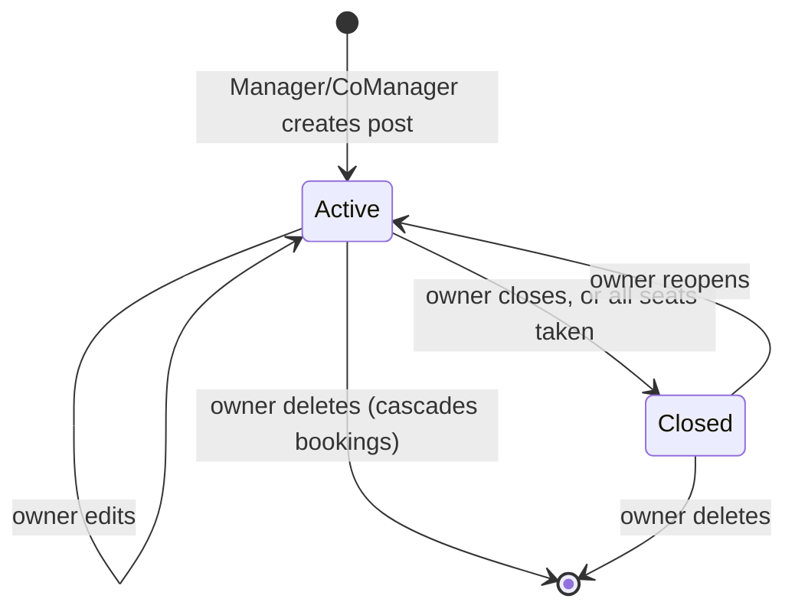

Booking lifecycle:

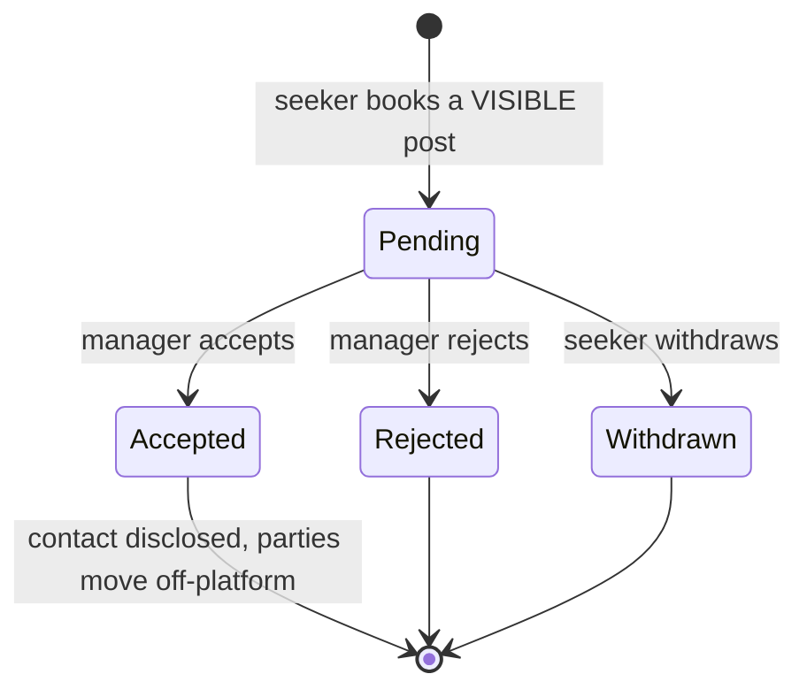

`Pending → Accepted` is the **disclosure transition** for this module. Before it, no contact detail of either party is reachable through any endpoint.

## 5.3 Eligibility matching — the authorization boundary

**This is the module's defining security requirement: a non-matching user must never receive a post in any API response, at any endpoint, under any query parameter.**

### The mechanism

A single query extension, `VisibleTo(viewer)`, is applied to `IQueryable<HousingPost>` and translated by EF Core into the SQL `WHERE` clause. It is the **only** way housing posts are read.

```csharp
// ILLUSTRATIVE SKETCH — not code to be committed from this document.
// Lives in Nestify.Api/Data/HousingPostQueryExtensions.cs
public static IQueryable<HousingPost> VisibleTo(
    this IQueryable<HousingPost> posts, ViewerContext v) =>
    posts.Where(p =>
        p.CreatedByUserId == v.UserId          // owners always see their own
     || (p.Status == PostStatus.Active
        && (p.ReqGender        == null || p.ReqGender == v.Gender)
        && (p.ReqOccupation    == null || p.ReqOccupation == v.Occupation)
        && (p.ReqMaritalStatus == null || p.ReqMaritalStatus == v.MaritalStatus)
        && (p.ReqMinAge        == null || v.Age >= p.ReqMinAge)
        && (p.ReqMaxAge        == null || v.Age <= p.ReqMaxAge)
        && (!p.ReqVerifiedOnly || v.IsVerified)
        && (!p.ReqStudentOnly  || v.IsStudent)));
```

`ViewerContext` is built once per request from the authenticated user — never from a query string, header, or request body. **Why:** if any part of the viewer's profile could be supplied by the caller, the filter would be self-service.

### The five rules that make it hold

| # | Rule | Why |
|---|---|---|
| 1 | `VisibleTo` is applied **inside** the `IQueryable`, before `Skip`/`Take`/`Count` | A post-fetch `.Where()` in C# would still have transferred the row out of the database, and would produce wrong page counts that reveal how many hidden posts exist |
| 2 | **Get-by-id applies the identical predicate** | This is the endpoint that gets forgotten. A detail endpoint that only checks `Status` is a complete bypass of the whole feature |
| 3 | A non-matching post returns **`404`, never `403`** | `403` confirms the post exists, which is the information the requirement is designed to withhold |
| 4 | Booking, reporting, and every other action resolves the post **through `VisibleTo`** | Otherwise a user who cannot see a post could still book it by guessing an id — and then appear in the manager's requester list |
| 5 | No query parameter, sort option, or admin flag can disable it | `includeAll`-style parameters are the classic bypass. None exists |

**Why an owner bypass exists in rule 1's predicate:** a manager may legitimately post "female students only" while being neither. Without the `CreatedByUserId == v.UserId` clause the owner could not see or edit their own listing. The bypass is safe because it discloses a post only to the person who wrote it.

**Enforcement across the team:** the `NestifyDbContext` exposes housing posts only through a repository method that already applies `VisibleTo`; there is no public `DbSet<HousingPost>` for controllers to reach. **Why:** making the safe path the only available path is more reliable than a code-review convention across four developers.

## 5.4 Area filtering

Seekers filter by `divisionId`, `districtId`, or `upazilaId`. Filtering happens in SQL against `housing_posts.UpazilaId` (denormalized from the house at post creation), joining up to `districts`/`divisions` for the coarser levels. `ix_posts_area_active` covers the common case.

Area filtering is a **convenience filter**, not a security boundary — unlike eligibility. Both are applied in the same query, but only eligibility is a correctness requirement.

## 5.5 The Bangladesh area hierarchy

### Dataset — verified

| Field | Value |
|---|---|
| Repository | [`nuhil/bangladesh-geocode`](https://github.com/nuhil/bangladesh-geocode) |
| **License** | **MIT** — `LICENSE` file reads "The MIT License (MIT) — Copyright (c) 2014 Nuhil Mehdy". Verified by fetching the file |
| Popularity | ~710 stars |
| Divisions | `https://raw.githubusercontent.com/nuhil/bangladesh-geocode/master/divisions/divisions.json` — **verified, 8 records** |
| Districts | `https://raw.githubusercontent.com/nuhil/bangladesh-geocode/master/districts/districts.json` — **verified, 64 records** |
| Upazilas | `https://raw.githubusercontent.com/nuhil/bangladesh-geocode/master/upazilas/upazilas.json` — **verified, 494 records** |
| Provenance | The README credits `bangladesh.gov.bd`, `wikipedia.org`, and `maps.google.com` |
| Coverage gap | **Metropolitan Thanas are absent** — the file contains upazilas only (§13, D-03) |

All three URLs were fetched and confirmed to return the JSON described below. The MIT license permits redistribution with attribution, so the files may be vendored into the repository.

### The JSON shape — and its trap

These files are **phpMyAdmin exports**, not plain arrays. The top level is an array whose first three elements are metadata and whose **fourth element** carries the rows under a `data` key:

```json
[
{"type":"header","version":"4.8.5","comment":"Export to JSON plugin for PHPMyAdmin"},
{"type":"database","name":"bd_geo_code"},
{"type":"table","name":"districts","database":"bd_geo_code","data":
[
{"id":"1","division_id":"1","name":"Comilla","bn_name":"কুমিল্লা","lat":"23.4682747","lon":"91.1788135","url":"www.comilla.gov.bd"},
{"id":"2","division_id":"1","name":"Feni","bn_name":"ফেনী","lat":"23.023231","lon":"91.3840844","url":"www.feni.gov.bd"}
]
}
]
```

Two gotchas that will otherwise cost an afternoon:

1. **Deserializing straight into `List<District>` fails.** Navigate with `JsonDocument` to `root[3].GetProperty("data")`, then deserialize that element.
2. **Every id and coordinate is a quoted string**, not a number — `"id":"1"`, `"lat":"23.4682747"`. Parse with `int.Parse` / `decimal.Parse` using `CultureInfo.InvariantCulture`. **Why invariant culture matters:** on a machine with a Bangla or European locale, `decimal.Parse("23.468")` can read the dot as a group separator and silently produce `23468`.

Field maps: divisions → `id, name, bn_name, url`; districts → `id, division_id, name, bn_name, lat, lon, url`; upazilas → `id, district_id, name, bn_name, url`. The `url` field is discarded.

### Decision: seeded PostgreSQL tables, not a static client JSON asset

**Decision — seed `divisions`, `districts`, `upazilas` into PostgreSQL from JSON files embedded in `Nestify.Api`.**

**Why:**

| Reason | Detail |
|---|---|
| Referential integrity | `houses.UpazilaId`, `housing_posts.UpazilaId`, `domestic_helper_profiles.UpazilaId`, and `marketplace_items.UpazilaId` are foreign keys. A client-side JSON file cannot make the database reject an invalid area id |
| The filter runs in SQL anyway | Area filtering is a `WHERE`/join on the server. The rows must exist server-side regardless, so a client-side copy would be a *second* source of truth |
| Cost is negligible | 8 + 64 + 494 = **566 rows**, seeded once |
| Corrections are deployable | A dataset fix is a migration, not a client rebuild |

The rejected alternative — shipping the JSON in `wwwroot` and populating dropdowns purely client-side — is faster to build and needs no seeding, but leaves area ids unvalidated on write. That is not acceptable for a column other modules filter on.

### Where deserialization happens

**At seed time, on the server, once.** The three JSON files are added to `Nestify.Api/Data/Seed/` as `<EmbeddedResource>`. An `IHostedService` runs on startup, checks `if (!await db.Divisions.AnyAsync())`, and if empty parses and inserts all 566 rows in one transaction, ordered divisions → districts → upazilas to satisfy foreign keys.

**Why embedded resources rather than fetching from GitHub at runtime:** a demo must not depend on network access to a third-party repository, and a startup that silently succeeds with zero areas because GitHub was slow is a bad failure mode. **Why a seeder rather than EF's `HasData`:** 566 rows in `HasData` produce a 566-row migration file that makes every future migration diff unreadable, and any dataset correction rewrites it.

### Caching strategy

| Layer | Mechanism | Rationale |
|---|---|---|
| Server | `IMemoryCache`, populated on first request, **no expiry** | The data is immutable between deployments. An expiry would only add cache-miss latency for no correctness gain |
| HTTP | `Cache-Control: public, max-age=86400` on all three area endpoints | The browser answers repeat cascades without touching the network |
| Client | A scoped `AreaService` holds divisions for the session; districts and upazilas are memoized per parent id | Selecting a division a second time is instant |
| Invalidation | Process restart | Reference data changes only on deployment, so a restart is a sufficient and honest invalidation strategy |

**Why not cache the whole tree in one payload:** 494 upazilas is roughly 40 KB of JSON that most users never need past their own district. Three cascading calls, each cached for a day, is less total transfer and simpler code.

### Cascading dropdowns

Division select → on change, load districts for that division and clear the two lower levels → district select → on change, load upazilas → upazila select. Lower levels are disabled until their parent is chosen. The same component is reused by M1 (post creation, post filtering), M2 (helper registration and search), and M4 (item posting and search). **Why one shared component:** four independent implementations of the same cascade is four places for the "clear the child selection" bug to live.

## 5.6 Reporting

`POST /api/v1/reports` with `TargetType = HousingPost`. The target is resolved **through `VisibleTo`** — a post the reporter cannot see returns `404`. **Why:** without this, the report endpoint becomes an existence oracle that leaks exactly what eligibility filtering hides.

## 5.7 Security considerations

- **Eligibility is enforced in the query, in every read path including get-by-id** (§5.3). Controllers cannot reach an unfiltered `DbSet<HousingPost>`.
- **Non-matching and non-existent are indistinguishable** — both return `404`.
- **Booking requester details are visible only to Manager/CoManager of the specific house owning that post**, resolved by joining post → house → membership in one query. A manager of a different house gets `404`.
- **Contact details appear only on `Accepted` bookings**, and only through `/bookings/{id}/contact`. `BookingRequesterDto` has no contact property (§11.4.3).
- **Ownership on edit and delete** is `WHERE Id = @id AND CreatedByUserId = @me`. The update DTO omits `HouseId` and `CreatedByUserId`, so a post cannot be reparented to a house the caller does not manage.
- **Booking spam** is capped by the partial unique index `ux_booking_open` plus the `booking-create` rate limit.
- **Area ids are foreign keys**, so a forged `upazilaId` fails at the database rather than creating an unreachable post.
- **Seeding is idempotent** and runs only against an empty table, so a restart cannot duplicate reference rows.

---

# 6 — M2 · Domestic help (Khala/Bua) directory

## 6.1 Module summary

Domestic helpers self-register with an area from the cascading dropdown, latitude/longitude coordinates, and service details (which services, availability window, monthly rate). Clients browse and filter, request an engagement, and — only after a real engagement completes — may leave one review.

## 6.2 Helper registration

A user creates a `domestic_helper_profiles` row for themselves; `UserId` is taken from the token, and the unique index means one profile per account. On creation the account is additionally granted the `DomesticHelper` global role.

Coordinates are required in addition to the upazila. **Why both:** the upazila drives the same cascading dropdown and the same indexed area filter as M1, so helpers and housing are searchable the same way; coordinates allow a distance sort within a dense upazila, where "Dhanmondi" alone is not a useful location. Coordinate capture method is D-10.

## 6.3 Engagement lifecycle — the verifiable service record

The brief's requirement — *only a user who actually received service from that specific helper may review them* — needs a record that neither party can fabricate alone. That record is `service_engagements`.

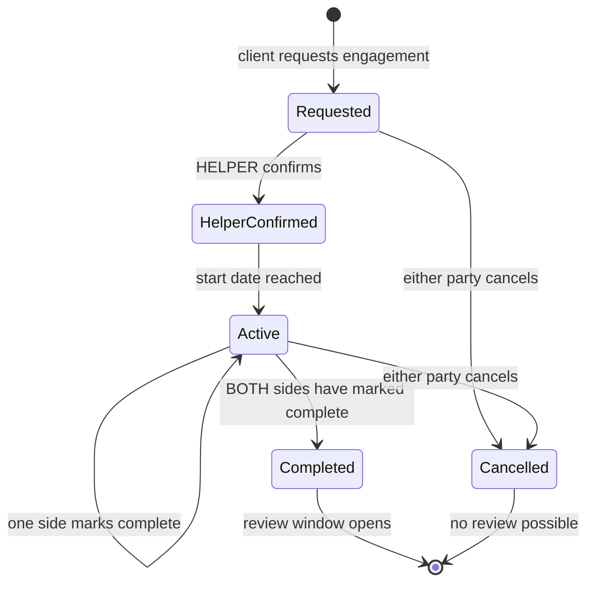

| Transition | Who | Effect |
|---|---|---|
| `→ Requested` | Client | Row created. Nothing is disclosed |
| `Requested → HelperConfirmed` | **Helper only** | **Disclosure transition** — contact unlocks both ways |
| `HelperConfirmed → Active` | Server, on `StartDate` | |
| `Active → Completed` | **Both parties**, independently | `ClientCompletedAtUtc` and `HelperCompletedAtUtc` are set separately; the server sets `CompletedAtUtc` and `Status = Completed` **only when both are non-null** |
| `→ Cancelled` | Either | Permanently closes the review path |

**Why completion requires both sides:** if a client alone could mark an engagement complete, the entire review gate collapses — anyone could request an engagement with any helper, self-complete it, and post a review. Requiring the helper's confirmation to start *and* both parties to finish means a review can only exist where two accounts independently attested to a real arrangement.

**The remaining honest weakness:** two colluding accounts can manufacture an engagement and therefore a review. This is not solvable without payment or identity proof, and is mitigated rather than eliminated — by verification gating engagement creation, by rate limits, and by the report queue. It is stated here so the answer exists in the viva rather than being discovered by the examiner.

## 6.4 Review eligibility — the five server-side checks

`POST /api/v1/engagements/{engagementId}/review` runs all five. Every one is server-side; the client's identical checks are cosmetic.

| # | Check | Failure |
|---|---|---|
| 1 | The engagement exists **and** `ClientUserId = @me` | `404` — a stranger's engagement id reveals nothing |
| 2 | `Status = Completed` **and** `CompletedAtUtc IS NOT NULL` | `409` — no review without a completed engagement |
| 3 | The engagement's helper's `UserId ≠ @me` | `403` — **no self-review** |
| 4 | No `helper_reviews` row exists for this `ServiceEngagementId` | `409` from `ux_review_engagement` — **one review per engagement** |
| 5 | `HelperProfileId` on the review is taken **from the engagement**, never from the request body | Prevents attaching a legitimate engagement's review to a different helper |

**Why check 5 matters more than it looks:** without it, a client with one real engagement could post unlimited reviews against arbitrary helpers by varying a body field. The request DTO therefore contains only `Rating` and `Comment` — the helper is not addressable by the caller at all.

The rating aggregate on `domestic_helper_profiles` is recomputed inside the same transaction as the insert, so `AverageRating` and `ReviewCount` cannot drift from the review rows.

## 6.5 Browse and filter

Filters: area (division/district/upazila cascade), service type, maximum monthly rate, minimum rating. Sort by rating, rate, or distance. Covered by `ix_helper_area_active` and `ix_helper_rating`.

## 6.6 Security considerations

- **Raw coordinates are never returned in list or detail responses.** `HelperListDto` and `HelperDetailDto` expose the upazila name and a coarse distance band ("within 2 km"). Exact lat/long is disclosed only through `/engagements/{id}/contact` after helper confirmation. **Why:** domestic helpers are a vulnerable population; a public endpoint returning a searchable list of women's home coordinates is a physical-safety problem, not a privacy nicety.
- **Contact disclosure requires helper confirmation** — the helper decides, and the client cannot force it.
- **Review integrity** rests on all five checks in §6.4, with one-review-per-engagement enforced by a database unique index rather than a service-layer check.
- **No self-review**, and the reviewed helper is derived from the engagement rather than accepted from the request.
- **Review creation is rate-limited** (`review-create`, 5/day per user) on top of the per-engagement uniqueness.
- **Review text is rendered as plain text**, never through `MarkupString` (§11.5.2).
- **Helper profile edits are addressed as `/helpers/me`**, with no id in the route — the IDOR is removed by construction rather than by a check.
- **An admin can hide a review** (`IsHidden`) on an upheld report but cannot edit its text; the original is retained for audit.

---

# 7 — M3 · Shared expense & meal cost settlement

## 7.1 Module summary

Per-house tracking of who spent how much on what, in two categories — **equally split** (cylinder, bulbs, internet: divided evenly across members) and **meal-based** (grocery spending settled by meals consumed, not headcount). At month end the system computes who owes, who receives, and how much.

House roles: `Manager`, `CoManager`, `Member`. Manager and Co-Manager may edit the meal entry for any member on any date of the month. Plain Member rights are **unspecified in the brief** and are recorded as open decision **D-01** with a recommended default — they are not invented here.

## 7.2 The settlement algorithm

For a house and a period (year, month):

```
total_equal_costs   = Σ expenses WHERE Category = EqualSplit
total_meal_spending = Σ expenses WHERE Category = MealPurchase
total_meals         = Σ current meal_entries for the period
per_meal_rate       = total_meal_spending ÷ total_meals          → numeric(18,6)

for each active member m:
    m.meal_count    = Σ m's current meal entries
    m.meal_cost     = round(m.meal_count × per_meal_rate, 2)
    m.equal_share   = Σ expense_shares for m in the period
    m.contributions = Σ contributions for m in the period
    m.net           = m.contributions − m.meal_cost − m.equal_share
```

`net > 0` → the house owes the member. `net < 0` → the member owes the house.

### Rounding — one step, one residual

`per_meal_rate` is held at **six decimal places**; each member's `meal_cost` is rounded to two **once**, at the end. Because rounding each member independently can make the rounded costs miss `total_meal_spending` by a few paisa, the difference is assigned as a `RoundingAdjustment` to a **deterministic** member: the one with the largest `meal_cost`, ties broken by ascending `UserId`.

**Why largest-cost-takes-the-residual:** the adjustment is at most a few paisa, and putting it on the largest consumer is both the smallest relative distortion and — crucially — reproducible. A settlement that produced different numbers on re-run would be indefensible in a viva.

**Why the invariant is asserted, not assumed:** before commit, the run checks `Σ net = 0`. If it does not, the transaction rolls back rather than persisting an unbalanced settlement.

### Transfer minimization

Members are split into creditors (`net > 0`) and debtors (`net < 0`), each sorted by magnitude. The largest debtor pays the largest creditor `min(|debt|, credit)`; both are reduced; repeat. This yields at most *n − 1* transfers for *n* members. **Why greedy rather than optimal:** minimal-transaction settlement is NP-hard in general, greedy already achieves *n − 1* which is the practical floor, and the code is ten lines an examiner can read.

## 7.3 Worked example

**House:** "Shanti Nibash", 4 active members. **Period:** September 2026.

| Member | House role |
|---|---|
| Rafi | Manager |
| Sadia | Co-Manager |
| Tanvir | Member |
| Nabil | Member |

### Step 1 — Equally-split expenses

| # | Description | Amount | Paid by |
|---|---|---:|---|
| 1 | Gas cylinder refill | ৳1,400.00 | Rafi |
| 2 | Light bulbs + wiring | ৳600.00 | Sadia |
| 3 | Internet bill | ৳1,150.00 | Tanvir |
| | **Total equal costs** | **৳3,150.00** | |

Equal share per member = `3,150.00 ÷ 4` = **৳787.50** each.

Check: `787.50 × 4 = 3,150.00` ✓

### Step 2 — Meal-based expenses

| # | Description | Amount | Paid by |
|---|---|---:|---|
| 4 | Groceries (1–10 Sep) | ৳4,500.00 | Rafi |
| 5 | Groceries (11–20 Sep) | ৳2,800.00 | Sadia |
| 6 | Groceries (21–30 Sep) | ৳1,900.00 | Nabil |
| | **Total meal spending** | **৳9,200.00** | |

### Step 3 — Meal counts (deliberately unequal)

| Member | Meals consumed |
|---|---:|
| Rafi | 62 |
| Sadia | 55 |
| Tanvir | 71 |
| Nabil | 45 |
| **Total meals** | **233** |

Tanvir ate at home most of the month; Nabil travelled for two weeks. This is exactly the case headcount splitting gets wrong.

### Step 4 — Per-meal rate

```
per_meal_rate = 9,200.00 ÷ 233
              = 39.4849785407…
              = ৳39.484979   (numeric(18,6), rounded once at 6 dp)
```

### Step 5 — Each member's meal cost

| Member | Meals | × rate | Exact product | Rounded (2 dp) |
|---|---:|---|---:|---:|
| Rafi | 62 | 62 × 39.484979 | 2,448.068698 | **৳2,448.07** |
| Sadia | 55 | 55 × 39.484979 | 2,171.673845 | **৳2,171.67** |
| Tanvir | 71 | 71 × 39.484979 | 2,803.433509 | **৳2,803.43** |
| Nabil | 45 | 45 × 39.484979 | 1,776.824055 | **৳1,776.82** |
| | **233** | | | **৳9,199.99** |

**Rounding residual:** `9,200.00 − 9,199.99 = ৳0.01`.

Applied to the largest meal cost — Tanvir:

> Tanvir's meal cost `2,803.43 + 0.01` = **৳2,803.44**, with `RoundingAdjustment = 0.01` recorded on his settlement line.

New total: `2,448.07 + 2,171.67 + 2,803.44 + 1,776.82 = 9,200.00` ✓ — exactly the meal spending, no paisa created or destroyed.

### Step 6 — Contributions

Every taka anyone paid out of pocket, from both categories:

| Member | Equal-split paid | Meal paid | **Total contribution** |
|---|---:|---:|---:|
| Rafi | 1,400.00 | 4,500.00 | **৳5,900.00** |
| Sadia | 600.00 | 2,800.00 | **৳3,400.00** |
| Tanvir | 1,150.00 | 0.00 | **৳1,150.00** |
| Nabil | 0.00 | 1,900.00 | **৳1,900.00** |
| | | | **৳12,350.00** |

Cross-check: total contributions must equal total costs.
`3,150.00 (equal) + 9,200.00 (meal) = 12,350.00` ✓

### Step 7 — Net position

`net = contributions − meal_cost − equal_share`

| Member | Contributions | − Meal cost | − Equal share | **Net** |
|---|---:|---:|---:|---:|
| Rafi | 5,900.00 | 2,448.07 | 787.50 | **+৳2,664.43** |
| Sadia | 3,400.00 | 2,171.67 | 787.50 | **+৳440.83** |
| Tanvir | 1,150.00 | 2,803.44 | 787.50 | **−৳2,440.94** |
| Nabil | 1,900.00 | 1,776.82 | 787.50 | **−৳664.32** |

Line by line:

```
Rafi   : 5,900.00 − 2,448.07 = 3,451.93 ; 3,451.93 − 787.50 = +2,664.43
Sadia  : 3,400.00 − 2,171.67 = 1,228.33 ; 1,228.33 − 787.50 =   +440.83
Tanvir : 1,150.00 − 2,803.44 = −1,653.44; −1,653.44 − 787.50 = −2,440.94
Nabil  : 1,900.00 − 1,776.82 =   123.18 ;   123.18 − 787.50 =   −664.32
```

**Balance invariant:**
```
+2,664.43 + 440.83 − 2,440.94 − 664.32
= 3,105.26 − 3,105.26
= 0.00   ✓
```

The run commits only because this is exactly zero.

### Step 8 — Settlement transfers

Creditors: Rafi +2,664.43, Sadia +440.83. Debtors: Tanvir −2,440.94, Nabil −664.32.

| # | From (owes) | To (receives) | Amount | Running state |
|---|---|---|---:|---|
| 1 | Tanvir | Rafi | ৳2,440.94 | Tanvir settled; Rafi still owed 2,664.43 − 2,440.94 = 223.49 |
| 2 | Nabil | Rafi | ৳223.49 | Rafi settled; Nabil still owes 664.32 − 223.49 = 440.83 |
| 3 | Nabil | Sadia | ৳440.83 | Nabil settled; Sadia settled |

Three transfers for four members — the *n − 1* minimum.

Verification: Rafi receives `2,440.94 + 223.49 = 2,664.43` ✓ · Sadia receives `440.83` ✓ · Tanvir pays `2,440.94` ✓ · Nabil pays `223.49 + 440.83 = 664.32` ✓

### What the example demonstrates

| Requirement | Where |
|---|---|
| Unequal meal counts | Step 3 — 62 / 55 / 71 / 45 |
| At least two equally-split bills | Step 1 — three bills |
| Meal settlement by consumption, not headcount | Tanvir ate 71 meals and pays ৳2,803.44 while Nabil ate 45 and pays ৳1,776.82 — a headcount split would have charged both ৳2,300.00 |
| Rounding handled deterministically | Steps 4–5 — the ৳0.01 residual and its assignment rule |
| Positive net = house owes the member | Rafi, Sadia |
| Negative net = member owes the house | Tanvir, Nabil |
| Auto-computed final settlement | Step 8 |

## 7.4 Transactional integrity

Finalization runs in one `Serializable` transaction:

1. Open the transaction.
2. Re-read every expense, current meal entry, and contribution for the period.
3. Compute rate, per-member costs, residual assignment, nets, transfers.
4. **Assert `Σ net = 0`** — roll back on failure.
5. Insert `settlement_runs` (`Status = Finalized`), `settlement_lines`, `settlement_transfers`.
6. Commit.

**Why `Serializable` and not the default `ReadCommitted`:** the computation reads a set of rows and then writes a summary asserting a property of that set. Under `ReadCommitted`, a concurrent expense insert between steps 2 and 5 produces a persisted settlement that does not match the data it claims to summarize. On PostgreSQL error `40001` (serialization failure) the operation is retried once, then surfaced as `409`.

The `ux_settlement_finalized` partial unique index makes double-finalization a database error rather than a race.

**Once a period is finalized, writes to that period are rejected with `409`.** Corrections require an admin-approved reopen (D-11) or roll into the next month as a correcting entry.

## 7.5 Concurrency on meal-sheet edits

**Scenario:** Rafi (Manager) and Sadia (Co-Manager) both open September's meal sheet and both edit Tanvir's 15 September count.

**Mechanism:** `UseXminAsConcurrencyToken()` on `MealEntry`. **Why `xmin`:** it is PostgreSQL's own row version — no extra column, no manual increment, and impossible to forget to bump.

**Flow:** `GET /meals` returns each cell with its token. `PUT /meals` sends the token for every changed cell. If any token is stale, `SaveChangesAsync` throws `DbUpdateConcurrencyException`; **nothing is written** and the API returns `409` with the current server state.

**Conflict-resolution UX:** the sheet shows only the conflicting cells:

> *15 Sep · Tanvir — you entered **2**, Sadia saved **3** at 12:04.*  → **[ Keep mine ]  [ Keep theirs ]**

The user resolves each cell and resubmits with fresh tokens; unaffected edits are preserved.

**Why not last-write-wins:** a silently discarded edit to a financial record is exactly the bug nobody notices until settlement is wrong, and the audit trail would show a change nobody remembers making.

## 7.6 Append-only ledger

| Record | Mutation policy |
|---|---|
| `expenses` | Never updated or deleted. A correction inserts a row with the negated `Amount` and `CorrectsExpenseId` set |
| `contributions` | Same, via `CorrectsContributionId` |
| `meal_entries` | Never updated. An edit inserts a new row with `SupersedesMealEntryId`; the current value is the greatest `RecordedAtUtc` for `(HouseId, UserId, MealDate)` |
| `settlement_runs` / `_lines` / `_transfers` | Immutable once `Finalized` |
| `meal_entry_audits` | Insert only |

**Why append-only rather than `UPDATE` with an audit table:** with updates, the audit table *is* the history, and a bug or a direct `psql` edit that skips it loses the record silently. With append-only, the history *is* the data — `SUM(Amount)` over the ledger is the truth by construction, and the audit table is a convenience index over it rather than the sole witness.

Every meal edit writes a `meal_entry_audits` row capturing actor, target, date, old value, new value, timestamp, and reason — in the same transaction as the insert. Members can read the audit trail for their own house (§4.6), so a manager quietly adjusting counts is visible to everyone affected.

## 7.7 Security considerations

- **All money is `decimal` in C# and `numeric` in PostgreSQL.** `float`, `double`, and `real` are banned schema-wide — binary floating point cannot represent 0.10, and a per-meal rate in `double` drifts by paisa that never reconcile (§11.6.1).
- **Settlement is atomic and `Serializable`**, with the `Σ net = 0` invariant asserted before commit.
- **Optimistic concurrency via `xmin`** on meal entries and settlement runs, with a defined 409 conflict UX (§7.5).
- **Append-only ledger with correcting entries**; no historical financial row is ever mutated (§7.6).
- **Full audit trail** of who changed which member's meal count, when, from what to what — readable by every member of the house.
- **Cross-house isolation:** every M3 endpoint takes `houseId` in the route and resolves the caller's membership in the same query. A Manager of House A reading House B's expenses gets `404` (§4.5).
- **Contribution recipients are validated as active members of that house** — otherwise money can be credited to an outsider.
- **Plain Member write rights are not invented.** The matrix marks them `D-01` and §13 carries the recommended default with its security rationale.
- **Finalized periods are locked** by a partial unique index, so a settled month cannot be quietly altered.
- **Admin has no access to household financial data** (§4.6).

---

# 8 — M4 · Second-hand marketplace

## 8.1 Module summary

Any verified user posts an item for sale. An interested user clicks **Buy**, which notifies the seller; if the seller accepts, the two exchange social handles and continue outside the platform. **Report** escalates a listing to admin. A poster may edit or delete only their own listings.

M4 is deliberately the structural twin of M1: `marketplace_items` ↔ `housing_posts`, `buy_interests` ↔ `booking_requests`, seller ↔ post owner, accept ↔ accept. **Why the symmetry is worth preserving:** the interest-then-disclose pattern, the owner-only edit predicate, and the report flow are written once and reviewed once. The one deliberate asymmetry is that marketplace items have **no eligibility filtering** — everything active is visible to every authenticated user.

## 8.2 Item lifecycle

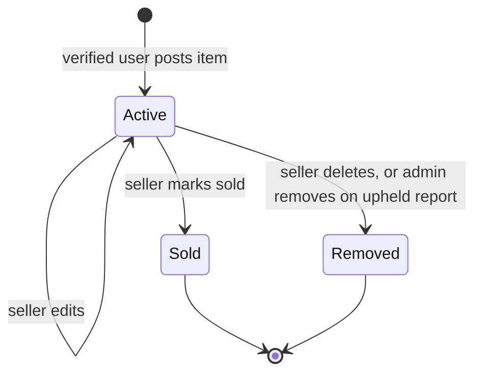

Buy-interest lifecycle:

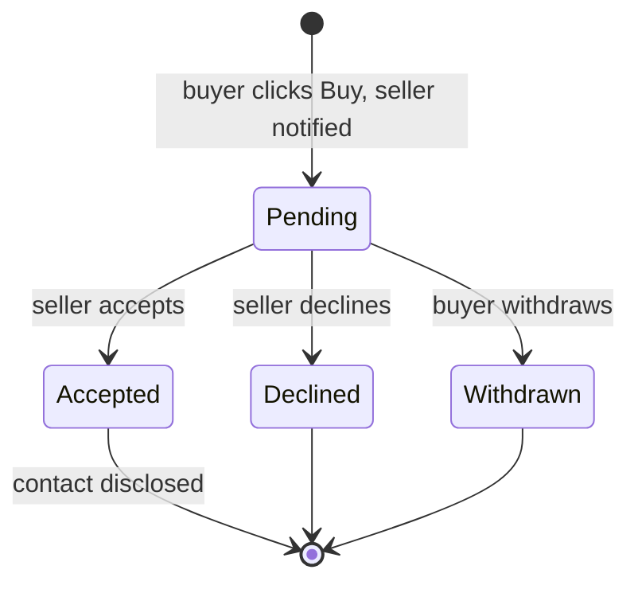

`Pending → Accepted` is this module's **disclosure transition**.

## 8.3 Browsing and filtering

Filters: area cascade (division/district/upazila), category, condition, price range. Sort by newest, price ascending, or price descending — all from an allowlisted enum, never a raw column name (§11.5.1). Only `Status = Active` items appear, plus the caller's own regardless of status. Covered by `ix_items_area_active`.

## 8.4 Buy flow

1. Buyer opens an item and clicks **Buy**, optionally with a message.
2. `POST /marketplace/items/{itemId}/buy-interests` — rejected if the buyer is the seller; `409` if an open interest already exists.
3. A `notifications` row for the seller is inserted **in the same transaction**.
4. The seller sees the interest list on their own item — buyer display name, message, timestamp, verified badge, **no contact**.
5. On **accept**, the interest moves to `Accepted`, the buyer is notified, and `/buy-interests/{id}/contact` starts returning social handles to both parties.

## 8.5 Images

Item images go through the same validated upload pipeline as verification documents (§11.5) — extension allowlist, magic-byte sniff, size cap, generated filename, EXIF strip — with two differences: images are stored under a separate public-read directory served as static files (they are meant to be seen), and malware scanning is optional for images (D-06). **Why EXIF stripping still applies to a public listing:** a phone photo of a sofa carries the GPS coordinates of the seller's home, and publishing that to every browsing user is a disclosure the seller did not intend.

## 8.6 Security considerations

- **Owner-only edit and delete** via `WHERE Id = @id AND SellerUserId = @me`. The create DTO has no seller field, and the update DTO omits `SellerUserId` and `Status`.
- **The buyer list is seller-only**, resolved by joining interest → item → seller in one query; contact appears only on `Accepted` rows.
- **Self-purchase is rejected** server-side.
- **Buy-interest spam** is capped by `ux_buy_open` plus the `buy-interest` rate limit, which together also cap notification flooding of a seller (§11.6.4).
- **Report** uses the shared endpoint with `ux_report_once`, so a user can report a listing once.
- **Free text** (`Title`, `Description`, buy-interest `Message`) is rendered as plain text; `MarkupString` is never used (§11.5.2).
- **EXIF is stripped from every uploaded image** before storage, and images are re-encoded rather than trusted.
- **Price is never overwritten by the ML suggestion** (§10.8) — the model advises, the seller decides.

---

# 9 — M5/M6 · Verification & admin

## 9.1 Module summary

**M5:** users (students, job holders) and domestic helpers submit identity documents to apply for verification; an admin approves or rejects. **M6:** admin manages the verification queue and the report queue across all modules.

## 9.2 Verification flow

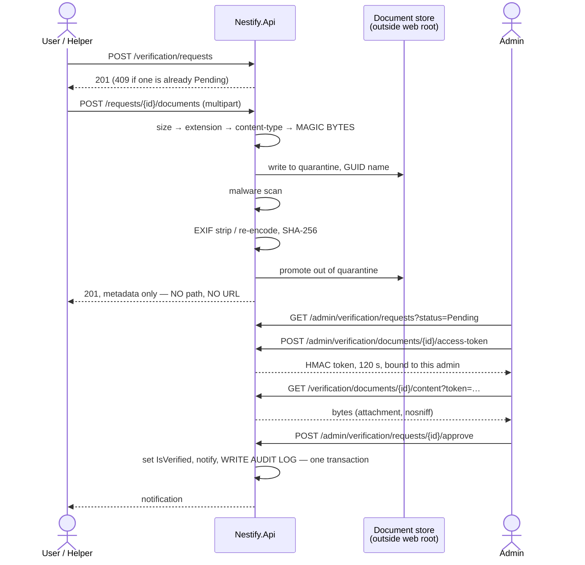

```mermaid
stateDiagram-v2
    [*] --> Pending: user submits request + documents
    Pending --> Approved: admin approves
    Pending --> Rejected: admin rejects with reason
    Approved --> [*]: IsVerified = true; documents purged after retention
    Rejected --> [*]: user may resubmit; documents purged after retention
```

One open request per user, enforced by `ux_verification_one_open`. On approval the server sets `AppUser.IsVerified = true` (and `domestic_helper_profiles.IsVerified` for a helper subject), inserts a notification, and writes an `admin_audit_logs` row — all in one transaction. **Why one transaction:** an approval that grants the flag but loses the audit row is an untraceable privilege grant.

## 9.3 Admin queues

| Queue | Endpoint | Ordering | Actions |
|---|---|---|---|
| Verification | `GET /admin/verification/requests?status=Pending` | Oldest first | Approve · Reject with reason · View document |
| Reports | `GET /admin/reports?status=Open` | Oldest first, distinct-reporter count shown | Dismiss · Hide content · Remove content · Ban user |

Report resolution actions and their effects:

| Action | Effect |
|---|---|
| `Dismiss` | `Status = Dismissed`, no change to the target |
| `HideContent` | `helper_reviews.IsHidden = true` — for reviews only |
| `RemoveContent` | `Status = Removed` on the housing post, item, or helper profile |
| `BanUser` | `AppUser.IsBanned = true` **and every refresh-token family for that user is revoked** |

**Why banning must revoke tokens:** without revocation the banned user keeps working until their access token expires, and their refresh token keeps minting new ones indefinitely. The `IsBanned` flag alone is cosmetic.

Every action writes `admin_audit_logs` with `Action`, `TargetType`, `TargetId`, before/after state, admin id, IP, and timestamp — in the same transaction as the action itself.

## 9.4 Document retention

| Stage | Policy |
|---|---|
| While `Pending` | Bytes retained, readable only via signed URL by an admin |
| After a decision | Bytes retained **30 days**, then unlinked by the maintenance job |
| After purge | Row retained with `DeletedAtUtc` and `Sha256Hash`; the content endpoint returns `410 Gone` |
| Metadata | Never deleted — decision, admin, timestamp, and hash keep the decision provable |

**Why 30 days and not indefinite:** these are national ID and passport scans. Holding them after the decision they were collected for creates ongoing breach exposure with no operational benefit. **Why not immediate deletion:** an approval disputed a week later needs the evidence. Thirty days is recorded as D-07 so the team can change it deliberately.

## 9.5 Security considerations

- **The full upload pipeline** — size cap, extension allowlist, declared content-type check, magic-byte sniff, quarantine, malware scan, EXIF strip, hash, promote — is specified in §11.5 and is mandatory for every verification document.
- **Documents are stored outside the web root** and are unreachable by any URL. There is no static-file middleware over that directory, and `verification_documents` has no column capable of holding a path.
- **Access requires a 120-second HMAC token bound to both the document id and the requesting admin's id**, on top of the `Admin` policy — a leaked URL is useless within two minutes and useless to a different admin immediately.
- **Upload responses contain metadata only** — no path, no URL, no storage key.
- **`ux_verification_one_open`** prevents queue flooding with parallel requests; `upload-document` rate-limits document submission.
- **Only an admin can set `IsVerified`.** The profile update DTO omits it, so self-verification is not expressible.
- **There is no self-service path to the `Admin` role** (§4.2).
- **Banning revokes all refresh-token families** so the ban takes effect immediately.
- **Every admin action is audit-logged in the same transaction as the action**, and `UPDATE`/`DELETE` on `admin_audit_logs` are revoked from the application database role (§11.9.5).
- **Document bytes, filenames, and storage paths are never logged** (§11.10.2).
- **Report targets are validated through the caller's own visibility**, so the report endpoint cannot be used to probe for hidden resources (§5.6).

---

# 10 — ML component — owner: Ishmam

> **Ownership.** This is the only part of the plan assigned to an individual: the ML component is owned by **Ishmam**. Everything else in this document is a single unified plan with no per-developer allocation.

## 10.1 Candidate evaluation

Five placements were considered. Scores are 1–5, higher is better; **Impl. risk** is scored inverted so that 5 = lowest risk.

| # | Candidate | Module | Label source | Training data from our own tables | Demo impact | Impl. risk (5 = safest) | Total |
|---|---|---|---|---|:--:|:--:|:--:|
| **1** | **Item price suggestion** | M4 | `marketplace_items.AskingPrice` | **5** | 4 | **5** | **14** |
| 2 | Domestic-helper ranking | M2 | Engagement occurred + review rating | 2 | 5 | 2 | 9 |
| 3 | Housing match / roommate compatibility | M1 | `booking_requests.Status = Accepted` | 2 | 4 | 2 | 8 |
| 4 | Report triage | M6 | `reports.Status` (ActionTaken vs Dismissed) | 2 | 3 | 3 | 8 |
| 5 | Next-month meal-cost forecast | M3 | Next period's `PerMealRate` | 1 | 2 | 4 | 7 |

### Why each scored as it did

**1 · Item price suggestion — 5 / 4 / 5.** Every single item post is one fully-labelled training row, produced by ordinary use with **zero admin effort and zero waiting for a second party**. Features are structured columns already in `marketplace_items` (category, condition, age, area) — no text embeddings, no image models. Tabular regression is the best-supported scenario in ML.NET. The failure mode is soft: a poor suggestion is ignored, unlike a poor moderation decision.

**2 · Domestic-helper ranking — 2 / 5 / 2.** The best demo in the set, and the README already promises it. But its label requires a *completed two-sided engagement plus a review* — the rarest event in the system. In a semester the table will hold seed data and a handful of demo rows. Ranking also needs implicit-feedback handling that ML.NET does not make easy.

**3 · Housing match — 2 / 4 / 2.** Label is booking acceptance, which needs both a booking and a manager decision. Worse, eligibility filtering already removes most negative examples, so the training set is severely biased toward matches — a subtle problem that would take longer to explain than to build.

**4 · Report triage — 2 / 3 / 3.** Labels come free from admin decisions, but only if reports exist and admins resolve them — neither happens organically in a student project. Text featurization is straightforward in ML.NET, but a wrong prediction touches moderation, where errors are costly.

**5 · Meal-cost forecast — 1 / 2 / 4.** Needs months of settled history per house; a semester yields perhaps three data points per house. Technically trivial, demonstrably useless.

## 10.2 Selection

**Primary: #1, marketplace item price suggestion.**

**Why:** it is the only candidate whose training data accumulates from ordinary single-user actions rather than from a completed two-party interaction. The other four all depend on an event (a confirmed engagement, an accepted booking, a resolved report, a settled month) that a semester-long student project will produce in single digits. A model that cannot be trained cannot be demoed, and a demo that only works on hand-seeded rows is not defensible in a viva.

**Fallback: #2, domestic-helper ranking**, implemented as a deterministic weighted score (rating, review count, distance, rate, verification status) with no trained model. It is listed as the fallback because it is the highest-impact demo, and because a transparent weighted score is genuinely a reasonable answer to that problem — the ML model would have to earn its place against it.

## 10.3 Serving path — ML.NET vs Python → ONNX

**Decision: ML.NET, in-process in `Nestify.Api`.**

| | ML.NET | Python-trained → ONNX Runtime |
|---|---|---|
| Toolchain | One — .NET | Two — Python + .NET |
| Training location | Inside the API project, reads EF Core directly | Separate script; needs an export path out of PostgreSQL |
| Serving | `AddPredictionEnginePool<TIn,TOut>()`, thread-safe, one line | `Microsoft.ML.OnnxRuntime`, manual tensor marshalling |
| Reproducibility at viva | `dotnet run` | Requires a working Python environment on the demo machine |
| Model quality for tabular regression | FastTree/LightGBM — competitive | Marginally better with more tuning |
| Team skill fit | Same language as everything else | Context-switching cost |

**Why ML.NET:** the quality gap on a tabular regression with a few thousand rows is negligible, and the cost of the alternative is a second toolchain that must be reproducible on whatever machine the viva runs on. "The model works, but only on my laptop with the right Python version" is a failure mode worth engineering away.

## 10.4 Features

All available at post time. **No feature derived from post-publication behaviour** (views, days listed, whether it sold) — those leak the future and would inflate offline metrics while degrading live suggestions.

| Feature | Source | Transform |
|---|---|---|
| `CategoryId` | `marketplace_items.CategoryId` | One-hot |
| `Condition` | `marketplace_items.Condition` | One-hot (5 levels) |
| `AgeMonths` | `marketplace_items.AgeMonths` | Numeric; median-imputed when null, with a `HasAge` indicator |
| `DistrictId` | `upazilas → districts` | One-hot (64) — district, not upazila, to avoid 494 sparse columns |
| `IsMetropolitan` | `upazilas.IsMetropolitanThana` | Boolean |
| `TitleWordCount` | Derived | Numeric — a proxy for description effort |
| `DescriptionLength` | Derived | Numeric |
| `ImageCount` | `marketplace_item_images` | Numeric |
| `SellerIsVerified` | `asp_net_users.IsVerified` | Boolean |

## 10.5 Label

`marketplace_items.AskingPrice`, `numeric(18,2)`.

**Stated honestly:** this predicts the **asking** price a seller would set, not the price an item sells for. The model learns community pricing convention, which is exactly what a "suggest a price" feature should offer a first-time seller — but it is not a market-value estimator, and claiming otherwise in a viva would be wrong.

**Upgrade path:** when `buy_interests` reaches `Accepted`, capture an optional agreed `SoldPrice` on the item and retrain on that where present. Recorded as D-14; not built now, because it depends on the two-party event that disqualified the other candidates.

Rows with `Status = Removed`, `AskingPrice = 0`, or a price beyond the 1st/99th percentile of their category are excluded. **Why trim the tails:** a single ৳9,999,999 typo drags a regression's predictions across the whole category.

## 10.6 Training pipeline

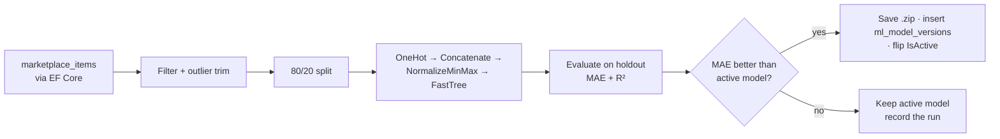

Triggered by `POST /api/v1/admin/ml/retrain` (Admin only, `409` if a run is in progress). Runs on a background task; the endpoint returns `202`. **Why an admin trigger and not a scheduled job:** it is one dependency less, it is demoable on demand in the viva, and the data does not change fast enough to need a schedule.

**A new model is promoted only if its holdout MAE beats the active model's.** **Why:** automatic promotion of every run means a bad training set silently degrades the live feature, and the demo would then depend on which retrain ran last.

Metrics recorded per run in `ml_model_versions`: `TrainingRowCount`, `MeanAbsoluteError`, `RSquared`, `TrainedAtUtc`, `StoredFileName`.

## 10.7 Cold start and the deterministic fallback

The feature **must** work on day one, with an empty database. It therefore has two independent implementations, and the rule-based one is built **first** (Milestone 10).

**The model is used only when both hold:** an active `ml_model_versions` row exists, **and** `TrainingRowCount ≥ 200`. Otherwise the rule path answers.

### The deterministic rule-based fallback

Pure SQL, no model, always available, same response contract:

| Tier | Rule | Condition |
|---|---|---|
| 1 | Median `AskingPrice` of items with the **same category and same condition**, posted in the last 180 days | ≥ 5 such items |
| 2 | Median `AskingPrice` of the **same category, any condition**, last 180 days, multiplied by a fixed condition factor — New 1.00 · LikeNew 0.85 · Good 0.70 · Fair 0.50 · Poor 0.30 | ≥ 5 such items |
| 3 | The category's seeded `DefaultPriceLow`/`DefaultPriceHigh` midpoint | always |

The range comes from `percentile_cont(0.25)` and `percentile_cont(0.75)` over the same set; at tier 3 it is the seeded band.

**Why median and not mean:** one mispriced listing moves a mean materially and a median barely at all — which is the same robustness argument that drove the outlier trim in training.

**Why the fallback is built first:** it makes the feature demoable in Milestone 10 before any model exists, it gives the model a baseline to beat, and it guarantees the viva demo works even if the model underperforms — which is precisely what the brief requires.

## 10.8 Inference API contract

`POST /api/v1/ml/price-suggestion` · policy `Authenticated` · rate limit `ml-price` (30/hour/user)

**Request — `PriceSuggestionRequestDto`**

| Field | Type | Required | Validation |
|---|---|:--:|---|
| `categoryId` | `int` | yes | Must exist in `marketplace_categories` |
| `condition` | `enum` | yes | 1–5 |
| `ageMonths` | `int?` | no | 0–600 |
| `upazilaId` | `int` | yes | Must exist |
| `titleWordCount` | `int` | yes | 0–50 |
| `descriptionLength` | `int` | yes | 0–5000 |
| `imageCount` | `int` | yes | 0–10 |

**Response — `PriceSuggestionResponseDto`**

| Field | Type | Meaning |
|---|---|---|
| `suggestedPrice` | `decimal` | Point estimate, `numeric(18,2)` |
| `lowerBound` / `upperBound` | `decimal` | Suggested range |
| `source` | `"model"` \| `"rule"` | **Always returned** — the UI shows "based on 23 similar listings" for `rule` |
| `modelVersion` | `int?` | Present only when `source = "model"` |
| `sampleSize` | `int?` | Comparable listings, when `source = "rule"` |
| `confidence` | `"high"` \| `"medium"` \| `"low"` | From holdout MAE relative to category median, or from tier for the rule path |

Status codes: `200` · `400` invalid input · `401` · `429`.

**There is no `503`.** **Why:** the endpoint cannot fail for lack of a model — tier 3 of the fallback always answers. An exception inside the model path is caught, logged, and answered by the rule path, so a corrupt model file degrades the suggestion rather than breaking the page.

**The suggestion never writes anything.** It is advisory: the seller's `AskingPrice` is whatever they type. **Why:** an auto-filled price the seller did not notice is a worse product and a worse demo than a visible suggestion they accept or ignore.

## 10.9 Security considerations

- **Authenticated and rate-limited** (30/hour/user). **Why rate limits on an ML endpoint specifically:** unlimited querying of a price model is model extraction, and it is also the cheapest way to load-test the server by accident.
- **The response exposes no per-row training data** — only an aggregate estimate and a sample count. No listing id, seller, or individual price is ever returned.
- **Every input field is validated** against the same DataAnnotations rules as item creation; `categoryId` and `upazilaId` must resolve to real rows. Feature values are clamped to their training ranges before inference. **Why clamping:** an absurd `ageMonths` extrapolates a tree model into nonsense, and echoing nonsense back with a "confidence" label is worse than clamping.
- **Retraining is `Admin`-only** and is `409`-guarded against concurrent runs. An open retrain endpoint is a CPU-exhaustion primitive.
- **The model file is stored outside the web root** and is never served over HTTP.
- **Training reads only non-PII columns.** No user id, name, email, or contact detail enters a feature vector.
- **The model is advisory and never writes to `marketplace_items`**, so a compromised or degraded model cannot alter listing data.
- **The rule fallback is pure parameterized SQL** through EF Core — no string concatenation, no dynamic column names (§11.5.1).

---

# 11 — Security

> **No credential, key, connection string, or secret value appears anywhere in this document.** Only configuration *key names* are used. Every mechanism below names the concrete ASP.NET Core, EF Core, or PostgreSQL feature that implements it.

## 11.1 Authentication

### 11.1.1 ASP.NET Core Identity configuration

`AddIdentityCore<AppUser>()` + `.AddRoles<AppRole>()` + `.AddEntityFrameworkStores<NestifyDbContext>()` + `.AddDefaultTokenProviders()`. **Why `AddIdentityCore` rather than `AddIdentity`:** `AddIdentity` registers cookie authentication schemes and sets the default scheme to cookies, which silently conflicts with the JWT bearer scheme this API needs.

| Option | Value | Why |
|---|---|---|
| `Password.RequiredLength` | 10 | Length contributes more entropy than character-class rules |
| `Password.RequireDigit` / `Lowercase` / `Uppercase` | `true` | Course-project expectation; kept |
| `Password.RequireNonAlphanumeric` | `false` | Composition rules past a length floor push users toward `Password1!` patterns |
| `User.RequireUniqueEmail` | `true` | Email is the login identifier |
| `SignIn.RequireConfirmedEmail` | `false` for the demo, `true` in production (D-13) | Unconfirmed-email login is acceptable for a viva demo, not for real users |

### 11.1.2 Password hashing

ASP.NET Core Identity's `PasswordHasher<AppUser>` with `PasswordHasherCompatibilityMode.IdentityV3` — **PBKDF2-HMAC-SHA256, 128-bit salt, 256-bit subkey**, at the .NET 8+ default of **100,000 iterations**. The iteration count is set **explicitly** in `PasswordHasherOptions.IterationCount` rather than left implicit. **Why explicit:** an auditable, greppable number that a framework upgrade cannot silently change, and a value the team can defend in a viva instead of saying "whatever the default is".

Argon2id would be stronger, but it is not in the framework and would add a dependency and a custom `IPasswordHasher<T>`. Identity's PBKDF2 at 100,000 iterations is the boring, well-documented option and is adequate here.

### 11.1.3 Account-enumeration prevention

The rule: **an unauthenticated caller must not be able to determine whether an email is registered** — on login, registration, or password reset.

| Endpoint | Behaviour | The leak it closes |
|---|---|---|
| **Login** | Always `401` with the identical `ProblemDetails` body for unknown email, wrong password, and locked account. When the user is not found, a **dummy `VerifyHashedPassword` against a fixed hash is still executed** | Without the dummy verification, a missing account returns in ~1 ms and a real one in ~80 ms — a timing oracle that works over the network |
| **Registration** | Always `202 Accepted` with an empty body. If the email exists, no user is created and a "someone tried to register with your address" email is sent to the existing owner instead | A `409 Conflict` on a duplicate email is a membership oracle for the whole user base |
| **Forgot password** | Always `202`, always the same latency. The token is generated and mailed only if the account exists | Same |
| **Reset password** | `400` with an identical body for expired, invalid, and already-used tokens | Distinguishing them tells an attacker which guesses were structurally valid |

Registration returning `202` means the client cannot say "that email is taken". The UI instead says "If that address is new, check your inbox." **Why this trade is worth making:** the alternative hands an attacker a free user-enumeration API against a platform holding national ID scans.

### 11.1.4 Lockout

`Lockout.MaxFailedAccessAttempts = 5`, `Lockout.DefaultLockoutTimeSpan = 15 minutes`, `Lockout.AllowedForNewUsers = true`. Sign-in uses `CheckPasswordSignInAsync(user, password, lockoutOnFailure: true)`. **Why the `lockoutOnFailure` argument matters:** `CheckPasswordAsync` — the method people reach for — does not increment the failure counter, so the lockout configuration silently does nothing.

Lockout complements but does not replace the `auth-login` rate limiter (§11.6.5): lockout is per account and defends one user against a password-guessing attack; the rate limiter is per IP and defends the server against credential stuffing across many accounts.

## 11.2 Token strategy

### 11.2.1 Why tokens at all

The client is standalone WebAssembly on a different origin from the API (§1.3), so a same-site session cookie is not available for API calls. The design uses a **short-lived JWT access token plus a refresh token in an `HttpOnly` cookie** — the standard split for this hosting model.

### 11.2.2 Access token

| Property | Value | Why |
|---|---|---|
| Algorithm | HS256, symmetric | One API validates its own tokens; asymmetric keys add rotation machinery for no benefit here |
| Signing key | ≥ 32 bytes, from configuration key `Jwt__SigningKey` | HS256 with a short key is brute-forceable offline |
| Lifetime | **15 minutes** | The revocation window (§11.2.5) |
| Claims | `sub` (user id), `email`, `role`, `jti`, `exp`, `iss`, `aud` | Minimal |
| **Never in claims** | House roles, contact details, verification documents | House roles must be revocable immediately (§4.1); anything else in a JWT is readable by anyone holding it — a JWT is signed, not encrypted |
| Validation | `ValidateIssuer`, `ValidateAudience`, `ValidateLifetime`, `ValidateIssuerSigningKey` all `true`; `ClockSkew = TimeSpan.FromSeconds(30)` | The default 5-minute skew extends every token's real life by five minutes |

### 11.2.3 Token storage in the browser — a required change

**The access token is held in a scoped in-memory service and never written to `localStorage` or `sessionStorage`.**

The repository currently does the opposite: `CustomAuthStateProvider` reads and writes `authToken` through `Blazored.LocalStorage`. **Why this must change:** `localStorage` is readable by any JavaScript running on the origin, so a single XSS anywhere in the app hands over every user's token. In-memory storage confines the token to the tab's lifetime and out of reach of injected script.

The cost is that a page refresh loses the access token — which is exactly what the refresh cookie exists to solve: on startup the client calls `/auth/refresh`, and the `HttpOnly` cookie silently restores the session. The user notices nothing.

`AuthorizationMessageHandler.cs` (currently a **0-byte file**) is implemented as a `DelegatingHandler` registered on the typed `HttpClient`, attaching `Authorization: Bearer` from the in-memory store on every request and transparently retrying once through `/auth/refresh` on a `401`. **Why a handler rather than `HttpClient.DefaultRequestHeaders`:** the current `AuthService` sets the header on a shared client, so the token is lost on refresh and leaks across client instances.

### 11.2.4 Refresh token — rotation and reuse detection

| Property | Value |
|---|---|
| Format | 256 bits from `RandomNumberGenerator`, base64url. **Opaque — not a JWT** |
| Storage server-side | **SHA-256 hash only**, in `refresh_tokens.TokenHash`. The raw value is never persisted |
| Storage client-side | `Set-Cookie` — `HttpOnly; Secure; SameSite=None; Path=/api/v1/auth` |
| Lifetime | 14 days, absolute — not sliding |
| Rotation | Every use issues a new token in the same `FamilyId`; the old row gets `RevokedAtUtc` and `ReplacedByTokenId` |

**Reuse detection:** presenting a refresh token whose row already has `RevokedAtUtc` set means either an attacker is replaying a stolen token or the legitimate client is replaying an old one. The server cannot tell which, so it assumes compromise: **every row sharing that `FamilyId` is revoked** and both parties are forced to log in again. **Why family-wide revocation:** revoking only the replayed token leaves the thief's freshly-rotated token valid, which is the wrong half.

**Why hash the token:** `refresh_tokens` is the one table whose plaintext contents are directly usable as credentials. Hashed, a database dump yields nothing sessionable.

**Why `Path=/api/v1/auth`:** the cookie is attached only to the two endpoints that need it, so it is not sent with every API call and cannot be exfiltrated by a response-reflecting bug on an unrelated route.

### 11.2.5 Revocation

| Vector | Mechanism | Latency |
|---|---|---|
| Logout | Revoke the family | Refresh: immediate. Access: ≤ 15 min |
| Ban | Revoke **all** families for the user | Same |
| Password change / reset | Identity security stamp changes; all families revoked | Same |
| Reuse detected | Family revoked | Immediate |

**Stated honestly:** an issued access token cannot be revoked before it expires without a per-request database check, which would negate the point of a stateless token. The 15-minute lifetime *is* the revocation guarantee. For actions where 15 minutes is too long — a ban — a `IsBanned` check runs in the `Authenticated` policy on every request, so a banned user is rejected immediately even with a valid token.

### 11.2.6 Cookie flags

| Cookie | `HttpOnly` | `Secure` | `SameSite` | Path | Why |
|---|:--:|:--:|---|---|---|
| Refresh token | **✔** | **✔** | `None` | `/api/v1/auth` | `HttpOnly` puts it out of XSS reach; `Secure` prevents plaintext transmission; **`None` is unavoidable** because the WASM client is a different origin from the API |
| Antiforgery (if any cookie-auth endpoint is added) | ✖ (must be script-readable) | ✔ | `Strict` | `/` | The double-submit pattern requires the script to read it |

**`SameSite=None` is a real weakening and is compensated explicitly** by the strict CORS origin allowlist and the required custom header in §11.7.4. This is stated rather than glossed because it is the first thing a careful examiner will ask about.

## 11.3 Authorization

### 11.3.1 Resource-based handlers on every owner-scoped action

| Action | Handler | Ownership predicate |
|---|---|---|
| Housing post edit / delete | `HousingPostAuthorizationHandler` | `CreatedByUserId = caller` |
| Marketplace item edit / delete | `MarketplaceItemAuthorizationHandler` | `SellerUserId = caller` |
| Meal-sheet edit | `MealSheetAuthorizationHandler` | Active membership in **that** house, `Role IN (Manager, CoManager)` (Member per D-01) |
| House data access | `HouseAuthorizationHandler` | Active membership in **that** house |
| Booking-request viewing | `BookingRequestAuthorizationHandler` | Manager/CoManager of the house owning **that** post |
| Buy-interest viewing | `BuyInterestAuthorizationHandler` | Seller of **that** item |
| Helper profile edit | `HelperProfileAuthorizationHandler` | `UserId = caller` |
| Engagement actions | `ServiceEngagementAuthorizationHandler` | Client or helper on **that** engagement |
| Review creation | `ReviewEligibilityHandler` | All five checks in §6.4 |
| Verification document upload | `VerificationRequestAuthorizationHandler` | `UserId = caller` and `Status = Pending` |

Handlers are the second line of defence; the loading query's predicate is the first (§4.4).

### 11.3.2 IDOR prevention

**Every endpoint that accepts an id verifies the caller's relationship to that resource, in the same query that loads it.** The per-endpoint risk and control are enumerated in §3.2–§3.15 — there are no exemptions.

Three structural supports:

1. **`uuid` primary keys** on every user-facing resource, so the id space cannot be walked.
2. **Single-round-trip predicates.** `WHERE Id = @id AND <relationship>` — never load-then-check. A check-after-load has already pulled the row into memory where an exception message or a log line can leak it.
3. **`404` not `403`** for non-relationship failures (§3.1), so existence is never confirmed.

The highest-risk endpoints, restated: `GET /housing-posts/{postId}` (eligibility bypass), `GET /housing-posts/{postId}/bookings` (requester PII), `PUT /houses/{houseId}/meals` (financial write), `GET /houses/{houseId}/*` (cross-house finance), and `GET /verification/documents/{documentId}/content` (identity documents).

### 11.3.3 House-scoped roles do not leak across houses

Proved in §4.5. The mechanism in one line: house roles live in `house_memberships` keyed by `(HouseId, UserId)`, are never placed in a token claim, and are always resolved against the **route's** `houseId`.

### 11.3.4 M1 eligibility is enforced in the query

Specified in §5.3. Applied inside the `IQueryable` before paging, on every read path including get-by-id, with no parameter able to disable it, and with controllers unable to reach an unfiltered `DbSet<HousingPost>`. **A post-fetch client-side filter is explicitly forbidden** — it transfers the protected row out of the database and produces page counts that reveal how many hidden posts exist.

### 11.3.5 Mass assignment / over-posting

| Rule | Mechanism |
|---|---|
| **EF entities are never bound to an endpoint** | Entities live in `Nestify.Api/Data/Entities` and are not visible to `Nestify.Shared`, so a controller *cannot* declare `[FromBody] HousingPost` — it is a compile error |
| Separate request DTOs per operation | `CreateHousingPostRequestDto` ≠ `UpdateHousingPostRequestDto` ≠ `HousingPostDetailDto` |
| Server-controlled fields are absent from request DTOs | `Id`, `CreatedByUserId`, `SellerUserId`, `IsVerified`, `IsBanned`, `Status`, `AverageRating`, `CreatedAtUtc` |
| Identity always comes from the token | `User.FindFirstValue(ClaimTypes.NameIdentifier)`, never a body field |
| Explicit mapping | Hand-written DTO → entity mapping. **Why not AutoMapper:** a convention-based mapper silently picks up any newly-added matching property, which is precisely the over-posting bug |

**The concrete attack this prevents:** `PUT /profile/me` with `{"fullName":"…","isVerified":true}`. Because `UpdateProfileRequestDto` has no `IsVerified` property, the field is discarded at deserialization — self-verification is not expressible.

### 11.3.6 Blazor client-side gating is UX only

**Every `<AuthorizeView>`, every hidden button, and every disabled form field in `Nestify.Web` is a user-experience affordance and nothing more.** The client is WebAssembly: its entire compiled code ships to the browser, can be read, patched, or bypassed, and its HTTP calls can be replayed by hand.

**Every check performed in the client is duplicated server-side, and the server's copy is the only one that matters.** Concretely: hiding the "Edit" button does not protect `PUT /housing-posts/{id}` — the owner predicate does. Filtering posts in the UI does not implement eligibility — `VisibleTo` does. Disabling the meal-sheet grid for Members does not restrict editing — the `MealSheetEdit` policy does.

## 11.4 PII and contact disclosure

### 11.4.1 What is gated

Everything in `user_contact_info`: phone number, WhatsApp number, Facebook handle, Messenger handle. Also gated: a domestic helper's exact latitude and longitude (§6.6).

### 11.4.2 The exact state transitions that unlock disclosure

Disclosure is unlocked by **a state transition, never by a role**.

| Module | Transition | Performed by | Unlocks | Endpoint |
|---|---|---|---|---|
| M1 Housing | `booking_requests.Status: Pending → Accepted` | Manager/CoManager of the house owning the post | **Mutual** between the requester and the accepting manager | `GET /bookings/{id}/contact` |
| M2 Domestic help | `service_engagements.Status: Requested → HelperConfirmed` | **The helper only** | **Mutual** between client and helper. Also unlocks exact coordinates | `GET /engagements/{id}/contact` |
| M4 Marketplace | `buy_interests.Status: Pending → Accepted` | The item's seller | **Mutual** between buyer and seller | `GET /buy-interests/{id}/contact` |

Properties of this design:

- **Disclosure is always consensual and always initiated by the party being approached.** A seeker cannot obtain a manager's contact by booking; a manager must accept. A client cannot obtain a helper's contact or coordinates by requesting; the helper must confirm.
- **Disclosure is mutual.** Both sides get the other's handles at the same moment, so neither is exposed unilaterally.
- **Disclosure is revocable in effect** — the endpoint re-checks the current status on every call, so a cancelled engagement stops returning contact immediately.
- **These three endpoints are the only ones that can return contact details in the entire API.**

### 11.4.3 Proving absence before the transition

The guarantee is **structural, not procedural**: the DTOs used before disclosure **do not declare contact properties at all**.

| DTO | Contact property? |
|---|---|
| `PublicProfileDto`, `HousingPostListDto`, `HousingPostDetailDto`, `BookingRequesterDto`, `HelperListDto`, `HelperDetailDto`, `MarketplaceItemListDto`, `MarketplaceItemDetailDto`, `BuyerSummaryDto`, `HouseMemberDto`, `NotificationDto`, `AdminReportDto` | **None. The property does not exist on the type** |
| `ContactDisclosureDto` | Yes — returned only by the three endpoints above |

**Why absence beats suppression:** `[JsonIgnore]`, `null`-ing a field, or a serializer setting can all be undone by a later edit, a different serializer configuration, or a projection that bypasses the DTO. A property that does not exist cannot be serialized under any configuration, and an attempt to populate it is a **compile error** — which a code review cannot miss and a new team member cannot accidentally undo.

Three supporting rules:

1. `user_contact_info` is a **separate table** (§2.3), so reaching contact data requires a deliberate join. There are exactly three such joins in the codebase.
2. Contact details never appear in `notifications.Body`, `admin_audit_logs`, or any log (§11.10.2).
3. `BookingRequesterDto` shows requester name, age, occupation, and verified badge — enough for a manager to decide — but contact only on `Accepted` rows, and even then only through the dedicated endpoint.

### 11.4.4 Booking requester details

`GET /housing-posts/{postId}/bookings` is restricted to Manager/CoManager **of the specific house that owns that post**, resolved in one query: `booking_requests → housing_posts → houses → house_memberships` filtered on the caller. A manager of any other house receives `404`.

## 11.5 Input, output, and file safety

### 11.5.1 Injection

| Rule | Mechanism |
|---|---|
| All data access through EF Core LINQ | LINQ compiles to parameterized SQL. There is no path by which a user string becomes SQL syntax |
| **String-concatenated SQL is banned outright** | `FromSqlRaw($"…{userInput}…")` and `ExecuteSqlRaw` with an interpolated `string` are prohibited. No exceptions |
| If raw SQL is unavoidable | `FromSql`/`FromSqlInterpolated` with a `FormattableString`, which parameterizes interpolation holes. **Why the distinction matters:** `FromSqlRaw` and `FromSql` look nearly identical at a call site and behave completely differently — one takes a pre-built string, the other parameterizes |
| Sorting and paging | `?sort=` is an **allowlisted enum** mapped to a fixed `Expression<Func<T,object>>`. A raw column name is never accepted. **Why:** `OrderBy(userSuppliedString)` via dynamic LINQ is a live injection vector that parameterization does not cover |
| Search text | Passed as an EF Core parameter to `EF.Functions.ILike`, never concatenated |
| Enforcement | Code review plus a repo-wide grep for `FromSqlRaw`/`ExecuteSqlRaw` in the pre-merge checklist (§12.2) |

### 11.5.2 XSS and output safety

| Rule | Mechanism |
|---|---|
| Default | Razor `@` expressions HTML-encode automatically. Every user-generated string — post titles and descriptions, review comments, item descriptions, report details, booking messages, display names — renders through `@` and is encoded |
| **`MarkupString` is banned for any user-derived string** | `@((MarkupString)userText)` bypasses encoding entirely and is the single way to get XSS into a Blazor app. Permitted only for developer-authored constants |
| No rich text | User content is plain text everywhere. **Why:** rich text needs an HTML sanitizer, which needs an allowlist, which needs maintaining — for a module that does not require it |
| If rich text is ever added | Sanitize **server-side on write** with an allowlist and store the sanitized form, so the database never holds unsanitized markup |
| JS interop | No user string is ever passed to `InvokeVoidAsync("eval", …)` or used to build markup in JavaScript |
| Uploaded files | Served with `X-Content-Type-Options: nosniff` and `Content-Disposition: attachment` — an HTML file renamed `.png` cannot execute in the origin |

### 11.5.3 File upload validation pipeline

Order is mandatory. **Why order matters: every step is cheap relative to the one after it, and every step reduces what the next step must trust.**

| # | Step | Mechanism | Rejects |
|---|---|---|---|
| 1 | **Size cap** | `RequestSizeLimit(5_242_880)` on the action + `MultipartBodyLengthLimit`. Rejected by the framework before the body is buffered | `413` |
| 2 | **Extension allowlist** | `.jpg`, `.jpeg`, `.png`, `.pdf` only, compared case-insensitively against `Path.GetExtension` | `415` |
| 3 | **Declared content-type check** | `image/jpeg`, `image/png`, `application/pdf` | `415` |
| 4 | **Magic-byte validation** | Read the first 8 bytes and match: JPEG `FF D8 FF`, PNG `89 50 4E 47 0D 0A 1A 0A`, PDF `25 50 44 46 2D`. **The sniffed type — not the declared one — is what gets stored** | `415` |
| 5 | **Filename replacement** | Stored name is a fresh `Guid` with no user-derived component. The original is sanitized (strip path separators, `..`, control characters, truncate to 120) and kept **for display only** | — |
| 6 | **Write to quarantine** | A directory distinct from the served store | — |
| 7 | **Malware scan** | ClamAV `clamd` over TCP. `Infected` → delete + audit; `ScanFailed` → hold as `Pending`, admin sees "scan unavailable" (D-05) | `422` |
| 8 | **EXIF strip** | Images re-encoded from decoded pixels, discarding all metadata | — |
| 9 | **SHA-256 hash** | Recorded; survives retention purge | — |
| 10 | **Promote out of quarantine** | Atomic move into the document store | — |

**Why steps 2, 3 and 4 are all present:** the extension is attacker-controlled, the declared `Content-Type` is attacker-controlled, and only the magic bytes reflect the actual content. Each alone is bypassable; the extension check is cheap and fails fast, and the magic-byte check is the one that is true.

**Why the malware scan sits at step 7 — after validation, before promotion:** scanning before validation wastes the scanner on garbage, and scanning after promotion means unscanned bytes were briefly in the served store. Quarantine-scan-promote means no unscanned file is ever reachable.

**Why EXIF stripping is mandatory:** a phone photo of a national ID carries the GPS coordinates of where it was photographed — usually the user's home.

### 11.5.4 Storage and signed access

| Rule | Mechanism |
|---|---|
| **Outside the web root** | `VerificationStorage__RootPath` points to a directory outside both `wwwroot` and the content root. No `UseStaticFiles` is mapped over it |
| **No guessable path** | Stored names are `Guid`s; `verification_documents` has **no column capable of holding a path or URL**; upload responses return metadata only |
| **Short-lived signed access** | `POST /admin/verification/documents/{id}/access-token` (policy `Admin`) mints `HMACSHA256(documentId ‖ adminUserId ‖ expiryUnix)` with the key `FileSigning__Key`, TTL **120 seconds** |
| **Re-validation on read** | `GET /verification/documents/{id}/content?token=` re-checks: HMAC (constant-time compare), expiry, **that the caller is the same admin the token was minted for**, the `Admin` policy, and that the document is not purged |
| Response headers | `Content-Disposition: attachment`, `X-Content-Type-Options: nosniff`, `Cache-Control: no-store` |
| Gone | `410` after retention purge |

**Why bind the token to the admin's id and not just the document:** an unbound token leaked from a browser history or a shared screen would work for anyone. Bound, it is useless to a different account and expires in two minutes regardless.

### 11.5.5 Retention and deletion

Specified in §9.4: bytes retained 30 days after the decision, then unlinked by the maintenance job; the row, decision, admin, timestamp, and SHA-256 hash are retained permanently so the decision stays provable; the content endpoint returns `410` thereafter. A rejected request purges on the same clock. Deletion is `DeletedAtUtc` **plus an actual file unlink** — a flag alone is not deletion.

## 11.6 Financial integrity and abuse resistance

### 11.6.1 Money is `decimal`, never `float` or `double`

| Rule | Mechanism |
|---|---|
| C# type | `decimal` for every monetary value and for `MealCount` |
| PostgreSQL type | `numeric(18,2)` via `HasPrecision(18, 2)`; the per-meal rate is `numeric(18,6)` |
| **Ban** | `float`, `double`, and `real` appear nowhere in the schema or in any DTO carrying money |
| Verification | A pre-merge grep for `double`/`float` in `Data/Entities` and in any DTO with a money field (§12.2) |

**Why:** binary floating point cannot represent 0.10 exactly. Accumulating a per-meal rate across 233 meals in `double` produces a residual that never reconciles, and a settlement that fails its own `Σ net = 0` assertion for reasons nobody can find at 2 a.m. `numeric` is exact decimal arithmetic, and the cost is irrelevant at this scale.

### 11.6.2 Report-spam prevention

| Control | Mechanism |
|---|---|
| One report per user per resource | `ux_report_once` UNIQUE on `(ReporterUserId, TargetType, TargetId)` → a second attempt is `409` |
| Daily cap | `report-create` rate limiter, 5 per day per user |
| No existence oracle | The target is resolved through the caller's own visibility; an invisible target returns `404` (§5.6) |
| Admin signal | The queue shows distinct reporter count, which is meaningful precisely because duplicates are impossible |

**Why the cap lives in the database rather than in a service method:** a unique index holds no matter which code path inserts the row.

### 11.6.3 Optimistic concurrency on meal-sheet edits

`modelBuilder.Entity<MealEntry>().UseXminAsConcurrencyToken()` — Npgsql maps PostgreSQL's `xmin` system column as the row version. Also applied to `SettlementRun`, `HousingPost`, and `MarketplaceItem`.

**Why `xmin`:** it is maintained by PostgreSQL itself, needs no extra column and no manual increment, and cannot be forgotten. A hand-managed `RowVersion int` fails silently the first time somebody writes an update path that does not bump it.

Behaviour and the conflict-resolution UX are specified in §7.5: a stale token aborts the **entire** `SaveChangesAsync` (nothing partial is written) and returns `409` with the current server state; the client shows a per-cell diff naming the other editor and the time, and the user chooses keep-mine or keep-theirs per conflicting cell.

### 11.6.4 Notification-flood prevention

| Control | Mechanism |
|---|---|
| Structural dedupe | `ux_notif_dedupe` UNIQUE on `(RecipientUserId, SourceType, SourceId, Type)` — a repeated trigger for the same source inserts nothing |
| Source-level caps | `ux_booking_open` and `ux_buy_open` make repeated Book/Buy on the same post or item impossible while one is pending, which caps the notifications they generate |
| Rate limits | `booking-create` and `buy-interest` at 10/hour per user |
| Per-recipient ceiling | At most 20 notifications per recipient per hour; beyond that they are collapsed into one digest row |

**Why four layers:** the abuse here is not one attacker but ordinary users repeatedly clicking Buy. The unique indexes make the common case impossible for free; the rate limits handle the deliberate case.

### 11.6.5 Rate limiting

Built-in ASP.NET Core rate limiter (`AddRateLimiter`), registered as named policies and applied per endpoint. Partitioning is by authenticated user id where available, otherwise by client IP.

| Policy | Endpoints | Algorithm | Limit | Partition |
|---|---|---|---|---|
| `auth-login` | `POST /auth/login` | Fixed window | **5 / 5 min** | IP + normalized email |
| `auth-register` | `POST /auth/register` | Fixed window | **3 / hour** | IP |
| `auth-forgot` | `POST /auth/forgot-password`, `/reset-password` | Fixed window | **3 / hour** | IP + email |
| `booking-create` | `POST /housing-posts/{id}/bookings` | Sliding window | **10 / hour** | User |
| `buy-interest` | `POST /marketplace/items/{id}/buy-interests` | Sliding window | **10 / hour** | User |
| `report-create` | `POST /reports` | Fixed window | **5 / day** | User |
| `review-create` | `POST /engagements/{id}/review` | Fixed window | **5 / day** | User |
| `engagement-create` | `POST /helpers/{id}/engagements` | Sliding window | **10 / hour** | User |
| `upload-document` | Document and image upload | Fixed window | **5 / day** | User |
| `ml-price` | `POST /ml/price-suggestion` | Sliding window | **30 / hour** | User |
| `global` | Everything else | Sliding window | **100 / min** | User or IP |

Rejection returns `429` with a `Retry-After` header and no detail about the limit's internals. The limiter runs **before** authentication (§1.4), so a throttled login never costs a PBKDF2 verification.

**Why partition login by IP *and* email:** IP alone lets an attacker behind one address lock out many accounts by exhausting a shared bucket; email alone lets a botnet spread attempts across addresses. Both together bound each dimension.

### 11.6.6 Review integrity

All five server-side checks are in §6.4. Restated against the brief's requirements:

| Requirement | Control |
|---|---|
| Server-verified service engagement | Check 1 — the engagement must exist with `ClientUserId = caller` |
| No review without a completed engagement | Check 2 — `Status = Completed` and `CompletedAtUtc IS NOT NULL`, and completion needs **both** parties (§6.3) |
| No self-review | Check 3 — the helper's `UserId` must differ from the caller |
| One review per engagement | Check 4 — `ux_review_engagement` UNIQUE index |
| Reviewing an arbitrary helper | Check 5 — the helper is taken from the engagement; the request DTO carries only rating and comment |

### 11.6.7 Atomic settlement and the append-only ledger

Specified in §7.4 and §7.6: settlement runs in one `Serializable` transaction, asserts `Σ net = 0` before commit, retries once on PostgreSQL `40001`, and is protected against double-finalization by a partial unique index. `expenses`, `contributions`, `meal_entries`, and `admin_audit_logs` are append-only; corrections are new rows, never mutations. Every meal edit writes an audit row in the same transaction, naming actor, target, date, old value, new value, and reason.

## 11.7 Transport, cookies, CORS, and CSRF

### 11.7.1 HTTPS and HSTS

`UseHttpsRedirection()` always; `UseHsts()` outside Development with `max-age=31536000; includeSubDomains`. **Why HSTS is Development-excluded:** an HSTS header on `localhost` pins the whole machine to HTTPS for a year, breaking every other local project a teammate runs — a genuinely painful and non-obvious mistake.

### 11.7.2 Cookie flags

Specified in §11.2.6. Globally: `CookiePolicyOptions` with `MinimumSameSitePolicy = SameSiteMode.Strict` as the default, overridden only for the refresh cookie which must be `None`. `Secure` is always on outside Development.

### 11.7.3 CORS allowlist

```
AddCors → policy "NestifyClient":
    WithOrigins( configuration["Cors:AllowedOrigins"] — exact scheme+host+port )
    WithMethods("GET","POST","PUT","DELETE")
    WithHeaders("Authorization","Content-Type","X-Refresh")
    AllowCredentials()
```

| Rule | Why |
|---|---|
| **`AllowAnyOrigin()` is banned** | It is incompatible with `AllowCredentials()` and would make the refresh cookie usable from any site |
| Origins come from configuration, not code | The dev and production origins differ; hardcoding guarantees one of them is wrong |
| Exact origins, no wildcard subdomains | A wildcard trusts every subdomain, including one an attacker might control |

This replaces the current hardcoded `https://localhost:7100` policy, which points at a port nothing listens on (§1.6).

### 11.7.4 CSRF / antiforgery

The API authenticates state-changing requests with a `Bearer` header, which a cross-site form cannot set — so classic CSRF does not apply to those. **The refresh cookie is the exception**, because `SameSite=None` means the browser will attach it to a cross-site request to `/auth/refresh`.

| Control | Mechanism |
|---|---|
| Required custom header | `/auth/refresh` and `/auth/logout` require `X-Refresh: 1`. A custom header forces a CORS **preflight**, which an attacker's origin fails |
| Strict origin allowlist | The preflight is answered only for the configured client origin (§11.7.3) |
| Origin/Referer check | Both endpoints additionally verify the `Origin` header against the allowlist |
| Narrow cookie path | `Path=/api/v1/auth` — the cookie is not attached to any other route |
| If cookie auth is ever added | `AddAntiforgery(o => o.HeaderName = "X-CSRF-TOKEN")` and `[ValidateAntiForgeryToken]` on every cookie-authenticated state-changing endpoint |

**Why a custom header is sufficient here:** a cross-origin `fetch` that sets a non-safelisted header is preflighted, and the preflight is refused for an unlisted origin, so the actual request is never sent. A simple form POST cannot set the header at all.

## 11.8 Secrets management

| Environment | Mechanism | Keys |
|---|---|---|
| Development | `dotnet user-secrets` (per-developer, stored outside the repository) | `ConnectionStrings:NestifyDb`, `Jwt:SigningKey`, `FileSigning:Key`, `Email:ApiKey` |
| Production | Environment variables using the `__` separator | `ConnectionStrings__NestifyDb`, `Jwt__SigningKey`, `FileSigning__Key`, `Email__ApiKey` |
| Never | **No secret value is ever committed to `appsettings.json`, `appsettings.Development.json`, or any file in the repository** | |

`appsettings.json` carries only non-secret configuration: logging levels, `AllowedHosts`, `Cors:AllowedOrigins`, `VerificationStorage:RootPath`, `Jwt:Issuer`, `Jwt:Audience`, retention windows, rate-limit numbers.

**The repository currently has no `ConnectionStrings` section and no committed secret. That is the correct state and must be preserved.** The `.gitignore` added in Milestone 0 excludes `*.user`, `appsettings.*.Local.json`, and `.env`.

**Why user-secrets rather than a `.env` file in development:** user-secrets live in the user profile directory, physically outside the repository, so they cannot be committed by an over-broad `git add -A`. A `.env` sitting in the working tree can be, and eventually is.

**If a secret is ever committed:** rotate it first, then rewrite history. Rewriting alone is insufficient — the value is already in every clone and in the remote's reflog.

## 11.9 Headers, CSP, and database hardening

### 11.9.1 Response security headers

Applied by one middleware to every response including error responses.

| Header | Value | Why |
|---|---|---|
| `X-Content-Type-Options` | `nosniff` | Stops the browser re-interpreting an uploaded file as HTML or script |
| `X-Frame-Options` | `DENY` | Clickjacking; belt-and-braces with CSP `frame-ancestors` |
| `Cache-Control` | `no-store` on authenticated responses | Keeps PII out of shared-machine browser caches |
| `Server` / `X-Powered-By` | Removed | Version disclosure aids targeted exploitation |

### 11.9.2 Referrer and permissions policy

| Header | Value | Why |
|---|---|---|
| `Referrer-Policy` | `no-referrer` | A document-access URL carrying a signed token must never leak in a `Referer` header |
| `Permissions-Policy` | `geolocation=(self), camera=(), microphone=(), payment=()` | `self` for geolocation because helper registration may capture coordinates; everything else denied |

### 11.9.3 Content Security Policy

Served with the WASM client's `index.html`:

```
default-src 'self';
script-src 'self' 'wasm-unsafe-eval';
style-src 'self';
img-src 'self' data: blob:;
font-src 'self';
connect-src 'self' https://<api-origin-from-config>;
frame-ancestors 'none';
base-uri 'self';
object-src 'none';
form-action 'self'
```

| Directive | Why |
|---|---|
| `'wasm-unsafe-eval'` | **Required by Blazor WebAssembly** — the .NET runtime compiles WASM at startup and the page will not load without it. It permits WASM compilation only, **not** JavaScript `eval`, so it is materially narrower than `'unsafe-eval'` |
| No `'unsafe-inline'` in `script-src` | Inline script is the payload of most XSS; the app has none |
| `connect-src` names the API origin | Limits where a successful injection could exfiltrate to |
| `frame-ancestors 'none'` | Modern clickjacking control |
| `object-src 'none'` | Plugins are a legacy attack surface with no use here |

### 11.9.4 TLS to PostgreSQL

Connection strings use `SSL Mode=Require` with `Trust Server Certificate=false` in production. **Why `Trust Server Certificate=false` specifically:** `true` accepts any certificate, which means TLS without authentication — encrypted against a passive eavesdropper, useless against an active one.

### 11.9.5 PostgreSQL least-privilege roles

Two application roles, neither of which is the database owner or a superuser.

| Role | Grants | Used by |
|---|---|---|
| `nestify_app` | `CONNECT` on the database, `USAGE` on the schema, `SELECT, INSERT, UPDATE, DELETE` on tables, `USAGE` on sequences. **No `CREATE`, no `DROP`, no `ALTER`, not the table owner** | The running API |
| `nestify_migrator` | Schema DDL rights | `dotnet ef database update` only — never the running application |

Additional grants:

```
REVOKE UPDATE, DELETE ON admin_audit_logs FROM nestify_app;
REVOKE UPDATE, DELETE ON meal_entry_audits FROM nestify_app;
REVOKE INSERT, UPDATE, DELETE ON divisions, districts, upazilas FROM nestify_app;
```

**Why separate the migration role:** if the application connects with DDL rights, a SQL-injection flaw or a compromised deployment can drop tables. With `nestify_app` holding only DML rights, the worst case is bounded by row-level damage that backups can undo.

**Why revoke `UPDATE`/`DELETE` on the audit tables:** an audit log the application can rewrite is not evidence. The database enforces append-only regardless of what the code does.

### 11.9.6 Backup and restore

| Aspect | Policy |
|---|---|
| Method | Nightly `pg_dump -Fc` |
| Retention | 7 daily, 4 weekly |
| Storage | Off the database host |
| Contents | Database only. **Verification documents are deliberately excluded** — backing up national ID scans multiplies the copies of the most sensitive data in the system, and §11.5.5 exists to reduce them |
| **Restore drill** | Restore into a scratch database **at least once before the viva** |

**Why the drill is a hard requirement:** a backup that has never been restored is an untested assumption, and the first restore always surfaces something — a missing extension, an ownership mismatch, a role that does not exist on the target.

## 11.10 Auditing, validation, and logging policy

### 11.10.1 Audit logging

Every admin action writes an `admin_audit_logs` row **in the same transaction as the action itself**: verification approvals and rejections, report resolutions, content hiding and removal, bans, and ML model promotions. Captured: admin id, action, target type and id, before/after state as `jsonb`, IP, timestamp.

**Why same-transaction:** an audit row written after the commit can be lost to a crash, and one written before can describe an action that rolled back. Same transaction is the only arrangement where the log and reality cannot diverge.

The table is append-only at the database level (§11.9.5) and the API exposes no write or delete route for it.

### 11.10.2 Logging policy

**Never logged, at any level, in any environment:**

- Passwords, password-reset tokens, access tokens, refresh tokens, or any part of them
- Verification document bytes, storage paths, storage filenames, or signed-URL tokens
- Contact details — phone numbers, WhatsApp numbers, social handles
- Email addresses in application logs (use the user's `uuid` instead)
- Full request bodies of `/auth/*` or any upload endpoint
- Connection strings or signing keys
- Helper latitude/longitude

**Logged deliberately:** user `uuid`, endpoint and method, status code, correlation id, admin action ids, rate-limit rejections, authorization failures with the resource type and id (not its contents), and settlement runs with their totals.

**Mechanism:** structured logging with explicitly-listed properties. **Why explicit properties rather than a redaction filter:** a filter is a denylist that must anticipate every field name a future developer invents. Logging only named values is an allowlist, and a new PII field is invisible to the logs by default.

Exception handling never returns raw exception detail to the client — a `ProblemDetails` with a correlation id, with the detail in the server log.

### 11.10.3 Server-side validation

**Decision: DataAnnotations, not FluentValidation.**

**Why:** the DTOs live in `Nestify.Shared`, which is referenced by both the API and the Blazor client. DataAnnotations attributes on those types are enforced **twice from one definition** — by the `DataAnnotationsValidator` already present in [Login.razor](src/Nestify.Web/Pages/Login.razor) for instant client feedback, and by `[ApiController]`'s automatic model validation on the server. FluentValidation would require either a second validator assembly shipped to the browser or two divergent copies of every rule. Choosing the framework-native option here is the boring choice and also the correct one.

The trade-off, stated: complex cross-field rules (age range coherence, date ordering, "at least one service selected") are awkward as attributes. These are implemented as `IValidatableObject` on the DTO — still framework-native, still enforced on both sides.

**Current gap:** `LoginRequestDto` and `RegisterRequestDto` carry **no attributes**, so the client's `DataAnnotationsValidator` currently does nothing. Adding them is a Milestone 2 task.

Rules: every DTO property is annotated; every string has `[MaxLength]` matching its column; every numeric has `[Range]`; `[Required]` on non-nullable fields. **Why `[MaxLength]` on every string specifically:** without it, a 10 MB description reaches the database and fails there as a 500 instead of a clean 400 — and having been accepted into memory first.

`[ApiController]` returns `400` with `ValidationProblemDetails` automatically. **Validation is never assumed from the client** — the client's copy is UX (§11.3.6).

## 11.11 OWASP Top 10 (2021) mapping

| Risk | Where it applies in Nestify | Mitigation |
|---|---|---|
| **A01 Broken Access Control** | The system's highest-risk area: M1 eligibility filtering, house-scoped roles across houses, owner-only post/item edits, meal-sheet edits, booking-requester lists, verification documents | Query-level relationship predicates on every id-bearing endpoint (§11.3.2); resource-based handlers (§11.3.1); house roles from the database, never claims (§4.1, §4.5); `VisibleTo` in the query on every housing read including get-by-id (§5.3); `404` not `403` (§3.1); per-endpoint IDOR analysis in §3; client gating is UX only (§11.3.6) |
| **A02 Cryptographic Failures** | Passwords, refresh tokens, JWT signing, document access tokens, DB transport | PBKDF2-HMAC-SHA256 at 100,000 iterations (§11.1.2); refresh tokens stored as SHA-256 hashes (§11.2.4); HS256 with a ≥32-byte key from secrets (§11.2.2); HMAC signed URLs with constant-time compare (§11.5.4); HTTPS + HSTS (§11.7.1); PostgreSQL TLS with certificate validation (§11.9.4) |
| **A03 Injection** | EF Core queries, search, sorting, user-generated text rendered in Blazor | LINQ parameterization with an outright ban on concatenated SQL (§11.5.1); allowlisted sort enums instead of column names; Razor automatic encoding with `MarkupString` banned for user text (§11.5.2); `nosniff` + `Content-Disposition: attachment` on uploads |
| **A04 Insecure Design** | Review integrity, contact disclosure, settlement correctness, verification | Two-sided engagement confirmation makes review eligibility unfakeable by one party (§6.3); disclosure gated on a state transition with contact absent from the DTO type itself (§11.4.3); append-only ledger with `Σ net = 0` asserted before commit (§7.4, §7.6); database-enforced invariants — one Manager per house, one review per engagement, one report per target, one finalized settlement per house-month |
| **A05 Security Misconfiguration** | CORS, CSP, headers, error detail, secrets in config, database privileges | Exact-origin CORS with `AllowAnyOrigin` banned (§11.7.3); full CSP including `frame-ancestors 'none'` (§11.9.3); security headers on every response (§11.9.1); `ProblemDetails` without exception detail (§11.10.2); secrets only in user-secrets or environment variables (§11.8); least-privilege database roles with a separate migration role (§11.9.5) |
| **A06 Vulnerable and Outdated Components** | NuGet packages, ClamAV, PostgreSQL | Pin package versions; `dotnet list package --vulnerable` in the pre-merge checklist (§12.2); prefer framework-native options — the deliberate reason ML.NET, DataAnnotations, and the built-in rate limiter were chosen over third-party alternatives is that each avoided dependency is one fewer thing to patch |
| **A07 Identification and Authentication Failures** | Login, registration, password reset, session lifetime, token handling | Lockout at 5/15 min with `lockoutOnFailure: true` (§11.1.4); uniform responses and dummy hashing against enumeration and timing (§11.1.3); rate limiting before authentication (§11.6.5); 15-minute access tokens with in-memory storage, never `localStorage` (§11.2.3); refresh rotation with family-wide reuse revocation (§11.2.4); ban revokes all token families (§9.3) |
| **A08 Software and Data Integrity Failures** | Financial records, audit logs, uploaded files, the ML model | Append-only ledger with correcting entries (§7.6); `UPDATE`/`DELETE` revoked on audit tables at the database level (§11.9.5); optimistic concurrency via `xmin` (§11.6.3); `Serializable` settlement with a balance assertion (§7.4); magic-byte validation and malware scanning before promotion (§11.5.3); model promoted only on improved holdout MAE, from an `Admin`-only endpoint (§10.6) |
| **A09 Security Logging and Monitoring Failures** | Admin actions, authorization failures, and the risk of logging PII | Same-transaction audit logging of every admin action (§11.10.1); authorization failures and rate-limit rejections logged with resource ids but never contents; an explicit never-log list covering tokens, documents, contact details, and secrets (§11.10.2); allowlist-style structured logging so new PII fields are invisible by default |
| **A10 Server-Side Request Forgery** | Low surface — the API makes no outbound requests on user input | The area dataset is embedded at build time, never fetched at runtime (§5.5); no endpoint accepts a URL to fetch; uploads are file bytes, never a URL to retrieve; the only outbound calls are to the configured mail provider and the local ClamAV socket, neither taking a user-supplied address |

---

# 12 — Build order, Git workflow, and migration policy

## 12.1 Dependency graph

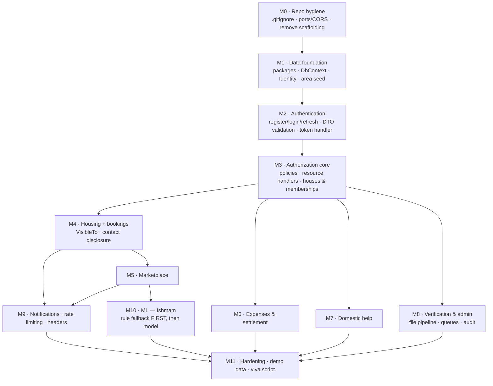

## 12.2 Milestones

### M0 · Repository hygiene — *blocks everything*

| Task | Why |
|---|---|
| Add `.gitignore` (`bin/`, `obj/`, `*.user`, `appsettings.*.Local.json`, `.env`) and `git rm -r --cached` the tracked build output | **~1,223 `bin`/`obj` files are currently tracked.** With four people on parallel branches, every PR will conflict on binary DLLs before it conflicts on code. Nothing else can proceed sanely until this is done |
| Fix the port/CORS triangle (§1.6) | Three configs disagree; the symptom is a generic CORS error |
| Delete `WeatherForecastController`, `WeatherForecast.cs`, `weather.json`, `Class1.cs` | Template noise that will otherwise be demoed by accident |
| Add a `@page "/"` home component; fix `NavMenu` links | Login currently redirects to a 404 |
| Add the pre-merge checklist (below) to the PR template | |

**Pre-merge checklist** — a short list, run by the reviewer:

- [ ] No `FromSqlRaw` / `ExecuteSqlRaw` with interpolation
- [ ] No `float` / `double` on any money field
- [ ] No `MarkupString` on user-derived text
- [ ] No EF entity bound to a controller parameter
- [ ] Every new id-bearing endpoint has a relationship predicate **in the query**
- [ ] No secret in any committed file
- [ ] At most one new EF migration, created after rebasing on `main`

### M1 · Data foundation

Add packages (**each requires the team's approval before install** — this plan does not install anything): `Npgsql.EntityFrameworkCore.PostgreSQL`, `Microsoft.EntityFrameworkCore.Design`, `Microsoft.AspNetCore.Identity.EntityFrameworkCore`, `EFCore.NamingConventions` (optional, D-16).

Then: `NestifyDbContext`; all entities and `IEntityTypeConfiguration` classes; Identity with `Guid` keys; the area seeder with the three embedded JSON files (§5.5) — **mind the phpMyAdmin wrapper and the string ids**; the initial migration.

**Exit criterion:** `dotnet ef database update` produces a database with 8 divisions, 64 districts, and 494 upazilas.

### M2 · Authentication

`Microsoft.AspNetCore.Authentication.JwtBearer`. Register/login/refresh/logout/me endpoints at the `/api/v1/auth/*` paths `AuthService` already calls; `TokenService`; `refresh_tokens` with rotation and reuse detection; lockout; enumeration-safe responses; **DataAnnotations on the shared auth DTOs**; in-memory token store replacing the `localStorage` path in `CustomAuthStateProvider`; the `AuthorizationMessageHandler` (currently 0 bytes) as a real `DelegatingHandler`.

**Exit criterion:** login works end to end from the existing `Login.razor`, survives a browser refresh via the refresh cookie, and no token is present in `localStorage`.

### M3 · Authorization core

Policies; all resource handlers; the per-request house-membership resolver; houses and memberships CRUD; the shared cascading area dropdown component; the `VerifiedUser` policy.

**Exit criterion:** a Manager of House A receives `404` on every House B endpoint. This is worth an explicit manual test — it is the property the whole authorization model rests on.

### M4 · Housing + bookings

`VisibleTo` and the repository that makes it unavoidable; post CRUD with owner predicates; area filtering; booking create/accept/reject/withdraw; the manager's requester list; `ContactDisclosureDto` and the first `/contact` endpoint; report submission.

**Exit criterion:** a user who does not match a post's requirements gets `404` on get-by-id and cannot book it by guessing the id.

### M5 · Marketplace

Reuses M4's patterns almost verbatim (§8.1). Items, images, buy interests, the second `/contact` endpoint.

### M6 · Expenses & settlement

Expenses with materialized shares; contributions auto-derived from expenses; the meal sheet with `xmin` concurrency and the 409 conflict UX; the audit trail; preview and finalize in a `Serializable` transaction; transfer minimization.

**Exit criterion:** the §7.3 worked example reproduces exactly, including the ৳0.01 residual on Tanvir, and `Σ net = 0`.

### M7 · Domestic help

Helper self-registration with coordinates; browse and filter; the engagement state machine with two-sided completion; the third `/contact` endpoint; reviews behind all five eligibility checks; rating aggregate maintained in-transaction.

### M8 · Verification & admin

The full ten-step upload pipeline (§11.5.3); document storage outside the web root; HMAC signed access; both admin queues; report resolution actions; ban with token revocation; `admin_audit_logs` written in-transaction; the retention job.

### M9 · Notifications, rate limiting, headers

The `notifications` table with transactional writes and dedupe; client polling; all rate-limit policies; the security-headers middleware and CSP; HSTS.

### M10 · ML — *owner: Ishmam*

**The deterministic rule-based fallback is built first**, and the endpoint ships working on it. Then the ML.NET training pipeline, `ml_model_versions`, the admin retrain endpoint, `PredictionEnginePool` wiring, and the model/rule switch at the 200-row threshold.

**Exit criterion:** `POST /ml/price-suggestion` returns a sensible answer with `source: "rule"` on an empty database, and `source: "model"` after seeding 200+ items and retraining.

### M11 · Hardening and demo preparation

Least-privilege database roles; the backup **and restore drill**; seed demo data (a house with four members and a full September meal sheet; helpers; items across categories; a pending verification; an open report); the viva walkthrough script.

## 12.3 Git workflow for four parallel contributors

| Rule | Detail |
|---|---|
| `main` is protected | No direct pushes. PR + at least one review |
| Branch naming | `feat/<name>/<topic>`, e.g. `feat/ishmam/ml-price-suggestion` |
| Rebase, don't merge, before opening a PR | `git fetch origin && git rebase origin/main` — keeps history linear and surfaces migration conflicts before review, not during merge |
| Squash merge | One commit per feature on `main` |
| Keep PRs small | A PR touching one milestone is reviewable; one touching four is rubber-stamped |
| Never commit build output | Enforced by the `.gitignore` from M0 |

## 12.4 EF Core migration-conflict policy

Parallel migrations are the single most likely source of lost work on this project, because `NestifyDbContextModelSnapshot.cs` is a generated file that four people will edit simultaneously.

| Rule | Why |
|---|---|
| **Migrations live only in `Nestify.Api/Data/Migrations`** | One project, one migration history, one snapshot file |
| **Rebase on `main` immediately before `dotnet ef migrations add`** | A migration generated against stale state produces a diff that assumes a schema nobody has |
| **Never hand-merge `NestifyDbContextModelSnapshot.cs`** | It is generated. A hand-merged snapshot can end up describing a schema that no migration produces, after which new migrations silently generate nothing — a failure that surfaces days later as a missing column |
| **On a snapshot conflict:** delete your migration files, take `main`'s snapshot wholesale, rebase, re-run `migrations add` | Regeneration is seconds; debugging a corrupted snapshot is hours |
| **Serialize schema changes** | A PR containing a migration is labelled `schema` and merges alone. Announce in the team channel before starting one |
| **Never edit an applied migration** | Teammates and the demo database have already run it. Add a new migration instead |
| **One migration per PR** | Multiple migrations in one PR multiply the conflict surface for no benefit |
| Naming | `<Milestone>_<What>`, e.g. `M6_AddSettlementTables` — the ordering is legible in a directory listing |

**Recovery — a teammate merged a migration while yours was open:**

```
git fetch origin
git rebase origin/main                    # conflicts on the snapshot
git checkout --theirs <snapshot path>     # take main's generated snapshot
rm Data/Migrations/<your migration>.cs
rm Data/Migrations/<your migration>.Designer.cs
git rebase --continue
dotnet ef migrations add <YourMigration>  # regenerate on the new base
```

**If the local database has already applied the deleted migration:** `dotnet ef database update <PreviousMigrationName>` to roll back before regenerating. In the early milestones, dropping and recreating the local database is faster and perfectly acceptable — the area seeder makes it a one-command recovery.

---

# 13 — Open decisions

Every ambiguity found while writing this plan, each with a recommended default. **These are defaults, not decisions taken** — where the brief did not specify behaviour, none was invented.

| # | Ambiguity | Recommended default | Rationale |
|---|---|---|---|
| **D-01** | **Plain `Member` rights over meal entries and expenses (M3).** The brief specifies Manager and Co-Manager may edit any member's entry on any date, and explicitly leaves Member rights unspecified | **A Member may create and edit only their *own* meal entry, only for dates within the current *unfinalized* month, and every edit is audited exactly as a manager's is. A Member may not edit anyone else's entry, may not touch a finalized period, and may not create or correct expenses or contributions** | **Security rationale:** least privilege applied to a financial record. Letting a Member edit others' counts lets any housemate quietly shift cost onto another and is indistinguishable from a manager's legitimate correction without reading the audit log. Restricting to the current unfinalized month keeps settled history immutable, which is the guarantee the append-only ledger exists to provide. Allowing own-entry edits is the minimum that makes daily self-reporting workable — the realistic alternative, routing every meal through a manager, means the sheet goes unfilled and the module is not demoable. Auditing every Member edit identically means the permission adds no blind spot: anything a Member changes is visible to the whole house (§4.6) |
| **D-02** | The brief calls the M1 role **Sub-Manager** and the M3 role **Co-Manager** | **One role, `CoManager`, displayed as "Co-Manager" everywhere. "Sub-Manager" appears nowhere in code or UI** | Both describe the same thing — a second person with elevated rights in one house. Two names for one row invites a second column, then two divergent permission checks. If the team wants "Sub-Manager" in M1 screens, make it a display string over the same enum value, never a second role |
| **D-03** | **Metropolitan Thanas are absent from the dataset** — `upazilas.json` holds 494 upazilas and no city-corporation thanas, but M1 and M2 need Dhaka/Chattogram metropolitan areas to be selectable | **Seed the 494 dataset rows with `IsMetropolitanThana = false`, then add a small hand-curated supplement for the metropolitan thanas of the largest city corporations, using ids from 10000 upward to avoid ever colliding with dataset ids** | Urban shared housing is the platform's core use case, and "Dhaka" as a single district is too coarse to filter by. The id offset keeps a future dataset refresh a clean reseed of ids 1–494 without touching local additions. Which city corporations to cover, and the thana list, need a decision — it is the one place the plan depends on data the verified source does not contain |
| **D-04** | Which library strips EXIF | **`SixLabors.ImageSharp`** — decode and re-encode, discarding metadata | Cross-platform and actively maintained. `System.Drawing.Common` is Windows-only and unsupported for server workloads since .NET 6. Note the licence: ImageSharp is Six Labors Split License, free for open-source and small organisations — fine for a course project, but the team should read it rather than assume MIT |
| **D-05** | Malware scanning: which scanner, and what happens when it is unavailable | **ClamAV via `clamd` over TCP. If the scanner is unreachable, the document is held at `ScanStatus = ScanFailed` and the admin queue shows "scan unavailable — review with caution" rather than blocking the upload** | ClamAV is free and runs in a container. **Fail-closed on scan errors would make the whole verification module undemoable if the container is down at viva time; fail-open with a visible warning keeps the flow working and keeps the risk in front of the human who is about to open the file.** If the team would rather fail closed, that is a defensible choice — it just needs to be a choice |
| **D-06** | Whether marketplace item images are malware-scanned like verification documents | **Yes, same pipeline, but a scan failure does not block the upload** | The images are served publicly, so the exposure is wider than a document only one admin ever opens; but blocking a for-sale listing on a scanner outage is disproportionate |
| **D-07** | Identity-document retention period after a verification decision | **30 days, then unlink the bytes; keep the row, decision, admin, timestamp, and SHA-256 hash permanently** | Long enough to resolve a disputed decision, short enough that the platform is not indefinitely holding national ID scans. The hash keeps the decision provable after the bytes are gone |
| **D-08** | How the first `Admin` account is created, given there is no self-service path | **A seeded admin whose email comes from configuration key `Seed__AdminEmail` and whose initial password comes from `Seed__AdminPassword`, both supplied via user-secrets or environment variables, with a forced password change on first login. Seeding runs only when no admin exists** | Any in-app path to `Admin` is a privilege-escalation target. Keeping the bootstrap in secrets means no credential is ever committed. The forced change covers the case where the initial value is shared during setup |
| **D-09** | Which actions require `IsVerified` | **Creating obligations — post a listing, book a seat, request an engagement, create a house — requires verification. Browsing, filtering, and reporting do not** | Requiring verification to read makes the platform useless during the approval wait; requiring it to transact is the trust signal verification exists to provide. **For the demo, the team may want to relax this** so a fresh account can complete a flow without an admin approving it first — if so, relax it via configuration, not by removing the policy |
| **D-10** | How a domestic helper's latitude and longitude are captured | **A Leaflet + OpenStreetMap map pin, defaulting to the selected upazila's centroid, with manual drag to adjust** | The README already names Leaflet/OSM. No API key, no billing, no geocoding service. **Alternative if map integration slips:** accept the district centroid from the seeded `districts.lat/lon` as an approximation, and treat precise coordinates as a later refinement |
| **D-11** | Whether a finalized settlement can be reopened, and by whom | **A finalized period is immutable. A correction is entered in the *next* open period as a correcting entry referencing the closed run. No reopen endpoint exists** | An append-only ledger whose periods can be reopened is not append-only. Rolling corrections forward is how real accounting handles this, and it keeps the audit story simple. If a reopen is genuinely needed, it should require an admin and write an audit row — but it is not built by default |
| **D-12** | Whether a user may be an active member of more than one house at a time | **Yes, multiple active memberships are allowed; the schema already supports it (`ux_membership_active` is per `(HouseId, UserId)`, not per user)** | Someone may manage a house they own while renting a seat elsewhere. Forbidding it needs a constraint with no clear justification. **Consequence for the UI:** every M3 screen needs an explicit house selector — there is no "current house" that can be inferred |
| **D-13** | Whether email confirmation is required before login | **`false` for the demo, `true` for any real deployment** | An unconfirmed-email login path is acceptable when the viva demo must work without a mail provider configured. It is not acceptable in production, where it lets anyone register under someone else's address |
| **D-14** | Whether to capture an agreed sale price to improve the ML label | **Not in the initial build. Add an optional `SoldPrice` when a `BuyInterest` reaches `Accepted`, once the flow is exercised** | It would turn the price model from an asking-price predictor into a market-value estimator — a real improvement. But it depends on a completed two-party interaction, which is exactly the data scarcity that disqualified the other ML candidates (§10.1) |
| **D-15** | Notification retention and whether polling is enough | **Delete read notifications older than 60 days. Keep polling; add SignalR only if M9 finishes early** | 30-second polling is indistinguishable from push for this product, and the WASM-plus-separate-origin hub setup is a genuine time sink (§1.5). The table design does not change if SignalR is added later |
| **D-16** | `snake_case` database naming via `EFCore.NamingConventions`, or EF's default PascalCase | **Use `EFCore.NamingConventions`** | Unquoted identifiers in `psql` matter during a live demo — `select * from housing_posts` works, `select * from "HousingPosts"` is a trap under pressure. It is one extra package and one line of configuration. **If the team prefers zero extra dependencies, PascalCase is fine** — nothing else in this plan depends on the choice |
| **D-17** | Whether a review can be edited or deleted after posting | **Editable by its author for 24 hours, then frozen. Never deletable by the author; an admin may hide it on an upheld report** | An unlimited edit window lets a reviewer extract concessions by threatening to change a rating. Author deletion would let a reviewer erase an honest negative review under pressure. Hiding rather than deleting preserves the audit trail |
| **D-18** | What the admin's report queue does about the *reported user*, as opposed to the reported content | **Content actions (hide, remove) are the default. A ban requires a separate explicit action with a mandatory reason recorded in the audit log** | Conflating "this post is spam" with "ban this account" makes bans too easy to issue by reflex on a queue screen |
| **D-19** | Whether `README.md` should be corrected | **Yes — it claims React, Clean Architecture, and Docker, none of which exist, and it will be read during assessment.** Not done by this plan, which was scoped to the plan document only | A stale README that contradicts the code is the first inconsistency an examiner finds |
| **D-20** | Where a housing post's area comes from when a house's area is edited | **`housing_posts.UpazilaId` is copied from the house at post creation and does *not* follow later house edits. Editing a house's area does not silently move its live posts** | A denormalized copy that quietly changes would move a listing to a different area under seekers who had already found it. If the team wants them linked, make it an explicit prompt on house edit |

## 13.1 Ambiguity count per module

Per the brief's stop condition, no module carries more than three unresolved ambiguities:

| Module | Open decisions | Count |
|---|---|:--:|
| M1 Housing | D-02, D-03, D-20 | 3 |
| M2 Domestic help | D-10, D-17 | 2 |
| M3 Expenses | D-01, D-11, D-12 | 3 |
| M4 Marketplace | D-06, D-14 | 2 |
| M5/M6 Verification & admin | D-04, D-05, D-07, D-18 | 4 → **D-04 and D-05 are library/ops choices with clear defaults, not behavioural ambiguities**; the behavioural ones are D-07 and D-18 |
| ML component | D-14 | 1 |
| Cross-cutting | D-08, D-09, D-13, D-15, D-16, D-19 | 6 |

**D-01 and D-03 are the two worth resolving before Milestone 6 and Milestone 1 respectively** — D-01 changes the M3 permission matrix, and D-03 changes what the area seeder inserts.

