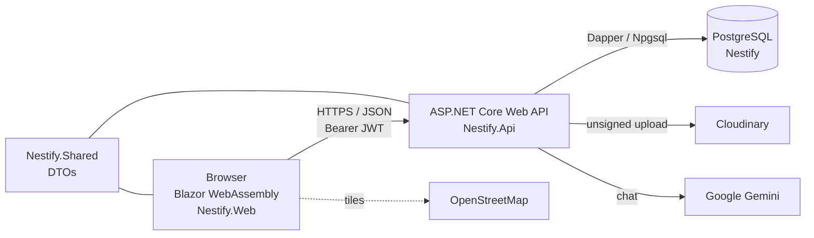
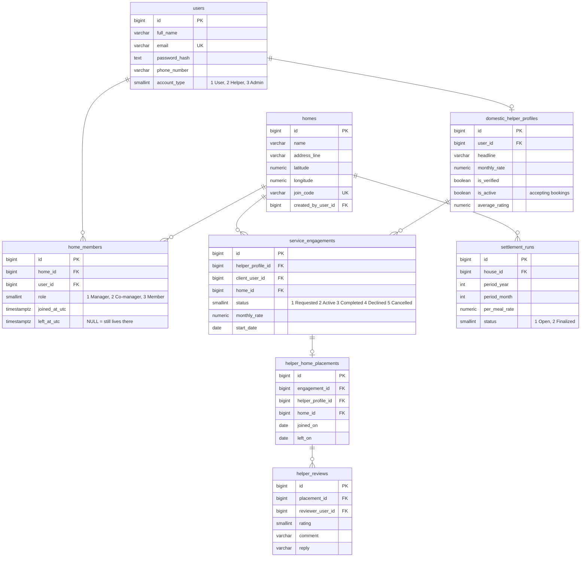
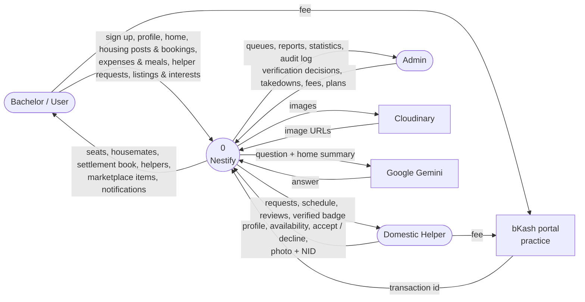
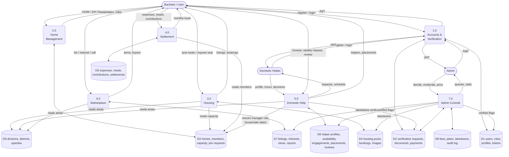
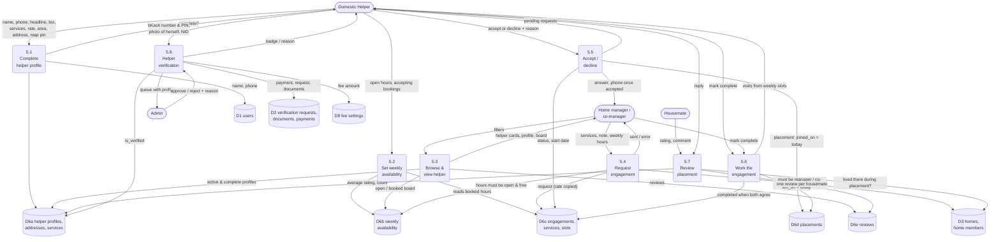

# Nestify — Bachelor Life, Unified

Nestify is a web platform for Bangladeshi university students and bachelors who live away from home in shared flats and messes. It brings the four scattered, word-of-mouth parts of bachelor life under one verified account:

- **Housing** — find a seat in a shared home, or post the free seats in yours.
- **Home & Settlement** — run the home you live in: members, roles, meals, expenses and the monthly settlement book.
- **Domestic Help** — find a verified khala / bua near you and book her weekly hours for your home.
- **Marketplace** — buy and sell second-hand things to other bachelors nearby.

An admin console handles verification of users and helpers, moderation of posts, fees and an audit log. A Gemini-powered assistant answers questions about the platform to signed-in users.

Built as a student project for the Software Development Lab course, Ahsanullah University of Science and Technology.

---

## Table of contents

1. [Team](#team)
2. [Features](#features)
3. [Tech stack](#tech-stack)
4. [Architecture](#architecture)
5. [Folder structure](#folder-structure)
6. [Data model (ERD)](#data-model-erd)
7. [Data flow diagrams](#data-flow-diagrams)
8. [Installation](#installation)
9. [Usage](#usage)
10. [API overview](#api-overview)
11. [Screenshots](#screenshots)

---

## Team

| Name | Student ID | Email |
|------|-----------|-------|
| Tahmid Mubashira Obonti | 20230104048 | tahmidobonti9@gmail.com |
| Tasmia Tabassum Shreoshi | 20230104026 | tasmiashreoshi@gmail.com |
| Tasnima Faruk Prapty | 20230104038 | tasnimafarukprapty@gmail.com |
| Kazi Ishmamul Haque | 20230104040 | kaziishmamulhaque@gmail.com |

---

## Features

### Accounts and verification
- Email + password sign-up as a **User** (bachelor), **Domestic Helper** or **Admin**; JWT access tokens with rotating refresh tokens, BCrypt password hashing, password change.
- Profile with photo (Cloudinary), occupation, institution/workplace, date of birth, smoker/drinker, address and social links.
- **Verification**: a user pays the fee through a practice bKash portal, uploads an NID or birth certificate (plus student/employee ID), and an admin approves or rejects with a reason. Verified users get a badge and can be required by housing posts.

### Home (the place you live)
- Create a home with a name, address and a pin on a Leaflet/OpenStreetMap map; housemates join with a short join code or by request.
- Roles inside a home: **Manager**, **Co-manager**, **Member**; transfer management, add/remove members, set capacity.

### Housing
- Managers and co-managers post free seats (single seat, multiple seats, entire house) with photos, rent and eligibility rules (gender, occupation, age range, verified / non-smoker / non-drinker only).
- Seekers browse by division → district → upazila, rent and listing type, then request a seat; the manager accepts, rejects or the seeker withdraws. Free seats are worked out live from the home's capacity and its members.

### Settlement
- Append-only ledger of shared expenses and meal purchases, per-member meal sheets, meal-fund and shared-bill contributions.
- Monthly settlement book opened by a manager: per-meal rate, equal shares, each member's net position and the transfers that settle the month. Corrections are new rows, never edits.

### Domestic help
- Helpers register, then complete a profile: headline, bio, languages, experience, services (cooking, cleaning, laundry, dishwashing, grocery runs, general help), monthly rate, area, address and a map pin of where they live.
- A weekly availability board (Saturday to Friday, 6 AM to midnight) the helper paints; bachelors see it live with booked hours locked.
- A home's manager or co-manager picks weekly hours and sends a request; the helper accepts or declines from her workspace (dashboard, schedule, engagements, reviews).
- Accepting creates a **placement** (joined / left dates) at that home. Every housemate who lived there while she worked there can rate and review her, once. Helpers can reply to reviews.
- Helper verification: bKash fee (amount set by the admin), a photo of herself plus her NID, reviewed by an admin next to her profile.

### Marketplace
- List second-hand items with photos, category, condition, price and handover area; browse and filter by area, category, condition and price.
- Buyers send an interest with a message; the seller accepts, declines, and marks the item sold to one of them. Contact details are exchanged only after acceptance.

### Admin console
- Dashboard with platform statistics, verification queue with applicant/helper profile and documents, housing and marketplace moderation (reports, takedowns, restores), fee and posting-plan pricing, admin team management, and an immutable audit log of every decision.

### Nestify Assistant
- Server-side Gemini chat for signed-in users about homes, settlement, housing, marketplace and privacy; rate-limited, with only a minimal non-identifying home summary sent as context.

---

## Tech stack

| Layer | Technology |
|-------|------------|
| Frontend | Blazor WebAssembly (.NET 10), Blazored.LocalStorage, hand-written CSS, Leaflet.js + OpenStreetMap |
| Backend | ASP.NET Core Web API (.NET 10), Dapper, Npgsql, BCrypt.Net, JWT Bearer auth, DotNetEnv |
| Database | PostgreSQL 17 — plain SQL schema, no ORM migrations |
| Shared | `Nestify.Shared` class library of DTOs used by both API and Web |
| External services | Cloudinary (image uploads), Google Gemini (assistant) |
| Payments | Practice bKash portal (no real money moves) |

---

## Architecture



- The Web app is a pure client: every screen talks to `api/v1/*` over HTTP with a JWT from local storage; the API refreshes tokens transparently.
- The API is organised by module (`Auth`, `Profiles`, `Homes`, `Housing`, `Helpers`, `Marketplace`, `Settlement`, `Admin`, `Assistant`), each a service class with hand-written SQL behind a thin controller.
- The database is authored as SQL files under `src/Nestify.Database`; the API never creates tables.

---

## Folder structure

```
Nestify/
├── .env.example                 # every secret the API needs, with notes
├── Nestify.slnx                 # solution
├── README.md
└── src/
    ├── Nestify.Api/             # ASP.NET Core Web API
    │   ├── Controllers/         # one controller per module (api/v1/...)
    │   ├── Auth/                # register, login, refresh, JWT, password
    │   ├── Profiles/            # user profile, verification, Cloudinary uploader
    │   ├── Homes/  Housing/  Helpers/  Marketplace/  Settlement/  Admin/  Assistant/
    │   ├── Data/                # DbConnectionFactory, Dapper type handlers
    │   └── Program.cs           # .env loading, DI, JWT, rate limiting
    ├── Nestify.Web/             # Blazor WebAssembly client
    │   ├── Pages/
    │   │   ├── User/            # Home, Housing, Marketplace, Helpers, Settlement, Profile
    │   │   ├── DomesticHelp/    # helper workspace: dashboard, availability, schedule, engagements, reviews, profile
    │   │   └── Admin/           # admin console
    │   ├── Components/          # shared UI: AreaCascade, RatingStars, helper board, housing/marketplace forms
    │   ├── Layout/              # user, helper and admin shells
    │   ├── Services/            # typed HTTP clients (IHelperService, IHousingService, ...)
    │   ├── Auth/                # token storage, AuthenticationStateProvider, role routes
    │   └── wwwroot/             # index.html, css/, js/map-picker.js
    ├── Nestify.Shared/          # DTOs and enums shared by API and Web
    │   └── Dtos/{Auth,Profile,Home,Housing,Helpers,Marketplace,Settlement,Admin,Area,Assistant}
    └── Nestify.Database/
        ├── nestify.sql          # the whole schema in one file (run this on a fresh database)
        ├── Autthintication.sql, User_Home.sql, Housing.sql, Marketplace.sql,
        │   Settlement.sql, User_Verification.sql, Admin.sql, Domestic_Help.sql, ...
        │                        # the same schema split per module, used as migrations
        └── seed/
            ├── bangladesh_administrative_seed.sql   # divisions, districts, upazilas
            └── domestic_help_seed.sql               # sample helpers
```

---

## Data model (ERD)

Fifty-four tables, grouped by module. Lookup tables (roles, listing types, categories, conditions, report reasons, fee settings, plans) and audit/token tables are left out of the diagram for readability; the full definition is in [`src/Nestify.Database/nestify.sql`](src/Nestify.Database/nestify.sql).

```mermaid
erDiagram
    users ||--o| user_additional_profile_info : "has"
    users ||--o{ user_roles : "has"
    users ||--o{ refresh_tokens : "signs in with"
    users ||--o{ verification_requests : "applies"
    verification_requests ||--o{ verification_documents : "carries"
    verification_requests ||--o| verification_payments : "paid by"

    divisions ||--o{ districts : "contains"
    districts ||--o{ upazilas : "contains"

    users ||--o{ homes : "creates"
    homes ||--o{ home_members : "houses"
    users ||--o{ home_members : "lives as"
    homes ||--o| home_capacity : "holds"
    homes ||--o{ home_join_requests : "receives"

    homes ||--o{ housing_posts : "advertises"
    housing_posts ||--o| housing_post_requirements : "requires"
    housing_posts ||--o{ housing_post_images : "shows"
    housing_posts ||--o{ housing_bookings : "gets"
    users ||--o{ housing_bookings : "asks for a seat"
    housing_posts ||--o{ housing_reports : "reported in"

    homes ||--o{ expenses : "spends"
    expenses ||--o{ expense_shares : "split into"
    homes ||--o{ meal_entries : "records"
    homes ||--o{ contributions : "collects"
    homes ||--o{ settlement_runs : "settles"
    settlement_runs ||--o{ settlement_members : "includes"
    settlement_runs ||--o{ settlement_lines : "per member"
    settlement_runs ||--o{ settlement_transfers : "pays out"

    users ||--o| domestic_helper_profiles : "is a helper"
    domestic_helper_profiles ||--o| helper_addresses : "lives at"
    upazilas ||--o{ helper_addresses : "in"
    domestic_helper_profiles ||--o{ helper_services : "offers"
    domestic_helper_profiles ||--o{ helper_weekly_availability : "opens hours"
    domestic_helper_profiles ||--o{ service_engagements : "receives"
    homes ||--o{ service_engagements : "books"
    users ||--o{ service_engagements : "requested by"
    service_engagements ||--o{ service_engagement_services : "asks for"
    service_engagements ||--o{ service_engagement_slots : "weekly hours"
    service_engagements ||--o| helper_home_placements : "becomes"
    helper_home_placements ||--o{ helper_reviews : "reviewed by housemates"
    users ||--o{ helper_reviews : "writes"

    users ||--o{ marketplace_listings : "sells"
    marketplace_listings ||--o{ marketplace_listing_images : "shows"
    marketplace_listings ||--o{ marketplace_buy_interests : "gets"
    users ||--o{ marketplace_buy_interests : "wants"
    marketplace_listings ||--o{ marketplace_listing_views : "viewed"
    marketplace_listings ||--o{ marketplace_reports : "reported in"

    users ||--o{ post_takedowns : "admin strikes"
    users ||--o| admin_accounts : "admin scope"
    users ||--o{ admin_audit_log : "admin action"
    users ||--o{ plan_purchases : "buys"
    post_plans ||--o{ plan_purchases : "of"
```



Key tables in a little more detail:



---

## Data flow diagrams

### Level 0 — context diagram



### Level 1 — the system broken into its modules



### Level 2 — process 5.0 Domestic Help



---

## Installation

### Prerequisites

- [.NET 10 SDK](https://dotnet.microsoft.com/download)
- [PostgreSQL 17](https://www.postgresql.org/download/) (any 14+ should work)
- A free [Cloudinary](https://cloudinary.com/) account with an unsigned upload preset (for photos)
- Optionally a [Gemini API key](https://aistudio.google.com/app/apikey) (for the assistant)

### 1. Clone

```bash
git clone https://github.com/<your-org>/Nestify.git
cd Nestify
```

### 2. Create the database

```bash
createdb -U postgres Nestify
psql -U postgres -d Nestify -f src/Nestify.Database/nestify.sql
psql -U postgres -d Nestify -f src/Nestify.Database/seed/bangladesh_administrative_seed.sql
# optional: six sample helpers around Dhaka, password Helper@123
psql -U postgres -d Nestify -f src/Nestify.Database/seed/domestic_help_seed.sql
```

`nestify.sql` drops and recreates every table, so only run it on a fresh (or disposable) database. The per-module files next to it are the same schema split up and can be run individually to migrate an existing database.

### 3. Configure secrets

```bash
cp .env.example .env
```

Fill in the values in `.env` (the API reads it on startup and it is git-ignored):

| Key | What it is |
|-----|------------|
| `DB_HOST`, `DB_PORT`, `DB_NAME`, `DB_USER`, `DB_PASSWORD` | PostgreSQL connection |
| `JWT_SECRET`, `JWT_ISSUER`, `JWT_AUDIENCE`, `JWT_ACCESS_MINUTES`, `JWT_REFRESH_DAYS` | Token signing and lifetimes (`JWT_SECRET` must be 32+ random characters) |
| `CLOUDINARY_URL`, `UPLOAD_PICTURE` | Cloudinary API URL and the unsigned preset name |
| `GEMINI_API_KEY`, `GEMINI_MODEL` | Assistant; optional, defaults to `gemini-3.6-flash` |

### 4. Run

Two terminals:

```bash
# API  → https://localhost:7284
dotnet run --project src/Nestify.Api

# Web  → https://localhost:7205
dotnet run --project src/Nestify.Web
```

The Web app reads the API address from `src/Nestify.Web/wwwroot/appsettings.json` (`ApiBaseUrl`, default `https://localhost:7284/`). Trust the dev certificate once with `dotnet dev-certs https --trust` if the browser complains.

### 5. Make an admin

Admins are not created from the sign-up form. Register a normal account, then promote it:

```sql
UPDATE users SET account_type = 3 WHERE email = 'you@example.com';
INSERT INTO user_roles (user_id, role_id) SELECT id, 3 FROM users WHERE email = 'you@example.com';
```

---

## Usage

**As a bachelor**
1. Sign up as a *User*, fill in your profile, apply for verification (bKash → NID/birth certificate → admin approval).
2. Create a home (or join one with its code). As manager you can post free seats, set capacity and open the monthly settlement book.
3. Browse *Domestic Help*, open a helper, tap the weekly hours you need on her board and send a request for your home. Once she accepts you see her phone; when the engagement ends, everyone who lived in the home during that time can review her.
4. Sell and buy in the *Marketplace*; contact details are exchanged only after an interest is accepted.

**As a domestic helper**
1. Sign up as a *Domestic Helper*. The workspace opens straight away; use *Edit* on each card of your profile to add services, rate, and where you live.
2. Paint your weekly hours on *Availability* and switch *Accepting bookings* on.
3. Answer requests from *Engagements*; your *Schedule* fills in from the booked hours. Apply for verification from your profile (bKash fee → photo + NID).

**As an admin**
- `/admin` shows the queues: verification requests with documents next to the applicant's profile, reported posts to take down or dismiss, fees and plans to price, and the audit log of everything decided.

---

## API overview

All endpoints live under `/api/v1`. Authenticated routes expect `Authorization: Bearer <access token>`; the refresh token is exchanged at `auth/refresh`. Error responses are `{ "message": "..." }`.

| Area | Routes |
|------|--------|
| Auth | `POST auth/register`, `auth/login`, `auth/refresh`, `auth/logout`, `auth/password` |
| Profile | `GET/PUT profile/me`, `POST profile/me/picture`, `GET profile/me/verification/fee`, `POST profile/me/verification/payment`, `POST/DELETE profile/me/verification` |
| Areas | `GET areas/divisions`, `areas/divisions/{id}/districts`, `areas/districts/{id}/upazilas` |
| Homes | `GET homes/mine`, `POST homes`, `homes/join`, `homes/my-request`, `homes/mine/requests/{id}/approve|reject`, `homes/mine/members` (add, promote, demote, remove, transfer-manager), `homes/mine/leave` |
| Housing | `GET housing/posts`, `housing/posts/{id}`, `housing/posts/mine`, `POST/PUT/DELETE housing/posts`, `close|reopen|report`, `housing/posts/{id}/bookings`, `housing/bookings/{id}/accept|reject|release|withdraw|contact`, `housing/bookings/mine` |
| Settlement | `GET settlement/mine`, `mine/books`, `mine/meal-cost-history`, `POST mine/open`, `mine/members`, `mine/bills`, `mine/payments`, `PUT mine/meals`, `POST mine/finalize` |
| Helpers (public) | `GET helpers`, `helpers/{id}`, `helpers/{id}/reviews` |
| Helpers (client) | `GET helpers/engagements`, `POST helpers/{id}/engagements`, `POST helpers/engagements/{id}/cancel|complete|review` |
| Helper workspace | `GET/PUT helpers/me`, `POST helpers/me/photo`, `GET helpers/me/nav`, `helpers/me/workspace/{dashboard,availability,schedule,engagements,reviews}`, `engagements/{id}/accept|decline`, `reviews/{id}/reply` |
| Helper verification | `GET helpers/me/verification`, `/fee`, `POST /payment`, `POST` (photo + NID), `DELETE` |
| Marketplace | `GET marketplace/items`, `items/{id}`, `items/mine`, `POST/PUT/DELETE marketplace/items`, `items/{id}/sold|report|interests`, `marketplace/interests/{id}/accept|decline|withdraw`, `interests/mine`, `price-suggestion` |
| Admin | `admin/summary`, `admin/verifications` (+ `{id}/decision`), `admin/housing/posts|reports` and takedown / restore, `admin/marketplace/items|reports` and takedown / restore, `admin/reports/{scope}/{id}/dismiss`, `admin/fees`, `admin/plans`, `admin/accounts`, `admin/audit`, `admin/me` |
| Assistant | `POST assistant/chat` (rate-limited per user) |

---

## Screenshots

| | |
|---|---|
|  | |

> More screenshots of the helper workspace, housing browse, settlement book and admin console can be added here.
